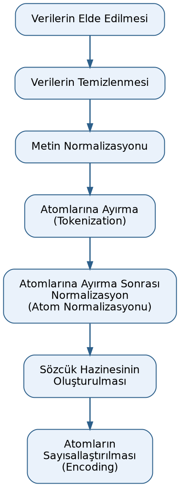

======================================
Doğal Dil İşlemenin Tarihsel Gelişimi
======================================

Doğal dil işleme alanının tarihsel gelişimini dört döneme ayırabiliriz:

1) İlk Dönem (1950-1990): Bu döneme *sembolik dönem* de diyebiliriz. Bu dönemde *kural tabanlı (rule based)* yaklaşımlar
   üzerinde çalışılmıştır. Burada *kural tabanlı yaklaşımlar* demekle kuralların ortaya konması ve işlemlerin bu
   kurallara uyularak yapılmaya çalışılması kastedilmektedir.

2) İstatistiksel Dönem (1990-2010): Bu dönemde veri miktarının artmasıyla ve bilgisayar donanımlarının gelişmesiyle
   birlikte metin yığınlarından (corpus) olasılıkların öğrenilmesi yöntemleri geliştirilmiş ve uygulamaya sokulmuştur.

3) Derin Öğrenme Ağları Dönemi (2014-2018): Derin öğrenmenin (Deep Learning) sahneye çıkışıyla sözcükler, sayılardan
   oluşan vektörlere (Word Embeddings) dönüştürülmüş ve bu vektörler çok katmanlı sinir ağlarına girdi olarak
   verilmiştir.

4) Dönüştürücüler (transformers) ve Büyük Dil Modelleri Dönemi (Large Language Models) (2018-Günümüz): *Dikkat
   (Attention)* mekanizmasının keşfiyle doğal dil işlemede büyük bir sıçrama yaşanmıştır. Artık modeller yalnızca
   sözcükleri değil, tüm cümlenin bağlamını aynı anda anlayabilecek hale gelmiştir.

Biz kursumuzda ilk dönem ve istatistiksel dönem için *klasik doğal dil işleme dönemi* de diyeceğiz.

Doğal Dil İşlemede Ön İşlemler (Preprocessing)
=================================================

Bu bölümde doğal dil işleme (natural language processing - NLP) faaliyetlerinin başlangıç aşaması olan *ön
işlemler (preprocessing)* üzerinde duracağız.

Ön İşlem Sürecinin Aşamaları
-------------------------------

Doğal dil işlemedeki önişlem süreci birkaç adımdan oluşmaktadır. Önce metinler elde edilir. Elde edilen metinler
eğer gerekiyorsa temizlenir. Veriler temizlendikten sonra *normalizasyon* işlemine sokulmaktadır. Daha sonra
normalize edilmiş metinler atomlarına ayrılır. Buna İngilizce *tokenization* denilmektedir. Atomlara ayırma
işleminden sonra da genellikle atomlar üzerinde yeniden normalizasyon işlemi yapılmaktadır. Bu ikinci
normalizasyona *atom normalizasyonu (token normalization)* da denilmektedir. Nihayet normalize edilmiş
atomlardan *sözcük hazinesi (vocabulary)* oluşturulmaktadır. Atomlardan sözcük hazinesi oluşturulduktan sonra bu
sözcük hazinesindeki atomlara birer numara karşılık düşürülür. Bu işleme *atomların id'ye dönüştürülmesi*,
*vektörizasyon (vectorization)*, *sayısallaştırma*, *kodlama (encoding)* ya da *eşleştirme (mapping)*
denilmektedir. Doğal dil işlemedeki bu ön işlem adımlarını şekilsel olarak şöyle gösterebiliriz:

Veri Kümelerinin Elde Edilmesi
---------------------------------

Makine öğrenmesinin diğer alanlarında olduğu gibi doğal dil işlemede de birinci aşama verilerin elde
edilmesidir. Doğal dil işlemede veriler yazılar biçimindedir. Yazılar da tipik olarak şu kaynaklardan elde
edilmektedir:

- Metin (text) ve ikili (binary) dosyaların içerisinden
- Veritabanlarından
- Web sitelerinden
- Algılayıcılardan (sensörlerden)
- Diğer başka kaynaklardan

Python'da metin dosyalarının içerisindeki yazıları dosyayı ``open`` fonksiyonuyla açıp ``read`` fonksiyonuyla
okuyarak elde edebilirsiniz. Ancak ``open`` fonksiyonunda kod sayfasını ya da karakter kodlamasını belirtmeyi
unutmayınız. Örneğin:

.. code-block:: python

   f = open('test.txt', encoding='iso-8859-9')
   s = f.read()
   print(s)
   f.close()

Default encoding genellikle ``utf-8`` biçimindedir. Ancak yerel makinenin ayarlarına bağlı olarak
değişebilmektedir. Unicode UTF-8 kodlamasıyla çalışıyorsanız bunu açıkça belirtmelisiniz:

.. code-block:: python

   f = open('test.txt', encoding='utf-8')
   s = f.read()
   print(s)
   f.close()

.. note::

   Yukarıdaki ``test.txt`` dosyası elimizde bulunmadığı için bu kod parçaları çalıştırılarak bir çıktı elde
   edilememiştir. Bu örnekler yalnızca kullanım biçimini göstermek amacıyla verilmiştir.

Türkçe Veri Kümeleri
-----------------------

Doğal dil işleme üzerinde çalışmalar yapabilmek için oluşturulmuş olan pek çok hazır veri kümesi bulunmaktadır.
Biz de kursumuzda klasik doğal dil işleme çalışmalarında hem bu hazır veri kümelerini kullanacağız hem de
``terapikulubu.com`` sitesindeki veri kümesinden faydalanacağız. ``terapikulubu.com`` sitesi C ve Sistem
Programcıları Derneği tarafından geliştirilmiş olan psikolojik bir sosyal ağdır.

Doğal dil işlemedeki veri kümeleri kullanılan doğal dile özgüdür. Aynı zamanda izleyen paragraflarda da
görüleceği gibi önişlem faaliyetlerinin bazıları da dile özgü bir biçimde yapılmaktadır. Biz de kursumuzda
mümkün olduğunca Türkçe metinler üzerinde çalışacağız. Bunun için Türkçe metinlerden oluşan veri kümelerine
gereksinim duyacağız. Türkçe metinlerden oluşan bazı veri kümelerini aşağıda veriyoruz:

- Turkish National Corpus (TNC)
- BOUN Corpus
- Turkish Wikipedia Dump
- Turkish Product Reviews Dataset
- Turkish Movie Reviews
- TTK Turkish News Dataset

Kursumuzda tüm veri kümelerinin ``Src`` dizininin altındaki ``Data`` dizininin içerisinde olduğunu varsayacağız
ve bu dizine hep göreli yol ifadeleri ile erişeceğiz.

Beyazperde Film Yorumları Veri Kümesi
----------------------------------------

``beyazperde.com`` sitesindeki film yorumlarından oluşan Türkçe veri kümesi aşağıdaki bağlantıdan
indirilebilir:

``https://github.com/turkish-nlp-suite/BeyazPerde-Movie-Reviews/blob/main/butun-fimler/all_movies_reviews.json``

Buradan indirdiğimiz ``all_movies_reviews.json`` dosyasını ``Src`` dizinimizin altındaki ``Data`` dizinine
yerleştiriyoruz. Buradaki veri kümesi JSON formatındadır. Bu JSON dosyasının içerisindeki bilgilerin
organizasyonu şöyledir:

**Veri Kümesi Alanları:**

1. ``url`` (string)

   - Filmin Beyazperde.com'daki sayfa bağlantısı
   - Örnek: ``https://www.beyazperde.com/filmler/film-288667``

2. ``name`` (string)

   - Filmin adı
   - Örnek: *Kurak Günler*, *Avatar: Suyun Yolu*

3. ``genre`` (array/dizi)

   - Film türleri listesi
   - Örnek: ``["Dram", "Gerilim"]``, ``["Bilimkurgu", "Macera", "Fantastik", "Aksiyon"]``

4. ``desc`` (string)

   - Filmin açıklaması/konusu
   - Film senaryosunun özeti

5. ``directors`` (string)

   - Yönetmen adı
   - Örnek: *Emin Alper*, *James Cameron*

6. ``actors`` (string)

   - Başrol oyuncuları (virgülle ayrılmış)
   - Örnek: *Selahattin Paşalı, Ekin Koç, Hatice Aslan, Selin Yeninci*

7. ``creators`` (string)

   - Yapımcı/Senarist
   - Örnek: *Emin Alper*

8. ``musicBy`` (string)

   - Film müziği bestecisi
   - Örnek: *Stefan Will*

9. ``rating`` (nesne/object)

   - ``totalRating`` (string): Genel ortalama puan - Örnek: ``3,9``
   - ``ratingCount`` (string): Toplam oy sayısı - Örnek: ``64``
   - ``reviewCount`` (string): Yorum sayısı - Örnek: ``12``
   - ``bestRating`` (string): En yüksek verilebilecek puan - Örnek: ``5``
   - ``worstRating`` (string): En düşük verilebilecek puan - Örnek: ``0,5``

10. ``reviews`` (array/dizi)

    Her yorum nesnesi şu alanları içerir:

    - ``rating`` (string): Kullanıcının verdiği puan - Örnek: ``3,0``, ``4,0``, ``5,0``, ``0,5``, ``3,5``
    - ``review`` (string): Kullanıcının yazdığı yorum metni (uzun metin, spoiler etiketleri içerebilir:
      ``[spoiler][/spoiler]``)

**Önemli Noktalar:**

- Sayısal değerler string formatında
- Ondalık ayırıcı olarak virgül (,) kullanılmakta
- İç içe nesne yapısı mevcut (rating nesnesi)
- ``reviews`` bir dizi/array yapısındadır

Biz JSON formatındaki bu bilgileri tek hamlede Pandas'ın ``read_json`` fonksiyonu ile DataFrame nesnesi
biçiminde elde edebiliriz:

.. code-block:: python

   import pandas as pd

   df = pd.read_json('../Data/all_movies_reviews.json')

Pandas bu tür fonksiyonlarda default kodlama biçimini ``utf-8`` almaktadır. Ancak bunu açıkça da
belirtebilirsiniz:

.. code-block:: python

   df = pd.read_json('../Data/all_movies_reviews.json', encoding='utf-8')

Yukarıda da belirttiğimiz gibi kursumuzda tüm veri kümelerini ``Src`` dizininin altındaki ``Data`` dizininde
toplayacağız. Her konu için ``Src`` dizininin altında yeni bir dizin yaratıp o dizini Python yorumlayıcısının
*çalışma dizini (current working directory)* haline getireceğiz. Dolayısıyla dosya erişimlerini de *göreli yol
ifadesi (relative paths)* kullanarak yapacağız.

JSON dosyalarını Pandas'ın DataFrame nesnesi biçiminde elde etmek yerine manuel biçimde de okuyabiliriz. Bunun
için Python'un standart kütüphanesindeki ``json`` modülü kullanılmaktadır. Bunun için dosya ``open``
fonksiyonuyla açılıp önce bir dosya nesnesi, bu dosya nesnesi kullanılarak da ``json`` modülündeki ``load``
fonksiyonu ile bir json nesnesi elde edilir. Bu json nesnesi aynı zamanda dolaşılabilir (iterable) bir nesnedir.
Bu nesne dolaşıldıkça JSON dosyasındaki kayıtlar elde edilmektedir. Örneğin:

.. code-block:: python

   import json

   with open('../Data/all_movies_reviews.json', 'r', encoding='utf-8') as f:
       movies = json.load(f)
       for movie in movies:
           print(movie)

Örneğin biz bu filmdeki tüm yorumları bir Python listesinde aşağıdaki gibi toplayabiliriz:

.. code-block:: python

   df = pd.read_json('../Data/all_movies_reviews.json', encoding='utf-8')
   all_reviews = []

   for review in df['reviews']:
       for d in review:
           all_reviews.append(d['review'])
   print(all_reviews)

Veri kümesinde toplam 45280 adet yorum bulunmaktadır. Aynı işlemi şöyle de yapabilirdik:

.. code-block:: python

   import json

   all_reviews = []
   with open('../Data/all_movies_reviews.json', 'r', encoding='utf-8') as f:
       movies = json.load(f)
       for movie in movies:
           for review in movie['reviews']:
               all_reviews.append(review['review'])

.. note::

   Bu derste kullanılan ``all_movies_reviews.json`` veri kümesi ortamda bulunmadığından ve internet erişimi
   kapalı olduğundan (yukarıdaki GitHub bağlantısından indirilemediğinden) bu kod örnekleri çalıştırılıp gerçek
   bir çıktı üretilememiştir. Kod örnekleri yalnızca yöntemi göstermek amacıyla verilmiştir.

Biz burada tüm yorum yazılarını bir Python listesi olarak elde ettik. Tabii bunu yeniden Pandas DataFrame
nesnesi haline de getirebiliriz:

.. code-block:: python

   df_reviews = pd.DataFrame({'review': all_reviews})

Pandas'ın ``to_xxx`` isimli çeşitli formatlarda kayıt (save) işlemini yapan fonksiyonları ve metotları vardır.
Daha önceden de belirttiğimiz gibi yazılar için CSV formatı uygun bir format değildir. Yazılar için en uygun
formatlar *parquet* formatı, *hdf5* formatı ve JSON formatıdır. Pandas'ın ``DataFrame`` sınıfının değişik
formatlarda kayıt işlemi yapan metotlarının önemli olanları şunlardır:

.. list-table:: Pandas DataFrame Kayıt (save) Metotları
   :header-rows: 1
   :widths: 25 25

   * - Metot
     - Format
   * - ``to_csv()``
     - CSV/TXT
   * - ``to_excel()``
     - Excel
   * - ``to_json()``
     - JSON
   * - ``to_html()``
     - HTML
   * - ``to_xml()``
     - XML
   * - ``to_latex()``
     - LaTeX
   * - ``to_markdown()``
     - Markdown
   * - ``to_pickle()``
     - Pickle (.pkl)
   * - ``to_parquet()``
     - Parquet
   * - ``to_feather()``
     - Feather
   * - ``to_hdf()``
     - HDF5
   * - ``to_stata()``
     - Stata (.dta)
   * - ``to_sas()``
     - SAS
   * - ``to_spss()``
     - SPSS (.sav)

Örneğin DataFrame nesnesini aşağıdaki gibi JSON dosyası olarak kaydedebiliriz:

.. code-block:: python

   df_reviews.to_json('../Data/movie-reviews.json', orient='records', force_ascii=False)

Geri okumasını da şöyle yapabiliriz:

.. code-block:: python

   df_reviews = pd.read_json('../Data/movie-reviews.json', encoding='utf-8')

Biz buradaki ``movie-reviews.json`` dosyasını da ``Data`` dizininin içerisine yerleştirdik. Parquet ve HDF
formatıyla kayıt ve okuma işlemleri de şöyle yapılabilir:

.. code-block:: python

   df_reviews.to_parquet('../Data/movie-reviews.parquet')
   df_reviews = pd.read_parquet('../Data/movie-reviews.parquet')

   df_reviews.to_hdf('../Data/movie-reviews.hdf5', key='reviews')
   df_reviews = pd.read_hdf('../Data/movie-reviews.hdf5')

Derlem (Corpus) Kavramı
---------------------------

Doğal dil işlemede yazısal verilerin tamamına İngilizce *corpus* denilmektedir. Yani *corpus* terimi doğal dil
işlemede faydalanılacak yazısal veri kümesini belirtmektedir. Yukarıdaki örnekte ``beyazperde.com`` sitesinden
elde edilen tüm yorum yazıları *corpus* oluşturmaktadır. Corpus yalnızca yazısal bilgilerden oluşmak zorunda
değildir. Bunlara iliştirilmiş diğer bilgiler de corpus'un bir parçası niteliğindedir.

Corpus sözcüğü eski Türkçeyle *külliyat* olarak ifade edilebilir. Biz *corpus* yerine kursumuzda *derlem*
terimini kullanacağız.
