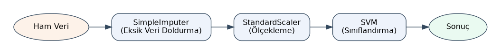

======
Giriş
======

Bu bölümde temel kavramlar açıklanmaktadır.  Derneğimizin açtığı bu kursla ilişkili kurslar şunlardır:

- **Python Programlama Dili Kursu:** Bu kurs Python Programlama Dilini kapsamlı bir biçimde öğretmeyi
  hedeflemektedir. *Python Programlama Dili* kursumuzun Dropbox bağlantısı şöyledir:

  https://www.dropbox.com/sh/hez3g36x6xa97cu/AAAJzxu2Yrza9cCcO1DJWrWia?dl=0

- **Python Uygulamaları Kursu:** Bu kurs Python Programlama Dilini bilenler için bir uygulama kursudur.
  Programlama dilinin dışındaki pek çok kütüphane ve framework'ün kullanımı bu kursun konusu içerisindedir.
  NumPy, Pandas, Matplotlib gibi yapay zeka ve makine öğrenmesinde yoğun kullanılan kütüphaneler resmi
  olarak bu kursta ele alınmaktadır. *Python Uygulamaları* kursumuzun Dropbox bağlantısı şöyledir:

  https://www.dropbox.com/sh/vylimm3evek0nnl/AABS_KdWdRMO6Xh0Fh6HT3rFa?dl=0

- **Yapay Zeka, Makine Öğrenmesi ve Veri Bilimi Kursu:** Bu kurs genel bir yapay zeka, makine öğrenmesi
  ve veri bilimi kursudur. Kurs içerisinde sinir ağları, çeşitli istatistiksel öğrenme yöntemleri ve veri
  bilimine ilişkin pek çok konu ele alınmaktadır. *Yapay Zeka, Makine Öğrenmesi ve Veri Bilimi* kursumuzun
  Dropbox bağlantısı şöyledir:

  https://www.dropbox.com/sh/xvnprjjs7w74x05/AADi9NaU4aiHYHYREwKZgIzQa?dl=0

Uygulama Dili Olarak Python
===========================

Kitabımızda programlama dili olarak Python kullanılacaktır. Python "genel amaçlı, yüksek seviyeli,
matematiksel alana yakın ve nispeten basit" bir programlama dilidir. Python "yapay zeka, makine öğrenmesi,
veri bilimi ve doğal dil işlemede" halen en çok kullanılan programlama dilidir. Python son 10 senedir bir
atak yapmış ve dünyanın en yaygın kullanılan programlama dili haline gelmiştir. Python'un neden bu kadar
popüler hale geldiği ve neden yapay zeka, makine öğrenmesi ve veri bilimi alanlarında yaygın biçimde
kullanıldığı konusundaki tespitlerimiz şöyledir:

- Python nispeten basit bir dildir. Python'un basitliği başka alanlardan gelip de ana uğraşı alanı
  programlama olmayan kişiler için uygun bir seçenek oluşturmaktadır.

- Python matematiksel ve veri işleme alanları için uygun bir tasarıma sahiptir.

- Python çeşitli yüksek seviyeli veri yapılarını bünyesinde barındırmaktadır. Python'da az tuşa basılarak
  çok şey yapmak mümkündür.

- Python'da yukarıda belirttiğimiz alanlara yönelik pek çok hazır kütüphane ve framework bulunmaktadır.
  Bu alanlardaki algoritmaları tasarlayanlar onları birincil olarak Python'da gerçekleştirmektedir.

- Python programlama dili olarak özellikle 3'lü versiyonlarla birlikte oldukça iyileştirilmiştir.

- ABD'de MIT gibi üst düzey üniversiteler belli bir süredir Python dilini *Programlamaya Giriş
  (Introduction to Programming)* gibi derslerde kullanmaya başlamıştır. Bu da dilin prestijini artırmıştır.

- Python'un geniş bir standart kütüphanesi vardır. Bu duruma Python dünyasında esprili olarak *batteries
  included* denilmektedir. Python Standart Kütüphanesi içerisinde çok çeşitli konulara yönelik büyük ölçüde
  platform bağımsız olan hazır fonksiyonlar ve sınıflar bulunmaktadır. Bu da programlamayı oldukça
  kolaylaştırmaktadır. Her ne kadar Python Standart Kütüphanesi içerisinde olmasa da NumPy gibi, Pandas
  gibi, Matplotlib gibi yardımcı kütüphaneler Python'da veri analizine ilişkin işlemleri oldukça
  kolaylaştırmaktadır.

- Python bir prototip dil olarak da kullanılmaktadır. Bir algoritma ya da uygulama *acaba oluyor mu diye*
  hızlı bir biçimde Python'da oluşturulabilmektedir. Bazı uygulamacılar ve firmalar bu prototipleri daha
  sonra C/C++, Rust, Java, C# gibi dillerde ürüne dönüştürebilmektedir.

Python Gerçekleştirimleri ve Dağıtımları
----------------------------------------

Python temel olarak yorumlayıcı tabanlı (interpretive) bir programlama dilidir. Python kodlarını çalıştıran
programlara Python dünyasında genel olarak "Python gerçekleştirimleri (Python Implementations)"
denilmektedir. Python'un sürdürümünden sorumlu olan "Python Software Foundation" kurumunun ana Python
gerçekleştirimine (buna İngilizce *reference implementation* da denilmektedir) "CPython" denilmektedir.
(CPython ismi bu yorumlayıcının C dilinde yazılmış olduğundan dolayı verilmiştir.) Python
gerçekleştirimlerinin yanı sıra birtakım araçları da bünyesinde barındıran çeşitli Python dağıtımları
oluşturulmuştur. Yapay zeka, makine öğrenmesi ve veri bilimi alanlarında en çok Anaconda isimli dağıtım
kullanılmaktadır. Biz de kursumuzda bu dağıtımı kullanacağız. Anaconda dağıtımını aşağıdaki bağlantıdan
indirebilirsiniz:

https://www.anaconda.com/download/success

Anaconda dağıtımının temel GUI arayüzü *Anaconda Navigator* denilen programdır. Anaconda Navigator
dağıtım içerisindeki çeşitli araçları bünyesinde barındıran ve bazı işlemlerin yapılmasını kolaylaştıran
yönetici bir program gibidir. Anaconda dağıtımı birincil olarak *Spyder* isimli IDE'yi kullanmaktadır.
Spyder IDE'si aslında bağımsız bir projedir. Yani bu IDE'yi Anaconda olmadan da bilgisayarınıza yükleyerek
kullanabilirsiniz. Anaconda dağıtımı kurulduğu zaman Python Standart Kütüphanesinin dışında pek çok
yardımcı kütüphane de kurulmuş olmaktadır. Yani NumPy, Pandas, Matplotlib gibi temel kütüphaneleri ayrıca
kurmaya gerek kalmamaktadır.

Python diğer bazı yüksek seviyeli diller gibi komut satırı çalışmasına da izin vermektedir. Bu tür komut
satırlı çalışmalara son zamanlarda "REPL (Read and Evaluate and Print Loop)" da denilmektedir. Bu çalışma
biçiminde bir prompt çıkar. Bu prompt'ta kullanıcı bir Python deyimi yazarak ENTER tuşuna basar. Python
yorumlayıcısı da o deyimi o anda çalıştırır ve yeniden prompt'a düşer.

CPython dağıtımında komut satırında doğrudan *python* programı çalıştırılır; ancak bir program dosyası
komut satırı argümanı olarak verilmezse komut satırına düşülmektedir. *python* programı çalıştırılırken
yanına komut satırı argümanı olarak bir kaynak dosya ismi verilirse Python yorumlayıcısı komut satırına
düşülmeden o dosya çalıştırılmaktadır. Aslında Python'da deyimleri tek tek çalıştıran başka REPL
uygulamaları da vardır. Bunların en yaygın kullanılanlarından biri *IPython* denilen uygulamadır. (Spyder
IDE'si de sağ tarafta IPython konsolunu kullanmaktadır.) IPython da aslında bağımsız olarak kurulabilen
ayrı bir uygulamadır. IPython'daki bu komut satırı süreçlerine *kernel* da denilmektedir. Spyder'daki sağ
bölmede birden fazla IPython konsolu açılabilmektedir.

Jupyter Notebook
----------------

Yapay zeka, makine öğrenmesi ve veri bilimi eğitiminde çok kullanılan *Jupyter Notebook* denilen bir araç
da vardır. Jupyter Notebook açıklama yazılarıyla Python kodlarını bir arada farklı hücrelerde
tutabilmektedir. Pek çok bulut sistemi Jupyter Notebook hizmeti de vermektedir. Ancak biz kursumuzda
çalışma hızını yavaşlattığı gerekçesiyle Jupyter Notebook kullanmayacağız. Anaconda Navigator içerisinde
Jupyter Notebook da bulunmaktadır. Jupyter Notebook artık pek çok IDE'ye de entegre edilmiştir. Örneğin
VSCode IDE'sinde bir eklenti olarak da yüklenebilmektedir.

Yaygın Kullanılan Üçüncü Parti Kütüphaneler
===========================================

Yapay zeka, makine öğrenmesi ve veri biliminde Python'un standart kütüphanesinden ziyade birtakım üçüncü
parti kütüphaneler çok daha yoğun bir biçimde kullanılmaktadır. Bu bölümde bu kütüphaneler hakkında bazı
temel bilgiler vereceğiz.

NumPy
-----

NumPy, Python'da vektörel işlemlerin yapılabilmesine olanak sağlayan en temel kütüphanelerden biridir.
NumPy sayesinde örneğin bir dizideki elemanların hepsi tek hamlede işlemlere sokulabilmekte, NumPy dizisi
çarpıldığında dizinin karşılıklı elemanları çarpılabilmektedir. Ya da örneğin bir NumPy dizisinin sinüsü
alındığında dizinin tüm elemanlarının sinüsü elde edilebilmektedir. Bu tür özelliklere sahip olan dillere
*dizisel diller (array languages)* de denilmektedir. Matlab gibi R gibi matematiksel alana yakın olan
dillerin bu biçimde vektörel işlemler yapabilme yeteneği vardır. İşte NumPy kütüphanesi Python'a bu
yeteneği kazandırmaktadır.

NumPy kütüphanesi C'de yazılmıştır. Dolayısıyla aslında bu kütüphane kullanılarak işlemler yapılırken
arka planda C'de yazılmış olan kodlar çalıştırılmaktadır. Bu durum NumPy işlemlerinin Python'un doğal
çalışmasına göre daha hızlı yapılabildiği anlamına gelmektedir.

Pandas
------

Pandas kütüphanesi NumPy kullanılarak yazılmıştır. Pandas istatistiksel veri tablolarını oluşturabilme
olanağını sunmaktadır. İstatistikte, veri biliminde ve makine öğrenmesinde her sütunu farklı türden
olabilen veri tablolarıyla çok sık karşılaşılmaktadır. Bu tür veri tablolarında satırlarda varlıklar,
sütunlarda ise onların özellikleri bulunur. Örneğin:

.. list-table:: **Örnek Veri Tablosu**
   :header-rows: 1
   :widths: 10 10 15 20

   * - Boy
     - Kilo
     - Cinsiyet
     - Tercih Edilen Renk
   * - 170
     - 68
     - Erkek
     - Mavi
   * - 165
     - 55
     - Kadın
     - Yeşil
   * - 180
     - 82
     - Erkek
     - Siyah
   * - 158
     - 52
     - Kadın
     - Mor
   * - 175
     - 74
     - Erkek
     - Gri
   * - 162
     - 58
     - Kadın
     - Kırmızı
   * - 185
     - 90
     - Erkek
     - Lacivert
   * - 168
     - 60
     - Kadın
     - Turuncu
   * - 172
     - 70
     - Erkek
     - Beyaz
   * - 160
     - 54
     - Kadın
     - Pembe

Burada sütunlar farklı türlerdendir. İşte NumPy ile böyle bir temsil oluşturulamamaktadır. Çünkü
NumPy'daki iki boyutlu dizilerin her elemanı aynı türden olmak zorundadır. İşte Pandas bizim yukarıdaki
gibi veri tablolarını oluşturmamıza olanak sağlamaktadır. Pandas'taki bu biçimde veri tablosu temsilinin
yapılmasını sağlayan sınıfa ``DataFrame`` denilmektedir. Pandas denilince akla ``DataFrame`` sınıfı gelir.
``DataFrame`` nesnelerinin sütunlarına da Pandas'ta *Series* denilmektedir. Yukarıdaki veri tablosu Pandas
kütüphanesi ile bir ``DataFrame`` olarak şöyle oluşturulabilmektedir:

.. code-block:: python

   import pandas as pd

   data = {
       "Boy": [170, 165, 180, 158, 175, 162, 185, 168, 172, 160],
       "Kilo": [68, 55, 82, 52, 74, 58, 90, 60, 70, 54],
       "Cinsiyet": [
           "Erkek", "Kadın", "Erkek", "Kadın", "Erkek",
           "Kadın", "Erkek", "Kadın", "Erkek", "Kadın"
       ],
       "Tercih Edilen Renk": [
           "Mavi", "Yeşil", "Siyah", "Mor", "Gri",
           "Kırmızı", "Lacivert", "Turuncu", "Beyaz", "Pembe"
       ]
   }
   df = pd.DataFrame(data)
   print(df)

Programın çıktısı şöyle olacaktır:

.. code-block:: text
 
      Boy  Kilo Cinsiyet Tercih Edilen Renk
   0  170    68    Erkek               Mavi
   1  165    55    Kadın              Yeşil
   2  180    82    Erkek              Siyah
   3  158    52    Kadın                Mor
   4  175    74    Erkek                Gri
   5  162    58    Kadın            Kırmızı
   6  185    90    Erkek           Lacivert
   7  168    60    Kadın            Turuncu
   8  172    70    Erkek              Beyaz
   9  160    54    Kadın              Pembe

Matplotlib
----------

Yapay zeka, makine öğrenmesi ve veri bilimi alanında görselleştirme için en yaygın kullanılan kütüphane
*Matplotlib* denilen kütüphanedir. Bu kütüphanenin yanı sıra *Seaborn* ve *Plotly* kütüphaneleri de
yaygın kullanılmaktadır. Bu alanlardaki uygulamalarda bir biçimde görselleştirmenin yapılmasına gereksinim
duyulmaktadır. Kursumuzda ağırlıklı olarak bu tür görselleştirmeler için Matplotlib kütüphanesini
kullanacağız.

Makine Öğrenmesi ve Bilimsel Hesaplama Kütüphaneleri
=====================================================

scikit-learn Kütüphanesi
-------------------------
 
Makine öğrenmesinde en çok kullanılan kütüphanelerden biri de *scikit-learn* denilen kütüphanedir. Bu kütüphane
makine öğrenmesinin *istatistiksel, olasılıksal ve matematiksel* yöntemlerine ilişkin işlemler yapan sınıfları ve
fonksiyonları barındırmaktadır. Bugün en yaygın kullanılan makine öğrenmesi teknikleri yapay sinir ağlarını
kullanmaktadır. scikit-learn ise yapay sinir ağlarına ilişkin yöntemleri içermemektedir. (scikit-learn içerisinde
ilkel düzeyde yapay sinir ağlarına yönelik birkaç sınıf bulunuyorsa da bunlar son derece yüzeyseldir.)
 
scikit-learn kütüphanesi Python'da yazılmıştır ve NumPy kütüphanesini taban kütüphane olarak kullanmaktadır. Bu
kütüphanenin diğer programlama dillerinden kullanılması doğrudan mümkün değildir. Ancak dolaylı biçimlerde -verimli
olmasa da- kullanım sağlanabilmektedir. Eskiden TensorFlow gibi, PyTorch gibi yapay sinir ağlarına ilişkin
kütüphaneler (bunlara *framework* de diyebiliriz) bazı temel işlemleri bünyesinde barındırmıyordu. Bu nedenle
scikit-learn kullanılması neredeyse zorunlu hale geliyordu. Ancak daha sonraları TensorFlow gibi PyTorch gibi yapay
sinir ağı framework'leri de scikit-learn tarafından sunulan bazı işlemleri bünyesine katmıştır. Biz kursumuzda
özellikle klasik doğal dil işleme yöntemlerinde scikit-learn kütüphanesini kullanacağız. scikit-learn Anaconda
dağıtımında default biçimde yüklü olarak bulunmaktadır. Ancak diğer ortamlar için bu kütüphaneyi şöyle
kurabilirsiniz:
 
.. code-block:: shell
 
    pip install scikit-learn
 
scikit-learn kütüphanesinde işlemler belli bir kalıba uygun bir biçimde yürütülmektedir. Buna *fit/transform/predict
kalıbı* diyebiliriz. Kütüphane büyük ölçüde nesne yönelimli biçimde tasarlanmıştır. ``fit``/``transform``/``predict``
kalıbı şöyle kullanılmaktadır:
 
1) Önce ilgili sınıf türünden bir nesne yaratılır. Yaratım sırasında ilgili konuya ilişkin çeşitli argümanlar da
   girilmektedir. Örneğin:
 
.. code-block:: python
 
    cv = CountVectorizer(...)
 
2) İlgili sınıf türünden nesne yaratıldıktan sonra eğitimin yapılması gerekir. Burada *eğitim (training)* demekle
   kullanılacak algoritmanın işletilmesi ve kestirim ya da sonuç için gereken bilgilerin elde edilerek nesnenin
   özniteliklerinde (attributes) saklanması kastedilmektedir. Örneğin doğrusal regresyon uygulamak için regresyon
   doğrusuna ilişkin (genel olarak *hyper-plane* denilmektedir) katsayıların elde edilmesi gerekir. İşte
   ``LinearRegression`` sınıfının ``fit`` metodu bu katsayıları elde edip nesnenin özniteliklerinde saklamaktadır.
   ``fit`` metoduna tipik olarak bir NumPy dizisi verilir. Ancak bu metotlar Python listeleriyle Pandas'ın
   ``Series`` nesneleriyle de çalışabilmektedir. Örneğin:
 
.. code-block:: python
 
    cv.fit(dataset)
 
``fit`` işlemiyle eğitim sonucunda elde edilen bilgiler nesnenin özniteliklerinde (attributes) saklanmaktadır.
 
3) Artık sıra sonucu elde etmeye gelmiştir. Bunun için ``transform`` metotları kullanılmaktadır. ``transform``
   metotları programcıdan dönüştürülecek verileri bir NumPy dizisi olarak (Python listeleri ve Pandas ``Series``
   nesneleri de kullanılabilmektedir) alır ve kestirimi yaparak sonucu bize verir. Sınıfların pek çoğunda (ama
   hepsinde değil) ``fit`` ve ``transform`` işlemlerini birlikte yapan ``fit_transform`` metotları da bulunmaktadır.
   (Bazı sınıflarda ``inverse_transform`` metotları da vardır. ``inverse_transform`` metotları ters işlemi
   yapmaktadır.) Örneğin:
 
.. code-block:: python
 
    transformed_dataset = cv.transform(target_dataset)
 
4) scikit-learn içerisindeki sınıfların bazıları dönüştürme, bazıları ise kestirim yapmaktadır. Dönüştürme yapan
   sınıflarda dönüştürmeler genel olarak ``transform`` isimli metotlarla, kestirim yapan sınıflarda ise kestirimler
   ``predict`` isimli metotlarla yapılmaktadır. ``predict`` metotlarına kestirilecek veriler argüman verilir,
   metotlar da sonucu bize verir. Örneğin:
 
.. code-block:: python
 
    lr = LinearRegression(...)
    lr.fit(dataset)
    predict_result = lr.predict(predict_dataset)
 
scikit-learn kütüphanesindeki ``fit``/``transform``/``predict`` kalıbı boru hattı (pipeline) mekanizmasının
uygulanmasını da mümkün hale getirmektedir. Makine öğrenmesinde *boru hattı (pipeline)* bir işlemin çıktısının
diğer işleme girdi yapılması, onun çıktısının da diğerine girdi yapılması ve böylece işlemlerin peşi sıra daha
zahmetsiz bir biçimde gerçekleştirilmesi anlamına gelmektedir. Örneğin önce ``SimpleImputer`` işlemini, onun çıktısı
üzerinde de ``StandardScaler`` işlemini yapmak isteyelim. ``StandardScaler`` işleminin çıktısını da ``SVM`` işlemine
sokmak isteyelim. Boru hattı kullanmadan bunları aşağıdaki gibi tek tek yapmak zorunda kalırız:
 
.. code-block:: python
 
    si = SimpleImputer(...)
    si_transformed = si.fit_transform(...)
 
    ss = StandardScaler(...)
    ss_transformed = ss.fit_transform(si_transformed)
 
    svm = SVM(...)
    result = svm.fit_transform(ss_transformed)
 
İşte boru hattı mekanizması sayesinde bu işlemler tek tek değil önceki çıktıyı sonraki girdiye vererek otomatik bir
biçimde de yapılabilmektedir:
 
.. code-block:: python
 
    pl = Pipeline([('Imputing', SimpleImputer(...)), ('Scaling', StandardScaler(...)), ('SVM', SVM(...))])
    result = pl.fit_transform(...)
 
Aşağıdaki şekil bu boru hattının akışını göstermektedir:
 

 
SciPy Kütüphanesi
------------------
 
Bilimsel uygulamalarda en fazla kullanılan kütüphanelerden biri de SciPy isimli kütüphanedir. SciPy temelde bir
nümerik analiz kütüphanesidir. Bu kütüphane pek çok matematiksel işlem yapan sınıflara ve fonksiyonlara sahiptir.
Örneğin bir fonksiyonun maksimum ve minimum noktalarının elde edilmesi gibi, bir fonksiyonun belli bir noktadaki
türevinin elde edilmesi gibi, bir denklemin köklerinin bulunması gibi işlemler SciPy kütüphanesiyle
yapılabilmektedir. SciPy lineer cebir ve istatistik paketlerine de sahiptir. Örneğin SciPy ile doğrusal denklem
sistemleri çözülebilmekte, bazı istatistiksel hipotez testleri gerçekleştirilebilmektedir.
 
Anaconda dağıtımında SciPy kütüphanesi de yüklü olarak gelmektedir. Ancak diğer ortamlara kütüphaneyi şöyle
kurabilirsiniz:
 
.. code-block:: shell
 
    pip install scipy
 
SciPy taban kütüphane olarak NumPy kütüphanesini kullanmaktadır.
 
TensorFlow, PyTorch ve Keras
-----------------------------
 
Yapay sinir ağlarına ilişkin iki taban (base) kütüphane yaygın olarak kullanılmaktadır: TensorFlow ve PyTorch.
TensorFlow kütüphanesi Google kökenli, PyTorch ise Meta (Facebook) kökenlidir. Eskiden TensorFlow en yoğun
kullanılan kütüphaneydi. Ancak son yıllarda PyTorch kütüphanesini tercih edenler TensorFlow kütüphanesini tercih
edenlerden fazla hale gelmiştir. Bunların yanı sıra eskiden Theano isimli bir kütüphane de özellikle akademik
çevreler tarafından kullanılıyordu. Ancak 2017 yılından beri bu kütüphanenin geliştirilmesi durdurulmuştur.
 
TensorFlow ve PyTorch için *kütüphane* yerine *framework* terimi de kullanılabilmektedir. Bir yazılımsal araca
*framework* denilebilmesi için onun *akışı bazen programcıdan alıp, gerektiğinde programcının belirlediği
fonksiyonları çağırabilmesi (inversion of control)* gerekmektedir. Bu açıdan bakıldığında TensorFlow ve PyTorch
için *framework* nitelemesi de yapılabilir. Ancak biz kursumuzda bunlara framework yerine kütüphane demeyi tercih
edeceğiz.
 
TensorFlow ve PyTorch kütüphaneleri (ya da framework'leri) eskiden yalnızca yapay sinir ağlarına ilişkin temel
işlemleri barındırıyordu. Yani bunlar aşağı seviyeli kütüphanelerdi. Ancak zamanla bu kütüphaneler gelişti ve
yüksek seviyeli katmanlara da sahip olmaya başladı. Örneğin yüksek seviyeli yapay sinir ağları işlemlerini yapmak
için tasarlanmış olan Keras isimli bir kütüphane bulunmaktadır. Keras başlangıçta bağımsız bir kütüphaneydi. Ancak
daha sonraları TensorFlow bünyesine katıldı. Biz kursumuzda yettiği sürece bu Keras kütüphanesini kullanacağız.
PyTorch'a da zamanla Keras gibi yüksek seviyeli katmanlar eklenmiştir.
 
Doğal Dil İşlemede Kullanılan Diğer Kütüphaneler
-------------------------------------------------

Yukarıda açıkladığımız kütüphaneler belli bir süredir var olan temel kütüphanelerdir. Doğal dil işlemede kullanılan
bu kursta da kullanacağımız alçak seviyeli ve yüksek seviyeli pek çok kütüphane de bulunmaktadır. Bu kütüphanelerin
bir bölümü klasik doğal dil işleme işlemlerine yöneliktir. Diğer bölümü ise *dönüştürücüler (transformer)* sonrası
modern doğal dil işleme süreçleriyle ilgilidir. Biz zaten kursumuzda yeri geldikçe bu kütüphaneleri tanıtarak
kullanacağız.
 
Doğal Dil İşlemede Veri Formatları
===================================
 
Doğal dil işlemede veriler genel olarak yazılar biçimindedir. Yazılara ilişkin veri kümeleri için CSV formatı uygun
bir format değildir. (Örneğin CSV formatında sütunlar virgüllerle birbirinden ayrılmaktadır. Ancak yazılarda zaten
virgül yazının içerisinde oldukça fazla bulunabilen bir karakterdir.)
 
Yazısal veri kümeleri çoğu kez doğrudan *düz metin dosyaları (pure text file)* biçiminde karşımıza çıkmaktadır. Düz
metin dosyası demekle *içerisinde hiçbir formatlama bilgisinin bulunmadığı, yalnızca yazıların karakterlerinin
bulunduğu dosyaları* kastediyoruz. Bu dosyalara genellikle ``.txt`` uzantısı verilmektedir. Bazı metin dosyalarının
içerisinde formatlama bilgileri de (örneğin yazıların renklerine ilişkin, bold'luk durumuna ilişkin bilgiler gibi)
bulunabilmektedir. Ancak bu bilgiler dosyanın içerisinde binary biçimde değil yine yazısal biçimde
bulundurulmaktadır. Bu tür dosyalara genel olarak *zengin metin dosyaları (rich text files)* denilmektedir.
Örneğin Microsoft'un ``.rtf`` uzantılı dosyaları, ``.md`` uzantılı markup dosyaları, ``.xml`` uzantılı XML
dosyaları bu bağlamda zengin metin dosyaları durumundadır. Ancak doğal dil işlemede zengin metin dosyaları yerine
genellikle (ama her zaman değil) düz metin dosyaları kullanılmaktadır.
 
Doğal dil işlemede yazılar metin dosyalarının yanı sıra veritabanlarının içerisinde de bulunabilmektedir. Doğal dil
işlemede yüksek miktardaki verileri depolamak için *Parquet* (*parke:* biçiminde okunuyor) *HDF (Hierarchical File
Format)* formatları da kullanılabilmektedir. Bazı doğal dil işleme uygulamalarında yazısal veriler web
sayfalarından da çekilip kullanıma hazır hale getirilebilmektedir. Web sayfasından bilgilerin elde edilmesine
İngilizce *web scraping* denilmektedir. (*Scrape* sözcüğü *kazımak, kazıyarak elde etmek* gibi anlamlara
gelmektedir.)
 
Doğal dil işlemede en çok kullanılan formatlardan biri de JSON (Java Script Object Notation) denilen formattır.
JSON formatı adeta Python'daki sözlük nesnelerinin temsiline benzemektedir. JSON düz metinsel bir biçime sahiptir.
Dolayısıyla ayrıca sıkıştırılmamışsa JSON dosyaları büyük yer kaplama eğilimindedir.
 
Düzenli İfadeler (Regular Expressions)
=======================================
 
Giriş
------
 
Yukarıda da belirttiğimiz gibi doğal dil işlemede Python'un standart kütüphanesinin yanı sıra pek çok özel
kütüphaneden de faydalanılmaktadır. Python'un standart kütüphanesinde doğal dil işlemede faydalanabileceğimiz
çeşitli modüller bulunmaktadır. Örneğin *düzenli ifadeler (regular expressions)* doğal dil işlemede yaygın biçimde
kullanılmaktadır. Özellikle aşağı seviyeli önişlem faaliyetlerinde düzenli ifadelerden sıkça faydalanılmaktadır.
Düzenli ifadeler *Python Uygulamaları* kursumuzda ele alınan bir konudur. Ancak burada kısaca bu konunun üzerinde
durmak istiyoruz.
 
Düzenli ifadeler (regular expressions, kısaca *regex* de denilmektedir) belli bir kalıba ilişkin yazı parçalarının
elde edilmesi amacıyla kullanılan mini bir dildir. Bu dilin de sentaks ve semantik kuralları vardır. Regex dilinde
kalıp oluşturulur. Sonra oluşturulan kalıp ismine *düzenli ifade motoru (regular expression engine)* denilen
motora verilir. Motor da kalıba uygun parçaları elde ederek birtakım işlemler yapar. Örneğin biz bir metin
içerisindeki ``dd/aa/yyyy`` gibi bir kalıba uygun tüm tarihleri bulmak isteyebiliriz. Ya da örneğin biz bir
metindeki sözcükleri bulmak isteyebiliriz. Düzenli ifadeler bu tür işlemlerin kolay yapılmasını sağlamaktadır. Pek
çok programlama dilinde düzenli ifadeler üzerinde işlemler yapan sınıflar ve fonksiyonlar onların standart
kütüphaneleri içerisinde bulunmaktadır. Hatta Ruby gibi Perl gibi dillerde düzenli ifadeler sentaks bakımından
dilin kendi içerisinde built-in bir biçimde desteklenmektedir. Python Standart Kütüphanesinde de düzenli
ifadelerle işlemler ``re`` isimli modülün içerisindeki fonksiyonlar ve sınıflarla yapılmaktadır.
 
Burada kısaca düzenli ifadelerle nasıl kalıp oluşturulacağından bahsedeceğiz. Konunun ayrıntıları için
*Python Uygulamaları* kursumuza ilişkin kurs notlarını gözden geçirebilirsiniz. Python Standart Kütüphanesindeki
düzenli ifadelerle ilgili ``re`` modülünün dokümantasyonuna aşağıdaki bağlantıdan erişebilirsiniz:
 
https://docs.python.org/3/library/re.html
 
Düzenli ifadeler ile ilgili denemeler yapmak için https://regex101.com/ sitesinden faydalanabilirsiniz.
 
Eskiden text editörlerin ve kelime işlem programlarının düzenli ifadelerle işlem yapma özellikleri yoktu. Zamanla
bu özellikler pek çok text editöre ve kelime işlem programına eklendi. Bugün Microsoft Word gibi kelime
işlemciler, Visual Studio, VSCode gibi IDE'ler ve editörler düzenli ifadelerle işlemlerin yapılmasına olanak
sağlamaktadır.
 
Kalıp Oluşturma Kuralları
--------------------------
 
Düzenli ifadeler bir metin içerisindeki belli bir kalıba uygun yazı parçalarını elde etmek ve onlar üzerinde
işlemler yapabilmek için tasarlanmış olan mini bir dildir. Metin içerisindeki yazı parçaları kalıplar
oluşturularak elde edilmektedir. Düzenli ifadelerdeki kalıplarda iki tür karakter kullanılmaktadır: Normal
karakterler ve meta karakterler. Normal karakterler kalıpta bulunması istenen gerçek karakterlerdir. Meta
karakterler ise *özel anlam ifade eden* karakterlerdir. Örneğin ``.`` karakteri bir meta karakterdir. Bu karakteri
biz bir kalıp içerisinde kullandığımızda bu nokta karakteri anlamına gelmez, ``\n`` dışındaki herhangi bir karakter
anlamına gelir. Eğer meta karakterlerin normal karakterler olarak ele alınması isteniyorsa onun soluna yapışık bir
ters bölü karakteri getirilmelidir. Örneğin ``.abc`` kalıbındaki ``.`` *burada herhangi bir karakter bulunabilir*
anlamına gelmektedir. Eğer biz bu kalıpta gerçekten nokta karakterini belirtmek istiyorsak kalıbı ``\.abc``
biçiminde yazmalıyız.
 
Düzenli ifadeler dili maalesef standart hale getirilememiştir. Dolayısıyla ana hatları aynı olmak üzere düzenli
ifadeler üzerinde işlem yapan motorlar arasında da küçük farklılıklar söz konusu olabilmektedir.
 
Düzenli ifadelere ilişkin kalıp oluşturma kuralları özet olarak şöyledir: (Örneklerimizde kalıp olarak verilen
yazılar bir Python string'i olarak değerlendirilmemelidir. Yani örneğin biz ``ka\.`` biçiminde bir kalıp
yazdığımızda buradaki ters bölü gerçekten ters bölü karakteridir. Bilindiği gibi Python'da ters bölü
karakterlerinin gerçek ters bölü karakteri olarak ele alınması için string'e yapışık ``r`` ya da ``R`` harfi
getirilmektedir.)
 
- Nokta bir meta karakterdir, bu karakter *\\n (new line) dışındaki herhangi bir karakter* anlamına gelir. Örneğin
  ``al.`` kalıbı ``al`` ile başlayan ve üçüncü karakteri herhangi bir karakter olan üç karakteri belirtir.
  Dolayısıyla ``al.`` kalıbı ``ali`` ile de uyuşabilir, ``alm`` ile de uyuşabilir, ``alr`` ile de uyuşabilir.
  (Burada uyuşmak İngilizce *match* sözcüğünün karşılığı olarak kullanılmaktadır.)
 
- ``*`` meta karakteri *solundaki karakterden sıfır tane ya da daha fazla* anlamına gelmektedir. Bu durumda
  örneğin ``ka*`` kalıbı ``k`` ile, ``ka`` ile, ``kaa`` ile, ``kaaa`` ile, ``kaaaaa`` ile uyuşur. Örneğin ``k.*``
  kalıbı başı ``k`` ile başlayan satır sonuna kadar tüm karakterle uyuşur. Nokta meta karakterinin ``\n``
  karakterini içermediğine dikkat ediniz. Bu durumda ``k.*`` kalıbı satır sonunda etkisini kaybedecektir.
 
- ``+`` meta karakteri *solundaki karakterden bir ya da daha fazlasını* belirtir. ``*`` ile ``+`` meta
  karakterlerini birbirine karıştırmayınız. ``*`` solundaki karakterden sıfır tane ya da çok tane ile uyuşurken,
  ``+`` solundaki karakterden bir tane ya da çok taneyle uyuşmaktadır. Örneğin ``ka+`` kalıbı ``k`` ile uyuşmaz.
  Ancak ``ka`` ile, ``kaaaa`` ile uyuşur. Fakat ``ka*`` kalıbı ``k`` ile, ``ka`` ile, ``kaaaa`` ile uyuşur.
 
- ``?`` meta karakteri *solundaki karakterden 0 tane ya da 1 tane* anlamına gelmektedir. Örneğin ``ab?c`` kalıbı
  ``ac`` ile uyuşur, ``abc`` ile de uyuşur ancak örneğin ``abbc`` ile uyuşmaz.
 
- Yukarıda da belirttiğimiz gibi bir meta karakter normal karakter olarak kullanılacaksa ters bölülenmelidir.
  Örneğin ``ka\.`` gibi bir kalıp ``ka.`` ile uyuşur. ``kal`` ile ve ``kar`` ile uyuşmaz. Tabii ters bölünün
  kendisi için de ``\\`` kullanılmalıdır. Eğer ``\`` karakterinin sağındaki karakter özel bir ters bölü karakteri
  değilse ve bir meta karakter de değilse ifade geçersizdir.
 
- Köşeli parantezler birer meta karakterdir. *İçerisindeki karakterlerin herhangi biri* anlamına gelir. Örneğin
  ``[abc]+`` kalıbı ``abcaaaabc`` ile ya da ``aaaabbbbbcccbcbcbca`` ile uyuşur. ``a[bcd]?`` kalıbı ``a`` ile,
  ``ab`` ile, ``ac`` ile, ``ad`` ile uyuşur.
 
- Köşeli parantez içerisinde ``-`` karakteri kullanılırsa bu *solundaki karakterden sağındaki karaktere kadar
  herhangi biri* anlamına gelir. Örneğin ``[a-z]+`` kalıbı ``ali`` ile, ``veli`` ile, ``selami`` ile uyuşur.
  Örneğin ``[a-zA-Z]+`` kalıbı sözcükleri bulmak için kullanılabilir. Ancak default durumda Türkçe karakter
  bulunamayacaktır. Python'un ``re`` modülündeki fonksiyonların lokale özgü (locale specific) davranışı ``flags``
  parametresi ile ayarlanabilmektedir. Normal olarak ``-`` karakteri bir meta karakter değildir. Ancak köşeli
  parantezler içerisindeki ``-`` karakteri bir meta karakter olarak ele alınmaktadır. (Bir istisna olarak köşeli
  parantezler içerisinde ``-`` karakteri son karakter olarak bulunuyorsa meta karakter olarak ele
  alınmamaktadır.) Tabii köşeli parantezler meta karakter olduğu için gerçekten köşeli parantezleri arayacaksak
  ters bölülemek gerekir. Örneğin amacımız köşeli parantezlerin kendisini aramak ise ``\[.*\]`` kalıbını
  kullanabiliriz.
 
- Köşeli parantezin başında ``^`` karakteri varsa bu durum *köşeli parantezin içerisindeki karakterlerden biri
  olmayan herhangi bir karakter* anlamına gelir. Örneğin ``[^abc]`` kalıbı ``a`` ya da ``b`` ya da ``c`` olmayan
  herhangi bir karakter anlamına gelmektedir.
 
- Düzenli ifadelerde uyum sağlayan en uzun karakter kümesi elde edilmektedir. Örneğin ``abcabxyz`` gibi bir
  yazıda ``[abc]+`` kalıbı ``abc`` ve ``ab`` ile uyuşacaktır.
 
- Küme parantez kalıbı dört biçimde kullanılabilir: ``{n}``, ``{n,k}`` ve ``{n,}``, ``{,n}``. ``{n}`` kalıbı
  *solundaki karakterden tam olarak n tane* anlamına gelmektedir. Örneğin ``a{3}`` kalıbı ``aaa`` ile uyuşur.
  Eğer yazıda ``aaaaaaaa`` biçiminde a varsa bu kalıp bunun ilk 3 tanesi ile uyuşum sağlayacaktır. ``{n,k}``
  kalıbı *solundaki karakterden n ile k arasında herhangi tane (n ve k dahil)* anlamına gelmektedir. Örneğin
  ``a{3,5}`` kalıbı ``aaa`` ile uyuşur, ``aaaa`` ile uyuşur, ``aaaaa`` ile uyuşur. Ancak örneğin ``aa`` ile
  uyuşmaz. ``aaaaaaaaaa`` daki ilk 5 a ile uyuşur. ``{n,}`` kalıbı *solundaki karakterden en az n tane* anlamına
  gelmektedir. ``{,n}`` kalıbı ise *solundaki karakterden en fazla n tane* anlamına gelmektedir. Örneğin
  ``a{,5}`` kalıbı *en fazla 5 tane a ile uyuşum sağlar*. Bu durumda 0 tane a ile de uyuşum sağlanır. Normal
  olarak küme parantezlerinin içinde boşluk karakterleri bir soruna yol açmamaktadır. Yani örneğin ``a{3,5}``
  kalıbını ``a{3, 5}`` biçiminde yazsak da bir sorun oluşmaz. Ancak siz küme parantezlerinin içerisinde SPACE
  karakteri kullanmayınız.
 
- Köşeli parantezlerin dışındaki ``^`` meta karakteri *yalnızca satırın başını* dikkate alır. Örneğin ``^a+``
  kalıbı yazının başındaki a'larla uyuşur. Örneğin ``^[0-9]+`` kalıbı yazının başındaki sayıları bulmaktadır.
 
- ``$`` meta karakteri yazının sonunu temsil etmektedir. Örneğin ``abc$`` kalıbı satırın sonundaki ``abc`` ile
  uyuşur. Örneğin ``[0-9]+$`` kalıbı yazının sonundaki sayıları bulur.
 
- ``\w`` meta karakteri *herhangi bir alfabetik, nümerik ya da alt çizgi karakteri* anlamına gelmektedir. Default
  durumda bu kalıp ``[a-zA-Z_0-9]`` ile eşdeğerdir. Yani Türkçe karakterler kalıba dahil değildir. Ancak pek çok
  regex kütüphanesinde bir lokal ayarı yapılabilmektedir. Eğer regex ortamı izin veriyorsa bu ayar yapılarak bu
  kalıba Türkçe karakterler de dahil edilebilir. Tabii Türkçe karakterleri dahil edecek biçimde kalıp manuel
  olarak ``[\wşçğüöıŞÇĞÜÖİ]`` biçiminde de oluşturulabilir. Düzenli ifade motorlarının ``UNICODE`` seçeneği de
  bulunabilmektedir. Bu seçenek aktif hale getirildiğinde artık ``\w`` kalıbı UNICODE tablodaki tüm alfabetik
  karakterleri kapsar hale gelmektedir. Yani UNICODE ayarı adeta *tüm lokalleri içerir* anlamına gelmektedir.
  ``\w+`` kalıbı sözcükleri bulmak için sık sık kullanılan bir kalıptır.
 
  ``\W`` meta karakteri ise *herhangi bir alfabetik, nümerik karakter ya da alt çizginin dışındaki karakter*
  anlamına gelir. Yani ``\w`` meta karakterinin tersini belirtir.
 
- ``\s`` meta karakteri *herhangi bir boşluk karakteri (white space)* anlamına gelmektedir. Benzer biçimde
  ``\S`` meta karakteri ise *herhangi bir boşluk karakteri dışındaki karakter* anlamına gelir.
 
- ``\d`` kalıbı *sayısal olan karakterlerden herhangi biri*, ``\D`` kalıbı ise *sayısal olmayan karakterlerden
  herhangi biri* anlamına gelmektedir. Örneğin ``\d+`` kalıbı ile sayıları bulabiliriz. O halde örneğin
  ``[\-+]?\d+`` kalıbı tamsayıları bulabilir. Noktalı sayıları da bulabilen kalıp ``[\-+]?\d*\.?\d+`` biçiminde
  olabilir.
 
- ``\b`` meta karakteri *sözcük başları* anlamına gelmektedir. Örneğin ``\ba+`` gibi bir kalıp ``a`` ile başlayan
  sözcüklerle uyuşur.
 
- Parantezler gruplama için kullanılmaktadır. Örneğin ``(abc)+`` kalıbı ile ``abc`` uyuşur, ``abcabc`` uyuşur,
  ``abcabcabc`` uyuşur. Ancak örneğin ``abab`` uyuşmaz.
 
- ``|`` karakteri *veya* anlamına gelmektedir. Örneğin ``ali|veli`` kalıbı ``ali`` ya da ``veli`` ile
  uyuşabilmektedir. Buradaki ``|`` karakterinin düşük öncelikli olduğuna dikkat ediniz. Örneğin ``a+|b+`` kalıbı
  bir ya da daha fazla a ile bir ya da daha fazla b ile uyuşur.
 
Çok kullanılan bazı kalıpları aşağıda veriyoruz:
 
- E-Posta kalıbı: ``[A-Za-z0-9._%+-]+@[A-Za-z0-9.-]+\.[A-Za-z]{2,}``
- Noktalı sayı kalıbı: ``[+-]?[0-9]+\.[0-9]+|\.[0-9]+|[0-9]+\.``
- Tamsayı kalıbı: ``[+-]?[0-9]+``
- Değişken atomu kalıbı: ``[_a-z-A-Z][_a-zA-Z-0-9]+``
- day/month/year tarih kalıbı: ``(0?[1-9]|1[0-2])\/(0?[1-9]|1\d|2\d|3[01])\/(19|20)\d{2}``
- dd/mm/yyyy tarih kalıbı: ``(0[1-9]|1\d|2\d|3[01])\/(0[1-9]|1[0-2])\/(19|20)\d{2}``
- IPV4 adresi kalıbı: ``([0-9]{1,3}\.){3}[0-9]{1,3}``
 
Her türlü ayrıştırma işlemi düzenli ifadelerle yapılamayabilmektedir. Bu tür durumlarda belli noktaya kadar
düzenli ifadeleri kullanıp sonra manuel kontrollerle hedefinize ulaşabilirsiniz. Örneğin bir programlama
dilindeki programı atomlarına ayırmak için düzenli ifadeler yeterli olmayabilir. Yani düzenli ifadeler bizim
ayrıştırma ve bulma işlemlerimizde tüm isteklerimizi yerine getiremeyebilmektedir.
 
Python'da Düzenli İfadeler: ``re`` Modülü
------------------------------------------
 
Python'da düzenli ifadelerle işlemler ``re`` modülündeki fonksiyonlar ve sınıflarla yapılmaktadır. ``re``
modülündeki fonksiyonlar genel olarak önce kalıp yazısını sonra da asıl yazıyı parametre olarak alırlar. Yine
modüldeki fonksiyonların son parametreleri düzenli ifadeler üzerindeki bazı seçenekleri belirtmektedir. Bu
parametre ``flags`` olarak isimlendirilmiştir. Programcının kalıp yazısını oluştururken string'i ``r`` ya da
``R`` öneki ile oluşturması ``\`` karakterlerinin gerçekten ters bölü karakteri olarak ele alınmasını garanti
edecektir.
 
``findall`` Fonksiyonu
^^^^^^^^^^^^^^^^^^^^^^^
 
``re`` modülündeki ``findall`` isimli fonksiyon yazıdaki regex kalıbına uyan tüm parçaları bir liste olarak bize
vermektedir. ``findall`` fonksiyonunun parametrik yapısı şöyledir:
 
.. code-block:: python
 
    findall(pattern, string, flags=0)
 
Örneğin:
 
.. code-block:: python
 
    import re
 
    text = 'ali veli 123 selami 628 ayşe fatma 876'
    pattern = r'\d+'
 
    result = re.findall(pattern, text)
    print(result)
 
    numbers = list(map(int, result))
    print(numbers)
 
Bu program çalıştırıldığında aşağıdaki gibi bir çıktı elde edilecektir:
 
.. code-block:: text
 
    ['123', '628', '876']
    [123, 628, 876]
 
Burada görüldüğü gibi ``findall`` fonksiyonuna önce kalıp yazısı sonra da asıl yazı argüman olarak
geçirilmiştir. ``flags`` parametresi default değer aldığı için hiç kullanılmamıştır.
 
``findall`` fonksiyonu parantezli grupları da ayırıp onları birer demet olarak da vermektedir. İzleyen
paragraflarda gruplama konusu üzerinde de duracağız.
 
Aşağıda ``findall`` fonksiyonu ile tarihlerin elde edilmesine yönelik bir örnek verilmiştir.
 
.. code-block:: python
 
    import re
 
    text = 'ali veli 10/12/2009 selami 05/07/1998 ayşe fatma 23/11/2014'
    pattern = r'\d\d/\d\d/\d\d\d\d'
 
    result = re.findall(pattern, text)
    print(result)
 
Bu program çalıştırıldığında aşağıdaki gibi bir çıktı elde edilecektir:
 
.. code-block:: text
 
    ['10/12/2009', '05/07/1998', '23/11/2014']
 
Aşağıda ``findall`` fonksiyonu ile bir yazıdaki e-posta adreslerinin bulunmasına örnek verilmiştir.
 
.. code-block:: python
 
    import re
 
    text = """bana e-posta atabilirsin. E-posta adresim aslank@csystem.org.
    Eğer bana ulaşamazsan info@csystem.org'ye de e-posta gönderebilirsin.
    """
    pattern = r'[A-Za-z0-9._%+-]+@[A-Za-z0-9.-]+\.[A-Za-z]{2,}'
 
    result = re.findall(pattern, text)
    print(result)
 
Bu program çalıştırıldığında aşağıdaki gibi bir çıktı elde edilecektir:
 
.. code-block:: text
 
    ['aslank@csystem.org', 'info@csystem.org']
 
``split`` Fonksiyonu
^^^^^^^^^^^^^^^^^^^^^

``re`` modülündeki ``split`` fonksiyonu ``str`` sınıfının ``split`` metodundan çok daha güçlü bir biçimde
ayrıştırma yapabilmektedir. Bu fonksiyon bir regex kalıbını ayıraç olarak kabul ederek yazıyı parçalarına ayırır.
``split`` fonksiyonunda verilen kalıp ayıraçları belirtmektedir. Fonksiyon bu ayıraçları diğer yazının
parçalarını ayırmak için kullanacaktır. Fonksiyonun parametrik yapısı şöyledir:
 
.. code-block:: python
 
    split(pattern, string, maxsplit=0, flags=0)
 
``split`` fonksiyonu her kalıba uygun ayıracı bulduğunda onun solundaki ve sağındaki yazı parçasını elde eder.
Eğer yazının başında ve sonunda ayıraç kalıbı varsa ``split`` bu ayıraç kalıbının solunda ve sağında bir yazı
olmadığı için boş string oluşturmaktadır. Örneğin:
 
.. code-block:: python
 
    text = '   ,,ali,,,  veli,,   selami   '
    pattern = "[ ,]+"
    result = re.split(pattern, text)
    print(result)
 
Burada yazının başı ayraçlarla başlamıştır. O halde yazının başında bir tane boş string bulunacaktır. Yazının
sonu da ayraçlarla bitmiştir, o halde yazının sonunda da boş string bulunacaktır. Bu kod parçası çalıştırıldığında
ekrana şunlar basılacaktır:
 
.. code-block:: text
 
    ['', 'ali', 'veli', 'selami', '']
 
``search`` Fonksiyonu ve ``Match`` Nesnesi
^^^^^^^^^^^^^^^^^^^^^^^^^^^^^^^^^^^^^^^^^^^
 
``re`` modülündeki ``search`` fonksiyonu yazı içerisinde bir regex kalıbını arar. Eğer bulursa ilk bulduğu kalıba
ilişkin ``re`` modülündeki ``Match`` türünden bir sınıf nesnesiyle geri döner. Fonksiyonun parametrik yapısı
şöyledir:
 
.. code-block:: python
 
    re.search(pattern, string, flags=0)
 
Yine fonksiyonun birinci parametresi aranacak kalıbı, ikinci parametresi aramanın yapılacağı yazıyı
belirtmektedir. Fonksiyon başarı durumunda ``Match`` nesnesine, başarısızlık durumunda ``None`` değerine geri
dönmektedir.
 
``Match`` sınıfının ``start`` metodu kalıbın bulunduğu karakterin başlangıç index numarasını, ``end`` metodu ise
bitiş index numarasının bir fazlasını vermektedir. Böylece biz dilimleme yoluyla bulunan kalıbı elde edebiliriz.
Örneğin:
 
.. code-block:: python
 
    text = ',,,ali, veli, selami'
    pattern = r'\w+'
    m = re.search(pattern, text)
 
Burada ilk uyuşumu yazı içerisindeki ``ali`` karakterleri sağlamaktadır. Ancak ``search`` bize ``ali`` yazısını
değil bir ``Match`` türünden bir nesne vermektedir. Bu ``Match`` nesnesinin ``start`` metodu kalıbın yazı
içerisindeki başlangıç index numarasını, ``end`` metodu ise bitiş indeks numarasından bir sonraki indeks
numarasını verir. Dolayısıyla biz bu aralığı dilimlemede kullanabiliriz. Örneğin:
 
.. code-block:: python
 
    if m:
        print(m.start(), m.end())
        print(text[m.start():m.end()])
 
.. code-block:: python
 
    import re
 
    text = 'my email addres is aslank@csystem.org but your email address is serce@csystem.com'
    pattern = r'[a-zA-Z0-9+_.-]+@[a-zA-Z0-9.-]+'
 
    m = re.search(pattern, text)
    if m:
        result = text[m.start():m.end()]
        print(result)
    else:
        print('cannot find match!..')
 
Bu program çalıştırıldığında aşağıdaki gibi bir çıktı elde edilecektir:
 
.. code-block:: text
 
    aslank@csystem.org
 
Gruplama (``group``)
^^^^^^^^^^^^^^^^^^^^^
 
Bir kalıp parantezler kullanılarak oluşturulmuşsa kalıbın içerisindeki parantezli kısımlara *grup (group)*
denilmektedir. ``search`` fonksiyonu yalnızca ana kalıbı değil parantezler içerisindeki grupları da
bulabilmektedir. Örneğin şöyle bir kalıp olsun: ``(\d+)@(\d+)``. ``123@456`` gibi karakter öbeği bu kalıp ile
uyuşmaktadır. İşte biz ``Match`` nesnesi ile uyuşan kısmı bir bütün olarak elde edebileceğimiz gibi bunun ``123``
ve ``456``'dan oluşan gruplarını da elde edebilmekteyiz.
 
``Match`` sınıfının ``group`` metodu regex kalıbındaki grupları bize vermektedir. ``group`` metodu grubun
numarasını parametre olarak alır. Grup numaraları 1'den başlamaktadır. 0'ıncı grup numarası kalıbın tamamını
belirtir. ``group`` metodu ile ``Match`` sınıfının ``[]`` operatör metodu aynı işlemi yapmaktadır. Örneğin:
 
.. code-block:: python
 
    text = 'ali 123@567 veli 135@854 selami'
    pattern = r'(\d+)@(\d+)'
    m = re.search(pattern, text)
 
Buradaki kalıp sayı@sayı biçimindeki karakterle uyuşur. Ancak bu kalıpta @ karakterinin iki yanı birer grup
biçiminde oluşturulmuştur. Bu sayede biz hem uyuşan kalıbın tamamını elde edebiliriz hem de onun parçalarını
elde edebiliriz. Buradaki örnekte ``search`` ilk uyuşan kalıbı, yani ``123@567`` karakterini bulacak ve bize
bunu bir ``Match`` nesnesi biçiminde verecektir. Bu ``Match`` nesnesinin 1'inci grubu ``123`` yazısından,
2'inci grubu ``567`` yazısından oluşacaktır. İşte biz ``m[1]`` ya da ``m.group(1)`` ifadesiyle 1'inci grubu,
``m[2]`` ya da ``m.group(2)`` ifadesiyle de 2'inci grubu elde edebiliriz. ``m[0]`` ya da ``m.group(0)`` ifadesi
ile de biz tüm kalıba erişebiliriz. İster gruplu bir kalıp olsun isterse grupsuz bir kalıp olsun ``m[0]`` her
zaman uyuşan kalıbı vermektedir. ``Match`` sınıfının ``string`` örnek özniteliği bize ``search`` fonksiyonunun
çağrılmasında kullanılan asıl yazıyı da vermektedir.
 
.. code-block:: python
 
    import re
 
    text = 'ali veli selami 123@789 ayşe fatma'
    pattern = r'(\d+)@(\d+)'
 
    m = re.search(pattern, text)
    if m:
        print(m[0])
        print(m[1])
        print(m[2])
    else:
        print('kalıp bulunamadı!..')
 
Bu program çalıştırıldığında aşağıdaki gibi bir çıktı elde edilecektir:
 
.. code-block:: text
 
    123@789
    123
    789
 
Aslında daha önce görmüş olduğumuz ``findall`` metodu da grupla çalışmaktadır. Eğer kalıpta parantezler varsa
``findall`` bu grupları bir demet listesi olarak bize vermektedir. Örneğin:
 
.. code-block:: python
 
    import re
 
    text = 'ali veli selami 123@789 ayşe fatma 478@456'
    pattern = r'(\d+)@(\d+)'
 
    result = re.findall(pattern, text)
    print(result)
 
Bu program çalıştırıldığında aşağıdaki gibi bir çıktı elde edilecektir:
 
.. code-block:: text
 
    [('123', '789'), ('478', '456')]
 
Ancak kalıpta tek bir grup varsa ``findall`` bize bunları tek elemanlı demet listesi olarak değil düz bir liste
olarak verir.
 
Gruplama hem bir kalıbın bulunmasına hem de o kalıp içerisindeki bir parçanın elde edilmesine olanak
sağlamaktadır. Örneğin birisi bize yazıdaki tek tırnak içerisinde bulunan isimleri elde etmemizi istesin. Yazı
aşağıdaki gibi olsun:
 
.. code-block:: python
 
    text = "ali veli 'selami' ayşe 'fatma' hasan"
 
Burada bizden tüm isimlerin değil 'selami' ve 'fatma' isimlerinin bulunması istenmektedir. Kalıbı aşağıdaki gibi
oluşturmuş olalım:
 
.. code-block:: python
 
    pattern = r"'\w+'"
 
Bu kalıpla biz tek tırnak içerisindeki isimleri tek tırnaklarıyla buluruz. Halbuki bizden tek tırnak içerisindeki
isimlerin tırnaksız bir biçimde bulunması istenmiştir. Tabii biz bu isimleri tırnaklı bulduktan sonra bu
tırnakları atabiliriz. Ancak bu da ek bir çaba gerektirir. İşte bu tür durumlarda gruplama pratik çözüm
oluşturmaktadır. Örneğin:
 
.. code-block:: python
 
    pattern = r"'(\w+)'"
    result = re.findall(pattern, text)
    print(result)
 
Bu program çalıştırıldığında aşağıdaki gibi bir çıktı elde edilecektir:
 
.. code-block:: text
 
    ['selami', 'fatma']
 
``match`` Fonksiyonu
^^^^^^^^^^^^^^^^^^^^^
 
``re`` modülündeki ``match`` fonksiyonu ``search`` fonksiyonu gibidir. Yani yine aranan kalıba ilişkin ``Match``
nesnesini verir. Ancak kalıbın yazının başında olması gerekir. Yani bu fonksiyon her zaman kalıp sanki yazının
başındaymış gibi arama yapmaktadır. Aşağıdaki örnekte uyuşum sağlanamayacaktır.
 
.. code-block:: python
 
    import re
 
    text = 'ali veli selami 123@789 ayşe fatma 478@456'
    pattern = r'(\d+)@(\d+)'
 
    m = re.match(pattern, text)
    print(m)
 
Bu program çalıştırıldığında aşağıdaki gibi bir çıktı elde edilecektir:
 
.. code-block:: text
 
    None
 
Tabii aslında yazının başından arama yapmak için kalıbın başına ``^`` meta karakteri de getirilebilir. ``^``
meta karakterinin yazının başından itibaren uyuşmaya bakacağını daha önce belirtmiştik.
 
.. code-block:: python
 
    import re
 
    text = 'ali veli selami 123@789 ayşe fatma 478@456'
    pattern = r'(\d+)@(\d+)'
 
    result = re.match(pattern, text)
    if result:
        print(result[0])
    else:
        print('kalıp bulunamadı!..')
 
Bu program çalıştırıldığında aşağıdaki gibi bir çıktı elde edilecektir:
 
.. code-block:: text
 
    kalıp bulunamadı!..
 
``fullmatch`` Fonksiyonu
^^^^^^^^^^^^^^^^^^^^^^^^^
 
``re`` modülündeki ``fullmatch`` fonksiyonu yazının tamamının kalıba uygun olup olmadığını belirlemekte
kullanılır. Bu fonksiyon da başarı durumunda ``Match`` nesnesine, başarısızlık durumunda ``None`` değerine geri
dönmektedir. Fonksiyonun parametrik yapısı diğerleriyle aynıdır:
 
.. code-block:: python
 
    re.fullmatch(pattern, string, flags=0)
 
.. code-block:: python
 
    import re
 
    text = '10/12/1997'
    pattern = r'\d\d/\d\d/\d\d\d\d'
 
    a = re.fullmatch(pattern, text)
    if a:
        print('Uyuşum var')
    else:
        print('Uyuşum yok')
 
    text = '10/12/1997   '
 
    a = re.fullmatch(pattern, text)
    if a:
        print('Kalıba uygun')
    else:
        print('Uyuşum yok')
 
Bu program çalıştırıldığında aşağıdaki gibi bir çıktı elde edilecektir:
 
.. code-block:: text
 
    Uyuşum var
    Uyuşum yok
 
``sub`` Fonksiyonu
^^^^^^^^^^^^^^^^^^^
 
``re`` modülündeki ``sub`` fonksiyonu belli bir kalıbın yerine başka bir yazı yerleştirmek için
kullanılmaktadır. Bu fonksiyon ``str`` sınıfının ``replace`` metodunun düzenli ifade alan versiyonu gibi
düşünülebilir. Fonksiyonun parametrik yapısı şöyledir:
 
.. code-block:: python
 
    re.sub(pattern, repl, string, count=0, flags=0)
 
Buradaki ``count`` parametresi kaç uyuşumun değiştirileceğini belirtmektedir. 0 değeri hepsinin değiştirileceği
anlamına gelmektedir. Tabii fonksiyon asıl yazıda bir değişiklik yapmaz, bize değiştirilmiş yeni bir yazıyı
verir. Örneğin:
 
.. code-block:: python
 
    import re
 
    text = 'ali -veli-, selami -ayşe- fatma -hayri- sibel -hasan-'
    pattern = r'-(\w+)-'
 
    result = re.sub(pattern, 'xxx', text)
    print(result)
 
Bu program çalıştırıldığında aşağıdaki gibi bir çıktı elde edilecektir:
 
.. code-block:: text
 
    ali xxx, selami xxx fatma xxx sibel xxx
 
Burada tireler arasındaki isimler ``xxx`` karakterleri ile yer değiştirilmiştir.
 
``sub`` fonksiyonunun ikinci parametresinde değiştirilecek yazıda ``\1``, ``\2``, ``\3`` gibi ``\n`` biçiminde
grup belirten meta karakterler kullanılabilmektedir. Bu sayede biz bir uyuşumun belli kısımlarını da
değiştirebiliriz. Örneğin ondalıklı sayıların ondalık kısmı ``.`` karakteri ile birbirinden ayrılmaktadır. Ancak
bazı yerel dillerde nokta yerine virgül de kullanılmaktadır. Biz bir metindeki noktalı sayılardaki noktaları
virgül ile yer değiştirmek isteyelim. Bunu sağlamak için aşağıdaki gibi bir kalıbı kullanabiliriz:
 
.. code-block:: python
 
    import re
 
    text = 'Aynanın eni 18.50 santim. Boyu da 21.50 santim. Ayrıca pi sayısı da kısa bir biçimde 3.14'
 
    result = re.sub(r'(\d+)\.(\d+)', r'\1,\2', text)
    print(result)
 
Bu program çalıştırıldığında aşağıdaki gibi bir çıktı elde edilecektir:
 
.. code-block:: text
 
    Aynanın eni 18,50 santim. Boyu da 21,50 santim. Ayrıca pi sayısı da kısa bir biçimde 3,14
 
``compile`` Fonksiyonu ve ``Pattern`` Nesnesi
^^^^^^^^^^^^^^^^^^^^^^^^^^^^^^^^^^^^^^^^^^^^^^
 
Regex motorunda kalıpların her defasında yazı olarak işleme sokulması göreli bir zaman kaybına yol açabilmektedir.
Çünkü regex motorları kalıplar üzerinde bazı ön işlemler yapmaktadır. İşte özellikle aynı kalıp birden fazla kez
kullanılacaksa bu kalıpların binary bir biçime dönüştürülmesi işlemleri göreli olarak hızlandırabilmektedir.
Python'da ``re`` modülündeki ``compile`` isimli fonksiyon bizden kalıbı ve isteğe bağlı olarak kalıp
seçeneklerini belirten bayrakları alır ve bize binary biçime dönüştürülmüş bir kalıp nesnesi verir. Bu kalıp
nesneleri ``Pattern`` isimli bir sınıf türündendir. Artık regex işlemleri global fonksiyonlarla değil onlarla
aynı isimli olan ``Pattern`` sınıfının metotlarıyla yapılır. Örneğin bizim amacımız yazı içerisindeki tamsayıları
``<NUM>`` yazısıyla değiştirmek olsun. Biz bunu ``sub`` fonksiyonuyla şöyle yapabiliriz:
 
.. code-block:: python
 
    text = 'eskişehir 26, istanbul 34, izmir 35'
    result = re.sub(r'\d+', '<NUM>', text)
 
İşte aynı işlemi şöyle de yapabiliriz:
 
.. code-block:: python
 
    text = 'eskişehir 26, istanbul 34, izmir 35'
    pattern = re.compile(r'\d+')
    result = pattern.sub('<NUM>', text)
 
Artık metotların ayrıca bir kalıp parametresi almadığına dikkat ediniz. Çünkü zaten ``Pattern`` nesnesi kalıbın
kendisini tutmaktadır. Peki ne zaman ``compile`` işlemini tercih etmeliyiz? İşte yukarıda da belirttiğimiz gibi
bir kalıp çok fazla kullanılıyorsa ``compile`` işlemi bir zaman kazancı sağlayabilmektedir. Aşağıda iki yöntemin
tercih durumlarını bir tablo biçiminde veriyoruz:
 
.. list-table:: ``re.sub()`` ile ``compile`` Kullanımının Karşılaştırılması
   :header-rows: 1
   :widths: 50 25 25
 
   * - Durum
     - ``re.sub()``
     - ``compile``
   * - Tek seferlik kullanım
     - EVET
     - ---
   * - Döngüde tekrar eden kalıp
     - ---
     - EVET
   * - Çok sayıda farklı kalıp
     - ---
     - EVET
   * - Karmaşık / uzun kalıp
     - ---
     - EVET
   * - Birden fazla flag
     - ---
     - EVET
   * - Aynı kalıpla çoklu operasyon
     - ---
     - EVET
