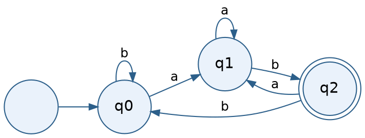
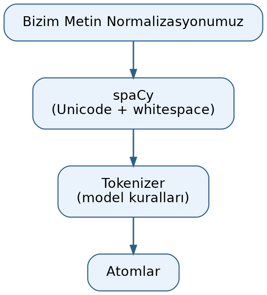
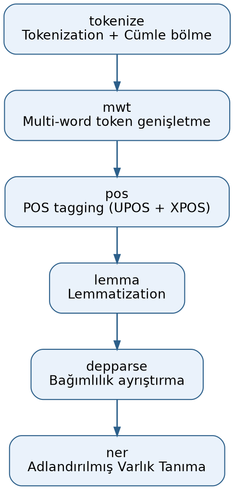

=================================
Atomlarına Ayırma (Tokenization)
=================================

Atomlarına Ayırma (Tokenization) Kavramına Giriş
=================================================

Metin normalizasyonu konusunu bitirdik. Şimdi metinlerin *atomlarına ayrılması (tokenization)* süreci
üzerinde duracağız. Atom (token) *bir dildeki kendi başına anlamlı en küçük birime* denilmektedir. Aslında
doğal dillerdeki yazılar, programlama dillerindeki programlar birbirini izleyen atomlar biçiminde ele
alınabilmektedir. Atom sözcüğü orijinal literatürde kullanılan bir sözcük değildir. Atom yerine
İngilizce'de *token* sözcüğü kullanılmaktadır. *Token* sözcüğünün İngilizce en bilinen anlamı *jeton* olsa
da bu sözcük dilbilimde *sembol*, *simge* gibi anlamlara da gelmektedir. *Atomlarına ayırma* için ise
İngilizce *tokenization* sözcüğü kullanılmaktadır. Bu sözcük Türkçe'de *tokınizasyon* biçiminde de ifade
edilebilmektedir.

Örneğin aşağıdaki gibi bir yazı olsun:

.. code-block:: python

   text = "bugün hava çok güzel! pikniğe gidelim."

Bu yazı sözcüklerine atomlarına ayrılabilir:

.. code-block:: text

   bugün
   hava
   çok
   güzel
   !
   pikniğe
   gidelim
   .

Noktalama işaretlerinin de ayrı birer anlamı olduğu için onların da birer atom olduğuna dikkat ediniz. Biz
bu örnekte sözcük tabanlı atomlarına ayırma işlemi uyguladık. Aslında doğal dil işlemede sözcük tabanlı
atomlarına ayırma yöntemi dışında zaman içerisinde başka biçimlerde atomlarına ayırma yöntemleri de
geliştirilmiştir. Ancak en bilinen yöntem yukarıdaki gibi sözcük tabanlı atomlarına ayırma yöntemidir.
Kullanım amacına bağlı olarak atomlara birer tür bilgisi de iliştirilebilmektedir. Örneğin atomlar *sözcük
(word)*, *noktalama işareti (punctuator)*, *kısaltma (abbreviation)*, *e-posta (email)* gibi atomsal
türlere ilişkin olabilmektedir.

Doğal dil işlemede kullanılan belli başlı atomlarına ayırma yöntemleri şunlardır:

1. Karakter Tabanlı (Character-Level) Yöntem
2. Sözcük Tabanlı (Word-Level) Yöntem

   - Boşluk ve noktalama işaretleri kullanılarak
   - Kural Tabanlı yöntemler kullanılarak (regex)

3. Cümle Tabanlı (Sentence-Level) Yöntem
4. N-gram (Unigram/Bigram/Trigram, ...) Yöntemleri
5. Alt Sözcük (Subword) Yöntemleri

   - BPE (Byte Pair Encoding)
   - WordPiece
   - Unigram LM

6. Byte Tabanlı (Byte-Level) Yöntem

Biz bu yöntemleri tek tek ele alarak inceleyeceğiz.

Sözcük Hazinesi (Vocabulary) Kavramı
-------------------------------------

Biz metni yukarıdaki yöntemlerin herhangi biri ile atomlarına ayırdığımızı düşünelim. Atomlarına ayırma
işlemi sonucunda elde edilen farklı atomların kümesine *sözcük hazinesi (vocabulary)* denilmektedir.
Örneğin derlemimiz (corpus) aşağıdaki metinlerden oluşuyor olsun:

.. code-block:: text

   "bugün hava çok güzel!"
   "hava durumuna baktım"
   "çok sıcak olması güzel değil"

Burada biz sözcük tabanlı atomlarına ayırma yöntemini kullanmış olalım. Bu derlemin sözcük hazinesi (yani
farklı atomların oluşturduğu küme) şöyle olacaktır:

.. code-block:: python

   {'bugün', 'hava', 'çok', 'güzel', '!', 'durumuna', 'baktım', 'sıcak', 'olması', 'değil'}

Derlemin sözcük hazinesinin uzunluğu (büyüklüğü) elde edilen bu kümenin eleman sayısıyla belirtilmektedir.
Örneğin yukarıdaki sözcük hazinesi 10 uzunluğundadır. Sözcük hazinesi oluşturulduktan sonra sözcük hazinesi
içerisindeki atomlara birer sayısal değer atanmaktadır. Çünkü algoritmalar sözcükler üzerinde değil onları
temsil eden sayısal değerler üzerinde işlemler yapabilmektedir. Sözcük hazinesi Python'da tipik olarak
*küme (set)* veri yapısıyla temsil edilmektedir. (Anımsanacağı gibi Python'da kümeler *tek (unique)
elemanları tutmak için* sıkça kullanılmaktadır.) Sözcük hazinesindeki atomlara birer sayı karşılık
düşürüldüğünde artık bu karşı düşürme işlemi için Python'da *sözlük (dictionary)* veri yapısı uygun hale
gelmektedir.

Derlemden sözcük hazinesi oluşturulduğunda sözcük hazinesine özel anlamlı bazı atomlar da eklenebilmektedir.
Bu tür atomlar genellikle ``[XXX]`` biçiminde ya da ``<XXX>`` biçiminde ifade edilmektedir. Örneğin en çok
kullanılan özel anlamlı atomlardan ikisi ``<UNK>`` ve ``<PAD>`` atomlarıdır. ``<UNK>`` (*unknown* sözcüğünden
geliyor) *bu atom sözcük hazinesinde yok* anlamına gelmektedir. ``<PAD>`` ise (*padding* sözcüğünden
geliyor) *doldurma atomları* anlamına gelmektedir. Bazen bir atom dizisini büyütmek isteyebiliriz. Bu
durumda büyütülen yerlere bu ``<PAD>`` atomunu yerleştiririz. Uygulamacılar genel olarak bu özel anlamlı
atomlara düşük numaralar atamaktadır. Örneğin:

.. code-block:: python

   vocab_dict = {
       '<UNK>': 0,
       '<PAD>': 1,
       'bugün': 2,
       'hava': 3,
       'çok': 4,
       'güzel': 5,
       '!': 6,
       'durumuna': 7,
       'baktım': 8,
       'sıcak': 9,
       'olması': 10,
       'değil': 11
   }

Buradaki sözlükte anahtar atomun kendisi, değer ise ona karşı düşürülen sayıyı belirtmektedir. Yani arama
*atom verildiğinde ona karşı gelen sayının bulunması* biçiminde yapılabilmektedir. Ancak bazen bunun tersi
de istenebilir. Bu durumda bu sözlüğün anahtarlarıyla değerleri ters çevrilmelidir:

.. code-block:: python

   vocab_dict_rev = {value: key for key, value in vocab_dict.items()}

Sayısallaştırma sonrasında artık yazıların birer sayı dizisi biçiminde ifade edilebileceğine dikkat ediniz.
Örneğin aşağıdaki gibi bir yazıyı sayısallaştırmak isteyelim:

.. code-block:: text

   "bugün hava soğuk değil sıcak"

Tek yapacağımız şey bu yazıyı atomlarına ayırıp her atoma karşı düşürülen sayıyı almaktır:

.. code-block:: python

   [2, 3, 0, 11, 9]

Dizinin (listenin) ikinci indeksli elemanının 0 olduğuna dikkat ediniz. Buradaki 0 değeri ``<UNK>`` atomuna
karşı gelmektedir. Bu ``<UNK>`` atomunun da yukarıda belirttiğimiz gibi *böyle bir atom sözcük hazinesinde
yok* anlamına geldiğini anımsayınız.

Atomlarına Ayırma Yöntemlerinin Gerçekleştirimi
------------------------------------------------

Şimdi atomlarına ayırma yöntemleri ve onların gerçekleştirimleri üzerinde duracağız.

Karakter Tabanlı (Character-Level) Atomlarına Ayırma
-----------------------------------------------------

Karakter tabanlı atomlarına ayırma yönteminde atomlar karakterlerden oluşmaktadır. Karakter tabanlı
atomlarına ayırmada sözcük hazinesi o dilde kullanılan karakter sayısı ile sınırlıdır. Ancak atomlar
karakterlerden oluştuğu için onların bağlam içerisinde değerlendirilmesi zorlaşmaktadır. Ayrıca her ne
kadar sözcük hazinesindeki atomların sayısı az olsa da yazılardaki toplam atomların sayısı yazıların
karakter sayısı kadar çok olacaktır. Bu da sayısallaştırılmış yazıların çok yer kaplaması ve gereken işlem
yükünün artması anlamına gelmektedir.

Karakter tabanlı atomlarına ayırma oldukça basit bir biçimde Python Standart Kütüphanesi kullanılarak
aşağıdaki gibi gerçekleştirilebilir:

.. code-block:: python

   corpus = ['bugün hava çok güzel!', 'hava durumuna baktım', 'çok sıcak olması güzel değil']

   vocab = set()

   for corpora in corpus:
       vocab.update(corpora)

   vocab_dict = {}
   vocab_dict['<UNK>'] = 0
   vocab_dict['<PAD>'] = 1

   for token_id, token in enumerate(vocab, 2):
       vocab_dict[token] = token_id

   vocab_dict_rev = {token_id: token for token, token_id in vocab_dict.items()}

Her ne kadar biz burada sözcük hazinesini derlemden hareketle oluşturmuş olsak da aslında sözcük hazinesi
çok küçük olduğu için hiç ``<UNK>`` atomu kullanılmadan söz konusu dilin temel karakterlerinin hepsini
baştan sözcük hazinesine yerleştirebilirdik.

Karakter tabanlı atomlarına ayırma modern doğal dil işleme uygulamalarında neredeyse hiç
kullanılmamaktadır. Bu yöntemin avantaj ve dezavantajlarını şöyle ifade edebiliriz:

- ✅ Sözcük hazinesi çok küçük (örn. Türkçe için ~80-100 karakter yeterli).
- ✅ OOV (vocabulary'de olmayan atomlar) problemi ortadan kaldırılabilir.
- ✅ Yeni sözcükler kolayca işlenir.
- ✅ Yazım hatalarına toleranslıdır.
- ❌ Çok uzun diziler oluşur, dolayısıyla hesaplama maliyeti artar.
- ❌ Model daha fazla uzun bağlamı *hatırlamak* zorunda kalır.
- ❌ Anlam birimleri (morfem, kelime) parçalanır.

Karakter tabanlı atomlara ayırma günümüzde oldukça seyrek kullanılmaktadır. Ancak özel durumlarda bu
yöntemin kullanılması gerekebilmektedir. Örneğin sözcük sayısının çok fazla olduğu sondan eklemeli
dillerde, sözcük hazinesinin yetersiz olduğu durumlarda bazen tercih edilebilmektedir. Karakter tabanlı
atomlarına ayırmayla sözcük tabanlı atomlarına ayırma yöntemlerinin karşılaştırmasını şöyle yapabiliriz:

.. list-table:: Sözcük Tabanlı ve Karakter Tabanlı Yöntemlerin Karşılaştırması
   :header-rows: 1
   :widths: 25 25 25

   * - Özellik
     - Sözcük Tabanlı
     - Karakter Tabanlı
   * - OOV Problemi
     - Yüksek
     - Yok
   * - Morfoloji Desteği
     - Zayıf
     - Güçlü
   * - Hesaplama Maliyeti
     - Düşük
     - Yüksek
   * - Seyrek Sözcükler
     - Sorunlu
     - Esnek

Sözcük Tabanlı Atomlarına Ayırma ve Sonlu Durum Otomatları
===========================================================

Sözcük Tabanlı Atomlarına Ayırmaya Giriş
-----------------------------------------

Sözcük tabanlı atomlarına ayırma işleminde yazının en küçük birimi sözcük kabul edilir. Yazı da sözcüklere
ayrılır. Tabii noktalama işaretleri, emoji gibi karakterler yine ayrı atomlar olarak ele alınmaktadır.
Kendi başına anlamı olan ya da cümle içinde görev yüklenen, tek başına kullanılabilen ses veya ses
birlikteliklerine sözcük denilmektedir. Ağzımızdan bir çırpıda çıkan seslere ise hece denilmektedir.
Sözcükler hecelerden, heceler ise harflerden oluşmaktadır.

Regex Kalıplarıyla Sözcük Tabanlı Atomlarına Ayırma
----------------------------------------------------

Sözcük tabanlı atomlarına ayırma regex kalıplarıyla yapılabilir. Ancak ayrıntıya inildikçe bu işlem için
daha fazla sayıda kalıp oluşturmak gerekir. Bu durumda da kalıplar birbirleriyle çakışabilmektedir.

Örneğin aşağıdaki regex kalıbı yüzeysel bir sözcüklerine ayırmayı sağlar:

.. code-block:: python

   pattern = r"[a-zA-Z0-9_çÇğĞıİöÖşŞüÜ]+"

Burada peşi sıra gelen harflerden ve rakamlardan sözcükler oluşturulmuştur. Ancak bu kalıp örneğin
noktalama işaretlerini, yüzde ifadelerini, e-posta adreslerini ayrı sözcük olarak bulamayacaktır. O zaman
tek bir kalıp yerine birden fazla kalıbın kullanılması ve bunların ``|`` kalıbıyla birleştirilmesi gerekir.
Örneğin:

.. code-block:: python

   special_patterns = [
       r'\d{1,2}[./-]\d{1,2}[./-]\d{2,4}',                           # tarih ifadelerini yakalar
       r'\d{1,3}(?:\.\d{3})+(?:,\d+)?',                              # Noktalı sayıları yakalar
       r'\d+,\d+',                                                   # Ondalıklı sayıları yakalar
       r'\d{1,2}:\d{2}(?::\d{2})?',                                  # Saatleri yakalar
       r'\d+(?:[.,]\d+)?\s*(?:TL|USD|EUR|₺|\$|€)',                   # Para birimlerini yakalar
       r'(?:TL|USD|EUR|₺|\$|€)\s*\d+(?:[.,]\d+)?',                   # Sembollü para birimlerini yakalar
       r'\d+(?:[.,]\d+)?%',                                          # Yüzde ifadelerini yakalar
       r'(?:0|\(\d{3}\)|\+\d{2})\s*\d{3}[\s-]?\d{3}[\s-]?\d{2,4}',   # Telefon numaralarını yakalar
       r'[a-zA-Z0-9._%+-]+@[a-zA-Z0-9.-]+\.[a-zA-Z]{2,}',            # E-postaları yakalar
       r'https?://[^\s<>"]+',                                        # URL'leri yakalar
       r'www\.[^\s<>"]+',                                            # URL'leri yakalar
       r'\d+/\d+',                                                   # Kesirli sayıları yakalar
       r'\d+(?:[.,]\d+)?\s*(?:kg|g|mg|km|m|cm|mm|lt|ml|m²|m³)',      # Ölçü birimlerini yakalar
       r'\d+',                                                       # Tamsayıları yakalar
   ]

   turkish_suffix = r"(?:'[a-zA-ZçÇğĞıİöÖşŞüÜ]+)?"
   combined_pattern = '|'.join(f'{p}{turkish_suffix}' for p in special_patterns)

   word_pattern = r"[a-zA-ZçÇğĞıİöÖşŞüÜ]+(?:[-'][a-zA-ZçÇğĞıİöÖşŞüÜ]+)*"
   punctuation_pattern = r'[.,!?;:()\"\-]'

   final_pattern = f'{combined_pattern}|{word_pattern}|{punctuation_pattern}'

Tabii bunu bir fonksiyon olarak da yazabiliriz:

.. code-block:: python

   def tokenize_regex(text):
       special_patterns = [
           r'\d{1,2}[./-]\d{1,2}[./-]\d{2,4}',                           # tarih ifadelerini yakalar
           r'\d{1,3}(?:\.\d{3})+(?:,\d+)?',                              # Noktalı sayıları yakalar
           r'\d+,\d+',                                                   # Ondalıklı sayıları yakalar
           r'\d{1,2}:\d{2}(?::\d{2})?',                                  # Saatleri yakalar
           r'\d+(?:[.,]\d+)?\s*(?:TL|USD|EUR|₺|\$|€)',                   # Para birimlerini yakalar
           r'(?:TL|USD|EUR|₺|\$|€)\s*\d+(?:[.,]\d+)?',                   # Sembollü para birimlerini yakalar
           r'\d+(?:[.,]\d+)?%',                                          # Yüzde ifadelerini yakalar
           r'(?:0|\(\d{3}\)|\+\d{2})\s*\d{3}[\s-]?\d{3}[\s-]?\d{2,4}',   # Telefon numaralarını yakalar
           r'[a-zA-Z0-9._%+-]+@[a-zA-Z0-9.-]+\.[a-zA-Z]{2,}',            # E-postaları yakalar
           r'https?://[^\s<>"]+',                                        # URL'leri yakalar
           r'www\.[^\s<>"]+',                                            # URL'leri yakalar
           r'\d+/\d+',                                                   # Kesirli sayıları yakalar
           r'\d+(?:[.,]\d+)?\s*(?:kg|g|mg|km|m|cm|mm|lt|ml|m²|m³)',      # Ölçü birimlerini yakalar
           r'\d+',                                                       # Tamsayıları yakalar
       ]

       turkish_suffix = r"(?:'[a-zA-ZçÇğĞıİöÖşŞüÜ]+)?"
       combined_pattern = '|'.join(f'{p}{turkish_suffix}' for p in special_patterns)

       word_pattern = r"[a-zA-ZçÇğĞıİöÖşŞüÜ]+(?:[-'][a-zA-ZçÇğĞıİöÖşŞüÜ]+)*"
       punctuation_pattern = r'[.,!?;:()\"\-]'

       final_pattern = f'{combined_pattern}|{word_pattern}|{punctuation_pattern}'

       tokens = re.findall(final_pattern, text)
       return [t for t in tokens if t.strip()]

Burada önce pek çok kalıp listeye yerleştirilmiş, sonra da ``|`` kalıbıyla birleştirilmiştir. Görüldüğü
gibi pek çok regex kalıbı oluşturulmuştur.

Eğer atomlara tür bilgileri de iliştirilecekse artık kod daha karmaşık hale gelecektir. Aşağıda sözcüksel
atomları bulup bunun türünü de tespit eden bir örnek verilmiştir:

.. code-block:: python

   def tokenize_regex(text):
       special_patterns = [
           (r'\d{1,2}[./-]\d{1,2}[./-]\d{2,4}',                          'DATE'),
           (r'\d{1,3}(?:\.\d{3})+(?:,\d+)?',                             'REAL_NUMBER'),
           (r'\d+,\d+',                                                  'REAL_NUMBER'),
           (r'\d{1,2}:\d{2}(?::\d{2})?',                                 'TIME'),
           (r'\d+(?:[.,]\d+)?\s*(?:TL|USD|EUR|₺|\$|€)',                  'CURRENCY'),
           (r'(?:TL|USD|EUR|₺|\$|€)\s*\d+(?:[.,]\d+)?',                  'CURRENCY'),
           (r%'\d+(?:[.,]\d+)?',                                         'PERCENT'),
           (r'(?:0|\(\d{3}\)|\+\d{2})\s*\d{3}[\s-]?\d{3}[\s-]?\d{2,4}',  'TEL'),
           (r'[a-zA-Z0-9._%+-]+@[a-zA-Z0-9.-]+\.[a-zA-Z]{2,}',           'EMAIL'),
           (r'https?://[^\s<>"]+',                                       'URL'),
           (r'www\.[^\s<>"]+',                                           'URL'),
           (r'\d+/\d+',                                                  'RATIONAL'),
           (r'\d+(?:[.,]\d+)?\s*(?:kg|g|mg|km|m|cm|mm|lt|ml|m²|m³)',     'MEASURE'),
           (r'\d+',                                                      'INTEGER'),
       ]

       turkish_suffix = r"(?:'[a-zA-ZçÇğĞıİöÖşŞüÜ]+)?"

       labels = [label for _, label in special_patterns] + ['WORD', 'PUNCTUATOR']

       combined = '|'.join(f'({p}{turkish_suffix})' for p, _ in special_patterns)
       word_pat  = r'([a-zA-ZçÇğĞıİöÖşŞüÜ]+(?:[-\'][a-zA-ZçÇğĞıİöÖşŞüÜ]+)*)'
       punct_pat = r'([.,!?;:()\"\-])'

       final_pattern = f'{combined}|{word_pat}|{punct_pat}'

       tokens = []
       for m in re.finditer(final_pattern, text):
           token = m.group()
           if token.strip():
               tokens.append((token, labels[m.lastindex - 1]))

       return tokens

.. note::

   ``PERCENT`` etiketli satırda ``(r%'\d+(?:[.,]\d+)?', 'PERCENT'),`` ifadesi bulunmaktadır. Listedeki diğer
   tüm satırlarla karşılaştırıldığında (hepsi ``(r'...'`` ile başlamaktadır) buradaki ``r%'`` yazımı bir
   yazım hatası gibi görünmektedir; doğrusu ``r'\d+(?:[.,]\d+)?%'`` olmalıdır (yüzde işareti kalıbın sonunda
   olmalı, ``r`` ile tırnak arasında değil). Bu kod çalıştırılmamıştır (yalnızca okuma yoluyla tespit
   edilmiştir); böyle çalıştırılırsa ``r`` adlı bir değişken tanımlı olmadığından ``NameError`` ile
   sonuçlanması beklenir. Kod, orijinal haliyle korunmuştur.

Yukarıdaki en son örneğimiz üzerinde yine de iyileştirmeler yapılabilir.

Biz yukarıda regex kalıplarını kullanarak atomlarına ayırma işlemini yaptık. Ancak atomlarına ayırmada atom
grupları karmaşık hale geldikçe regex yönteminin uygulanması zorlaşabilmektedir. Bunun sonucunda da
kalıplara pek çok yamanın yapılması gerekebilmektedir. Yani regex yöntemi özel durumlar için sorunlu hale
gelebilmektedir. Ancak pek çok klasik uygulamada zaten karmaşık düzeyde atom grupları oluşturulmamaktadır.

Sonlu Durum Otomatları (FSA / FSM)
-----------------------------------

Peki hiç regex kullanmadan manuel bir biçimde bu işlemi nasıl yapabilirdik? Yani atomlara ayırma işleminin
algoritmik yapısı nasıldır? İşte bu biçimde atomlarına ayırma işlemlerinde FSA (Finite State Automata)
denilen algoritmik yöntem kullanılmaktadır. FSA ile FSM (Finite State Machine) terimleri çoğu kez
birbirleri yerine kullanılabilmektedir. Ancak FSA terimi daha çok diller için, FSM terimi ise durumlardan
oluşan genel uygulamalar için kullanılmaktadır. FSA terimi daha çok *kabul/ret* temelindeki uygulamalar
için kullanılırken FSM terimi daha çok içinde bulunulan durumun vurgulandığı uygulamalar için
kullanılmaktadır. FSA terimi İngilizce *Finite State Automata* sözcüklerinden kısaltılmıştır. Biz bu terimi
İngilizce FSA kısaltmasıyla ya da Türkçe *Sonlu Durum Otomatları* biçiminde ifade edeceğiz. FSM terimi ise
İngilizce *Finite State Machine* sözcüklerinin kısaltmasıdır. Bu terim de Türkçe'de genellikle *Sonlu Durum
Makineleri* biçiminde ifade edilmektedir. Bu iki terimin farkını *Claude AI* şöyle açıklamaktadır:

.. epigraph::

   FSA (Finite State Automata), saf bir matematiksel model/teorik kavramdır. Bir girdiyi kabul edip
   etmediğine karar veren, yani *evet/hayır* yanıtı üreten bir tanıyıcıdır. FSM (Finite State Machine) ise
   daha geniş bir mühendislik kavramıdır; durumlar arasında geçiş yaparken çıktı da üretebilir.

   -- Claude AI

Her iki kavramda da sonlu sayıda *durum (state)* vardır. Yeni bir girdi durumlar arasında geçiş
sağlamaktadır. Otomat belli bir durumdadır. Dışarıdan girdi gelince durum değiştirir. Programcı da
durumları belirler, hangi girdi oluştuğunda hangi duruma geçileceğini tespit eder. Otomatlar deterministik
olabilir (DFA) ya da deterministik olmayabilir (NFA). Deterministik otomatlarda belli bir durumda belli bir
girdi tek bir duruma geçiş sağlamaktadır. Ancak deterministik olmayan otomatlarda belli bir durumda belli
bir girdi birden fazla duruma geçiş sağlayabilmektedir.

FSA'nın biçimsel tanımlaması genellikle beşli bir demetle yapılmaktadır:

.. code-block:: text

   M = (Q, Σ, δ, q₀, F)

- Burada ``Q`` tüm durumların kümesini belirtmektedir. Örneğin:

  .. code-block:: text

     Q = {q₀, q₁, q₂}

- ``Σ`` sembolü girdi alfabesini belirtmektedir. Yani ``Σ`` belli bir durumdayken oluşabilecek girdilerin
  kümesini belirtmektedir. Örneğin ``Σ = {0, 1}`` ise belli bir durumda girdi olarak ya 0 gelir ya 1 gelir.

- ``δ`` sembolü geçiş (transition) fonksiyonunu belirtmektedir. Geçiş fonksiyonu şöyle ifade edilebilir:

  .. code-block:: text

     δ : Q × Σ → Q

  Bu ifade her ``Q`` ve ``Σ`` değerinin bir ``Q`` değeriyle eşleştirildiğini belirtmektedir. Yani geçiş
  fonksiyonu biçimsel olmayan (informal) anlatımla *belli bir durumdayken, girdi olarak ne gelirse hangi
  duruma geçileceğini belirten tablodan* oluşmaktadır.

- ``q₀`` başlangıçtaki durumu belirtmektedir.

- Otomat belli bir duruma geldiğinde artık işlem bitmiş sayılır. Başka bir deyişle *kabul durumu* oluşur.
  İşte bu durumlar ``F`` sembolüyle betimlenmektedir. Tabii ``F ⊆ Q`` olmak zorundadır.

Şimdi bu beşli için bir FSA örneği verelim. Durumların kümesi şöyle olsun:

.. code-block:: text

   Q = {q₀, q₁, q₂}

Giriş alfabesi şöyle olsun:

.. code-block:: text

   Σ = {a, b}

Yani biz durumlardan biri içerisindeysek girdi olarak bize a ya da b gelebilir. Başlangıç durumu ``q₀``
olsun:

.. code-block:: text

   q₀ = q₀

Otomat ``q₂`` durumuna geldiğinde kabul koşulu oluşuyor olsun:

.. code-block:: text

   F = {q₂}

Geçiş fonksiyonu ya da geçiş tablosu da şöyle olsun (``q₂`` kabul durumu olduğu için ``*`` ile
işaretlenmiştir):

.. list-table:: FSA Geçiş Tablosu
   :header-rows: 1
   :widths: 15 15 15

   * - Durum
     - a
     - b
   * - q₀
     - q₁
     - q₀
   * - q₁
     - q₁
     - q₂
   * - \*q₂
     - q₁
     - q₀

Örneğin biz ``q₀`` durumundaysak ve bu durumda ``a`` geliyorsa ``q₁`` durumuna geçeriz. Şimdi ``q₁``
durumundayız. Bu durumda ``b`` gelirse ``q₂`` durumuna geçeriz. ``q₂`` kabul koşulu olduğu için otomat bu
işlemi tamamlamış olacaktır. Bu otomatın durum geçiş diyagramı aşağıdaki gibidir (çift çerçeveli düğüm
kabul durumunu, düğüme giren ok ise başlangıç durumunu göstermektedir):

Buradaki geçiş fonksiyonunu şöyle de ifade edebiliriz:

.. list-table:: Geçiş Fonksiyonu δ(q, σ)
   :header-rows: 1
   :widths: 20 10

   * - δ(q, σ)
     - Sonuç
   * - δ(q₀, a)
     - q₁
   * - δ(q₀, b)
     - q₀
   * - δ(q₁, a)
     - q₁
   * - δ(q₁, b)
     - q₂
   * - δ(q₂, a)
     - q₁
   * - δ(q₂, b)
     - q₀

FSA Tabanlı Manuel Atomlarına Ayırma Gerçekleştirimi
-----------------------------------------------------

İşte manuel atomlarına ayırma işlemi FSA yöntemi kullanılarak yapılabilmektedir. Tokenizer belli bir anda
belli bir durumda olur. Sıradaki karakter metinden okunur ve tokenizer konum değiştirir. Belli bir konuma
ulaşıldığında atomun bulunduğu kabul edilir.

FSA gerçekleştirimleri iki biçimde yapılabilmektedir:

1) Durum kontrolü dışarıda girdi kontrolü içeride
2) Girdi kontrolü dışarıda durum kontrolü içeride

Durum kontrolü dışarıda girdi kontrolü içeride yöntemini şöyle temsil edebiliriz:

.. code-block:: python

   for ch in text:
       match state:
           case SPACE:
               <ch kontrol ediliyor>
           case PUNCT:
               <ch kontrol ediliyor>
           ...

Girdi kontrolü dışarıda durum kontrolü içeride yöntemini de şöyle temsil edebiliriz:

.. code-block:: python

   for ch in text:
       if ch.isspace:
           <durum kontrol ediliyor>
       elif ch.ispunct():
           <durum kontrol ediliyor>
       ...

.. note::

   Yukarıdaki iki kod parçası şematik/yalın kod (pseudocode) niteliğindedir; ``<...>`` biçimindeki
   ifadeler birer yer tutucudur ve geçerli Python sözdizimi değildir, dolayısıyla doğrudan
   çalıştırılamazlar.

Her iki yöntem de duruma göre diğerinden daha iyi olabilmektedir.

Durum kontrolü dışarıda girdi kontrolü içeride FSA oluşturmaya bir örnek verelim. Örneğimiz karmaşık
olmasın diye atom türlerini üç bölüme ayıralım:

.. code-block:: text

   WORD
   NUMBER
   PUNCT

Gerçekleştirimde dışarıda yazının karakterlerini elde eden bir döngü bulundurulur. Yazıdan karakter
alındıktan sonra *ben hangi durumdayım* sorusu sorulur, sonra okunan karakter kontrol edilir, gerekiyorsa
durum değişikliği yapılır. Durumsal geçişi şöyle belirleyebiliriz:

- **SPACE durumundan SPACE olmayan duruma geçiş:** Eğer otomat SPACE durumundaysa ve yeni gelen karakter
  SPACE değilse otomatın yeni durumu bu yeni gelen karakterin ne olduğuna göre ayarlanmalıdır. Örneğin
  SPACE durumunda yeni gelen karakter digit ise artık otomatın durumu NUMBER olacaktır. Ancak yeni gelen
  karakter alfabetik ise otomatın durumu WORD olacaktır.

- **SPACE olmayan durumdan SPACE durumuna geçiş:** Artık atom bitmiştir, atom saklanabilir. Yeni durum
  SPACE olacaktır.

- **SPACE olmayan bir durumdan PUNCT durumuna geçiş:** Artık atom bitmiştir, atom saklanabilir.

- **WORD olan bir durumdan NUMBER durumuna geçiş:** Örneğin ``ankara06`` gibi bir yazı için ``ankara`` ve
  ``06`` atomları da üretilebilir. ``ankara06`` atomu da üretilebilir. ``ankara06`` atomunun üretilmesi
  daha uygundur. Bunu sağlamak için bu geçişte bir durum değişikliği yapılmaz.

- **PUNCT durumundan diğer bir duruma geçiş:** Artık atom bitmiştir, atom saklanabilir. Yeni durumu okunan
  karaktere göre belirlemek gerekir.

FSA Tabanlı Atomlarına Ayırmanın Gerçekleştirimi
=================================================

"Durum Kontrolü Dışarıda" Yöntemiyle tokenize_fsa Fonksiyonu
-------------------------------------------------------------

Aşağıda *durum kontrolü dışarıda karakter kontrolü içeride* olacak biçimde atomlarına ayırma işlemini yapan
``tokenize_fsa`` isimli örnek bir fonksiyon yazılmıştır. Bu fonksiyonda önce ``for`` döngüsü ile yazıdaki
karakterler okunmuş, sonra ``state`` değişkeni kontrol edilmiş ve sonra da ``match`` içerisinde okunan
karakterler ele alınmıştır. Örneğimizdeki atomlarına ayırma işlemini yapan ``tokenize_fsa`` fonksiyonu
aşağıdaki gibi kullanılabilir:

.. code-block:: python

   import normalizer

   text = "bugün 06ankara plaka gördüm. Türkiye'nin başkenti Ankara'dır"

   turkish_normalizer = normalizer.build_turkish_normalizer()
   normalized_text = turkish_normalizer(text)
   tokens = tokenize_fsa(normalized_text)
   print(tokens)

Burada daha önce yazmış olduğumuz ``normalizer`` modülündeki ``build_turkish_normalizer`` fonksiyonunu
kullandığımıza dikkat ediniz. Kursumuzda bu modül ``Src`` dizininin altındaki ``01-TextNormalization``
dizinindedir. Bildiğiniz gibi bir modülü import etmek için o modülün içinde bulunduğu dizinin ``sys.path``
listesinin içerisinde bulunuyor olması gerekir. Python yorumlayıcısı çalıştığında yorumlayıcının
``PYTHONPATH`` çevre değişkenindeki dizinleri ``sys.path`` listesine eklediğini anımsayınız. Kendi
dizininizin ``sys.path`` listesi içerisinde bulundurulmasını birkaç biçimde sağlayabilirsiniz:

1) İşletim sistemi düzeyinde ``PYTHONPATH`` çevre değişkenini oluşturup ``01-TextNormalization`` dizininin
   yol ifadesini bu çevre değişkenine ekleyerek.

2) ``sys.path`` listesine ``append`` ile doğrudan bu dizinin yol ifadesini ekleyerek.

3) Spyder'da ``Tools/PYTHONPATH Manager`` menü elemanından ``01-TextNormalization`` dizinini seçerek.

Biz kursumuzda bu tür durumlarda üçüncü yöntemi tercih edeceğiz. Ancak duruma göre yukarıdaki diğer iki
yöntemi de tercih etmek isteyebilirsiniz.

Yukarıdaki test kodunu çalıştırdıktan sonra ekranda şunlar görülecektir:

.. code-block:: text

   [('bugün', 'WORD'), ('06ankara', 'WORD'), ('plaka', 'WORD'), ('gördüm', 'WORD'), ('.', 'PUNCT'),
    ("Türkiye'nin", 'WORD'), ('başkenti', 'WORD'), ("Ankara'dır", 'WORD')]

Görüldüğü gibi ``tokenize_fsa`` fonksiyonu tüm atomları türleriyle birlikte iki elemanlı demetlerden oluşan
bir liste biçiminde vermektedir.

.. code-block:: python

   from enum import Enum
   import string

   class State(Enum):
       START = 0,
       WORD = 1,
       SPACE = 2,
       NUMBER = 3,
       PUNCT = 4,

   def tokenize_fsa(text):
       def setstate(ch):
           nonlocal state
           if ch.isspace():
               state = State.SPACE
           elif ch.isdigit():
               state = State.NUMBER
           elif ch.isalpha():
               state = State.WORD
           elif ch in string.punctuation:
               state = State.PUNCT

       tokens = []
       current_token = ''

       state = State.START
       for next_ch in text:
           match state:
               case State.START:
                   if not next_ch.isspace():
                       current_token = next_ch
                       setstate(next_ch)
                   else:
                       state = State.SPACE
               case State.SPACE:
                   if not next_ch.isspace():
                      setstate(next_ch)
                      current_token = next_ch
               case State.WORD:
                   if next_ch.isspace() or next_ch in string.punctuation and next_ch != "'":
                       tokens.append((current_token, state.name))
                       current_token = next_ch
                       setstate(next_ch)
                   else:
                       current_token += next_ch
               case State.NUMBER:
                   if next_ch.isspace():
                       tokens.append((current_token, state.name))
                       current_token = ''
                       state = State.SPACE
                   elif next_ch == '.':
                         current_token += next_ch
                   elif next_ch in string.punctuation:
                       tokens.append((current_token, state.name))
                       current_token = next_ch
                       state = State.PUNCT
                   elif next_ch.isalpha():
                       state = State.WORD
                       current_token += next_ch
                   else:
                       current_token += next_ch
               case State.PUNCT:
                       tokens.append((current_token,state.name))
                       current_token = next_ch
                       setstate(next_ch)

       if state != State.SPACE:
           tokens.append((current_token, state.name))

       return tokens

   text = "bugün 06ankara plaka gördüm. Türkiye'nin başkenti Ankara'dır"

   tokens = tokenize_fsa(text)
   print(tokens)

   # Test

   import normalizer

   text = "bugün 06ankara plaka gördüm. Türkiye'nin başkenti Ankara'dır"
   turkish_normalizer = normalizer.build_turkish_normalizer()
   normalized_text = turkish_normalizer(text)
   tokens = tokenize_fsa(text)
   print(tokens)

.. note::

   ``State`` enum tanımındaki her satırın sonunda bulunan virgül (``START = 0,`` gibi) her bir üyenin
   değerini tek elemanlı bir demete (``(0,)``, ``(1,)`` gibi) dönüştürmektedir; muhtemelen kasıtsızdır
   (genellikle ``START = 0`` biçiminde virgülsüz yazılır). Bu durum ``Enum`` üyelerinin adlarıyla
   (``state.name``) çalışmayı etkilemediği için kodun bu derste gösterilen kullanımını bozmaz, ancak
   muhtemel bir yazım hatasıdır. Kod, orijinal haliyle korunmuştur; çalıştırılarak test edilmemiştir.

"Girdi Kontrolü Dışarıda" Yöntemiyle tokenize_fsa Fonksiyonu
-------------------------------------------------------------

Şimdi de aynı atomlarına ayırma fonksiyonunu *girdi kontrolü dışarıda durum kontrolü içeride* olacak
biçimde yazalım. Burada biz yine ``for`` döngüsü içerisinde karakterleri tek tek okuyacağız, ancak önce
karakterin türünü sonra o andaki tokenizer durumunu (``state`` değişkenini) kontrol edeceğiz. Yukarıdaki
kodun bu yaklaşıma göre değiştirilmiş biçimini aşağıda veriyoruz.

.. code-block:: python

   from enum import Enum
   import string
   import normalizer

   class State(Enum):
       START = 0,
       WORD = 1,
       SPACE = 2,
       NUMBER = 3,
       PUNCT = 4,

   def tokenize_fsa(text):
       def setstate(ch):
           nonlocal state
           if ch.isspace():
               state = State.SPACE
           elif ch.isdigit():
               state = State.DIGIT
           elif ch.isalpha():
               state = State.WORD
           elif ch in string.punctuation:
               state = State.PUNCT

       tokens = []
       current_token = ''

       state = State.START
       for next_ch in text:
           if next_ch.isspace():
               if state not in [State.START, State.SPACE]:
                   tokens.append((current_token, state.name))
                   setstate(next_ch)
                   current_token = ''
           elif next_ch.isalpha():
               if state in [State.SPACE, State.START]:
                   current_token = next_ch
                   setstate(next_ch)
               elif state == State.PUNCT:
                   tokens.append((current_token, state.name))
                   current_token = next_ch
                   setstate(next_ch)
               elif state == State.NUMBER:
                   state = State.WORD
               else:
                   current_token += next_ch
           elif next_ch in string.punctuation:
               if next_ch != "'":
                   tokens.append((current_token, state.name))
                   current_token = next_ch
                   setstate(next_ch)
               else:
                   current_token += next_ch
           elif next_ch.isdigit():
               if state == State.SPACE:
                   state = State.NUMBER
               current_token += next_ch

       if state != State.SPACE:
           tokens.append((current_token, state.name))

       return tokens

   # Test

   text = "bugün 06ankara plaka gördüm. Türkiye'nin başkenti Ankara'dır"

   turkish_normalizer = normalizer.build_turkish_normalizer()
   normalized_text = turkish_normalizer(text)
   tokens = tokenize_fsa(text)
   print(tokens)

.. note::

   ``setstate`` iç fonksiyonundaki ``elif ch.isdigit(): state = State.DIGIT`` satırı bir hata
   içermektedir: ``State`` enum'unda ``DIGIT`` adlı bir üye tanımlı değildir (üyeler ``START``, ``WORD``,
   ``SPACE``, ``NUMBER``, ``PUNCT``'tır). Bu satır çalıştırıldığında ``AttributeError: DIGIT`` hatası
   alınması beklenir; doğrusu ``state = State.NUMBER`` olmalıdır. Bu, kodu okuyarak (çalıştırmadan) tespit
   edilmiştir; kod orijinal haliyle korunmuştur.

Peki *durum kontrolü dışarıda, girdi kontrolü içeride* yöntemi mi yoksa *girdi kontrolü dışarıda, durum
kontrolü içeride* yöntemi mi daha iyidir? Aslında bu durum kişisel tercihe göre değişebilir. Ancak genel
olarak durum kontrolünün dışarıda yapılması daha anlaşılır ve sürdürülebilir bir algoritmik yapının
oluşturulmasını sağlamaktadır.

Daha Kapsamlı Bir FSA Tokenizer: TurkishFSATokenizer
-----------------------------------------------------

Biz sözcük tabanlı atomlarına ayırma işlemini önce regex yöntemini kullanarak daha sonra da FSA yöntemini
kullanarak manuel bir biçimde yaptık. FSA kullanarak manuel yaptığımız örnekte kolaylık sağlamak amacıyla
atom türlerini bilerek kısıtlı tuttuk. Şimdi de *Claude AI* kullanarak oluşturduğumuz daha fazla atom
grubuna sahip bir örnek üzerinde duralım. Oluşturduğumuz örnekteki durumlar şunlardır:

.. code-block:: python

   class State(Enum):
       IDLE              = auto()
       WORD              = auto()
       APOSTROPHE_SUFFIX = auto()
       NUMBER            = auto()
       NUMBER_DOT        = auto()
       FLOAT             = auto()
       DATE_PART         = auto()
       URL_BODY          = auto()
       EMAIL_LOCAL       = auto()
       EMAIL_DOMAIN      = auto()
       HASHTAG           = auto()
       MENTION           = auto()
       PUNCTUATION       = auto()

Buradaki ``IDLE`` durumu herhangi bir atomun içerisinde bulunulmayan SPACE durumunu belirtmektedir. Atomlar
da şu gruplardan oluşmaktadır:

.. code-block:: python

   class TokenType(Enum):
       WORD         = auto()
       NUMBER       = auto()
       PUNCTUATION  = auto()
       URL          = auto()
       EMAIL        = auto()
       HASHTAG      = auto()
       MENTION      = auto()
       DATE         = auto()
       ABBREVIATION = auto()
       UNKNOWN      = auto()

Bu örnekte atomlar da ``Token`` isimli bir sınıf ile temsil edilmektedir:

.. code-block:: python

   class Token:
       def __init__(self, text, token_type, start, end, sentence_id=0, metadata=None):
           self.text        = text
           self.token_type  = token_type
           self.start       = start
           self.end         = end
           self.sentence_id = sentence_id
           self.metadata    = metadata if metadata is not None else {}

       def __repr__(self):
           return f'Token({self.text!r}, {self.token_type.name}, ({self.start},{self.end}))'

       def __len__(self):
           return len(self.text)

       def __eq__(self, other):
           if not isinstance(other, Token):
               return NotImplemented
           return (
               self.text       == other.text
               and self.token_type == other.token_type
               and self.start      == other.start
               and self.end        == other.end
           )

Buradaki ``Token`` sınıfının örnek öznitelikleri şunlardır:

.. list-table:: Token Sınıfının Öznitelikleri
   :header-rows: 1
   :widths: 18 50

   * - Öznitelik Adı
     - Açıklama
   * - ``text``
     - Bulunan atomun yazısını belirtir.
   * - ``token_type``
     - Bulunan atomun türünü belirtir.
   * - ``start``
     - Bulunan atomun ana metindeki başlangıç offset'ini belirtir.
   * - ``end``
     - Bulunan atomun ana metindeki bitiş offset'ini belirtir.
   * - ``sentence_id``
     - Atomun içinde bulunduğu cümlenin numarasını belirtir.
   * - ``metadata``
     - Atom hakkındaki ilave bilgileri içermektedir.

Oluşturulan örnekte atomlara ayırma işlemi ``TurkishFSATokenizer`` isimli sınıfın ``tokenize`` metodu
tarafından yapılmaktadır. Ancak bu metot da aslında durum makinesi işlemini yapan ``_run_FSA`` metodunu
çağırmaktadır. ``_run_FSA`` üretici (generator) bir metot biçiminde yazılmıştır. Yani bu metodun çağrısı
``for`` döngüsüne sokulursa her yinelemede ``Token`` sınıfı türünden bir atom nesnesi elde edilecektir.

.. note::

   ``_run_FSA`` gerçekten üretici (generator) bir metottur (içinde ``yield`` kullanılmaktadır). Ancak
   ``tokenize`` metodu bunu ``list(self._run_FSA(text))`` biçiminde doğrudan bir listeye çevirmektedir;
   dolayısıyla ``tokenize`` metodunun kendisi çağrıldığında tüm atomlar anında üretilip bir liste olarak
   döndürülür, satır satır/parça parça üretim yapılmaz. Sınıfta ayrıca tanımlı olan ``iter_tokens`` metodu
   ise ``yield from`` kullandığı için gerçekten satır satır (lazy) çalışan bir üreticidir. Aşağıdaki test
   kodu ``tok.tokenize(...)`` çağırdığından, kullanılan metot aslında listeye çevrilmiş sürümdür.

Aşağıda Claude AI tarafından yazılan kodu bir bütün olarak veriyoruz. Biz buradaki kodla yazıyı atomlarına
ayırmadan önce normalize ettik. Aşağıdaki gibi bir kodla da testimizi yaptık:

.. code-block:: python

   tests = [
       "Türkiye'de hava sıcaklığı 37,5 derece oldu.",
       'Prof. Dr. Kaya, TÜBİTAK\'ın raporunu inceledi.',
       'Ziyaret: https://tubitak.gov.tr veya bilgi@tubitak.gov.tr',
       'Fiyat %12,5 arttı! Tarih: 12.03.2024 #ekonomi @hazine',
       'Ali\'nin Ayşe\'ye yazdığı mektup 2024\'te bulundu.',
       '<Ali>'
   ]

   tok = TurkishFSATokenizer(split_apostrophe=True)

   for text in tests:
       turkish_normalizer = normalizer.build_turkish_keep_normalizer()
       normalized_text = turkish_normalizer(text)
       print(f'\n── {normalized_text}')
       for token in tok.tokenize(normalized_text):
           print(f'   {token.text:<25} [{token.token_type.name}]')

Burada ``tests`` listesinin her elemanı ayrı bir yazı gibi atomlarına ayrılmaktadır. Yukarıda da 
belirttiğimiz gibi ``TurkishFSATokenizer`` sınıfının ``tokenize`` metodu bir üretici metottur. Yani 
her çağrıda metot kalınan yerden devam ederek bize sıradaki atomu vermektedir. 

Aşağıda ``TurkishFSATokenizer`` sınıfının ve ilgili tanımların tam kodunu veriyoruz:

.. code-block:: python

   from enum import Enum, auto
   import normalizer

   class TokenType(Enum):
       WORD         = auto()
       NUMBER       = auto()
       PUNCTUATION  = auto()
       URL          = auto()
       EMAIL        = auto()
       HASHTAG      = auto()
       MENTION      = auto()
       DATE         = auto()
       ABBREVIATION = auto()
       UNKNOWN      = auto()

   class State(Enum):
       IDLE              = auto()
       WORD              = auto()
       APOSTROPHE_SUFFIX = auto()
       NUMBER            = auto()
       NUMBER_DOT        = auto()
       FLOAT             = auto()
       DATE_PART         = auto()
       URL_BODY          = auto()
       EMAIL_LOCAL       = auto()
       EMAIL_DOMAIN      = auto()
       HASHTAG           = auto()
       MENTION           = auto()
       PUNCTUATION       = auto()

   class Token:
       def __init__(self, text, token_type, start, end, sentence_id=0, metadata=None):
           self.text        = text
           self.token_type  = token_type
           self.start       = start
           self.end         = end
           self.sentence_id = sentence_id
           self.metadata    = metadata if metadata is not None else {}

       def __repr__(self):
           return f'Token({self.text!r}, {self.token_type.name}, ({self.start},{self.end}))'

       def __len__(self):
           return len(self.text)

       def __eq__(self, other):
           if not isinstance(other, Token):
               return NotImplemented
           return (
               self.text       == other.text
               and self.token_type == other.token_type
               and self.start      == other.start
               and self.end        == other.end
           )

   TURKISH_ABBREVIATIONS = {
       'Dr', 'Prof', 'Doç', 'Yrd', 'Öğr', 'Arş', 'Gör',
       'Av', 'Müh', 'T.C', 'TDK', 'TÜBİTAK', 'TBMM',
       'vb', 'vd', 'vs', 'bkz', 'örn', 'yy', 'sf',
       'cm', 'mm', 'km', 'kg', 'gr', 'mg', 'lt', 'ml',
       'KB', 'MB', 'GB', 'TB', 'ms',
       'İst', 'Ank', 'İzm', 'no', 'No', 'sok', 'cad',
   }

   PUNCTUATION_CHARS = frozenset('.,!?;:()[]{}"\'-–—/\\«»…°')

   class TurkishFSATokenizer:
       def __init__(self, lowercase=False, keep_punctuation=True, split_apostrophe=True):
           self.lowercase        = lowercase
           self.keep_punctuation = keep_punctuation
           self.split_apostrophe = split_apostrophe
           self._abbreviations   = TURKISH_ABBREVIATIONS.copy()

       def tokenize(self, text):
           if not text or not text.strip():
               return []
           return list(self._run_FSA(text))

       def tokenize_to_strings(self, text):
           return [t.text for t in self.tokenize(text)]

       def iter_tokens(self, text):
           text = self._normalize(text)
           yield from self._run_FSA(text)

       def add_abbreviation(self, abbr):
           self._abbreviations.add(abbr)

       def _run_FSA(self, text):
           state     = State.IDLE
           buf       = []
           buf_start = 0

           i = 0
           n = len(text)

           while i < n:
               char = text[i]
               if state == State.IDLE:
                   if self._is_space(char):
                       i += 1
                   elif char == '#':
                       buf, buf_start = [char], i
                       state = State.HASHTAG
                       i += 1
                   elif char == '@':
                       buf, buf_start = [char], i
                       state = State.MENTION
                       i += 1
                   elif self._is_letter(char):
                       url_end = self._lookahead_url(text, i)
                       if url_end > i:
                           yield Token(text[i:url_end], TokenType.URL, i, url_end)
                           i = url_end
                       else:
                           buf, buf_start = [char], i
                           state = State.WORD
                           i += 1
                   elif self._is_digit(char):
                       buf, buf_start = [char], i
                       state = State.NUMBER
                       i += 1
                   elif char in PUNCTUATION_CHARS:
                       if self.keep_punctuation:
                           yield Token(char, TokenType.PUNCTUATION, i, i + 1)
                       i += 1

                   else:
                       i += 1  # Bilinmeyen karakter, atla
               elif state == State.WORD:
                   if self._is_letter(char) or char == '-':
                       buf.append(char)
                       i += 1
                   elif char in ("'", '\u2019') and self.split_apostrophe:
                       word_text = self._finalize_text(''.join(buf))
                       yield Token(
                           word_text,
                           self._classify_word(word_text),
                           buf_start, i
                       )
                       buf, buf_start = ["'"], i
                       state = State.APOSTROPHE_SUFFIX
                       i += 1

                   elif char == '@':
                       buf.append(char)
                       state = State.EMAIL_LOCAL
                       i += 1
                   else:
                       word_text = self._finalize_text(''.join(buf))
                       yield Token(
                           word_text,
                           self._classify_word(word_text),
                           buf_start, i
                       )
                       buf   = []
                       state = State.IDLE
               elif state == State.APOSTROPHE_SUFFIX:
                   if self._is_letter(char):
                       buf.append(char)
                       i += 1
                   else:
                       suffix_text = ''.join(buf)
                       yield Token(suffix_text, TokenType.WORD, buf_start, i)
                       buf   = []
                       state = State.IDLE
               elif state == State.NUMBER:
                   if self._is_digit(char):
                       buf.append(char)
                       i += 1
                   elif char in ('.', '/') and self._is_digit_at(text, i + 1):
                       buf.append(char)
                       state = State.NUMBER_DOT
                       i += 1
                   elif char == ',' and self._is_digit_at(text, i + 1):
                       buf.append(char)
                       state = State.FLOAT
                       i += 1
                   elif char in ('%', '°'):
                       buf.append(char)
                       num_text = ''.join(buf)
                       yield Token(num_text, TokenType.NUMBER, buf_start, i + 1)
                       buf   = []
                       state = State.IDLE
                       i += 1
                   else:
                       num_text = ''.join(buf)
                       yield Token(num_text, TokenType.NUMBER, buf_start, i)
                       buf   = []
                       state = State.IDLE
               elif state == State.NUMBER_DOT:
                   if self._is_digit(char):
                       buf.append(char)
                       # İkinci nokta/slash gelirse → tarih
                       if self._is_date_separator_ahead(text, i):
                           state = State.DATE_PART
                       else:
                           state = State.FLOAT
                       i += 1
                   else:
                       raw          = ''.join(buf)
                       number_part  = raw.rstrip('./\\')
                       sep_part     = raw[len(number_part):]

                       yield Token(number_part, TokenType.NUMBER, buf_start,
                                   buf_start + len(number_part))
                       if self.keep_punctuation and sep_part:
                           sep_start = buf_start + len(number_part)
                           yield Token(sep_part, TokenType.PUNCTUATION,
                                       sep_start, sep_start + len(sep_part))
                       buf   = []
                       state = State.IDLE
               elif state == State.FLOAT:
                   if self._is_digit(char):
                       buf.append(char)
                       i += 1
                   else:
                       float_text = ''.join(buf)
                       yield Token(float_text, TokenType.NUMBER, buf_start, i)
                       buf   = []
                       state = State.IDLE
               elif state == State.DATE_PART:
                   if self._is_digit(char) or char in ('.', '/'):
                       buf.append(char)
                       i += 1
                   else:
                       date_text = ''.join(buf).rstrip('./')
                       yield Token(date_text, TokenType.DATE, buf_start,
                                   buf_start + len(date_text))
                       buf   = []
                       state = State.IDLE
               elif state == State.EMAIL_LOCAL:
                   if self._is_letter(char) or self._is_digit(char) \
                           or char in ('.', '-', '_'):
                       buf.append(char)
                       state = State.EMAIL_DOMAIN
                       i += 1
                   else:
                       word_text = self._finalize_text(''.join(buf))
                       yield Token(word_text, TokenType.WORD, buf_start, i)
                       buf   = []
                       state = State.IDLE
               elif state == State.EMAIL_DOMAIN:
                   if self._is_letter(char) or self._is_digit(char) \
                           or char in ('.', '-'):
                       buf.append(char)
                       i += 1
                   else:
                       email_text = ''.join(buf).rstrip('.')
                       yield Token(email_text, TokenType.EMAIL, buf_start,
                                   buf_start + len(email_text))
                       buf   = []
                       state = State.IDLE
               elif state == State.HASHTAG:
                   if self._is_letter(char) or self._is_digit(char) or char == '_':
                       buf.append(char)
                       i += 1
                   else:
                       tag_text = ''.join(buf)
                       if len(tag_text) > 1:   # Tek "#" değilse token üret
                           yield Token(tag_text, TokenType.HASHTAG, buf_start, i)
                       buf   = []
                       state = State.IDLE
               elif state == State.MENTION:
                   if self._is_letter(char) or self._is_digit(char) or char == '_':
                       buf.append(char)
                       i += 1
                   else:
                       mention_text = ''.join(buf)
                       if len(mention_text) > 1:
                           yield Token(mention_text, TokenType.MENTION, buf_start, i)
                       buf   = []
                       state = State.IDLE
           if buf:
               remaining = ''.join(buf)
               yield from self._flush_buffer(remaining, buf_start, state)

       def _flush_buffer(self, text, start, state):
           if not text:
               return
           end = start + len(text)
           if state == State.WORD:
               word_text = self._finalize_text(text)
               yield Token(word_text, self._classify_word(word_text), start, end)
           elif state == State.APOSTROPHE_SUFFIX:
               yield Token(text, TokenType.WORD, start, end)
           elif state in (State.NUMBER, State.FLOAT):
               yield Token(text, TokenType.NUMBER, start, end)
           elif state == State.DATE_PART:
               clean = text.rstrip('./')
               yield Token(clean, TokenType.DATE, start, start + len(clean))
           elif state == State.EMAIL_DOMAIN:
               clean = text.rstrip('.')
               yield Token(clean, TokenType.EMAIL, start, start + len(clean))
           elif state == State.HASHTAG:
               if len(text) > 1:
                   yield Token(text, TokenType.HASHTAG, start, end)
           elif state == State.MENTION:
               if len(text) > 1:
                   yield Token(text, TokenType.MENTION, start, end)
           elif state == State.NUMBER_DOT:
               # Belirsiz bitti → sayıyı ve ayracı ayır
               clean = text.rstrip('./')
               sep   = text[len(clean):]
               yield Token(clean, TokenType.NUMBER, start, start + len(clean))
               if self.keep_punctuation and sep:
                   s = start + len(clean)
                   yield Token(sep, TokenType.PUNCTUATION, s, s + len(sep))
           else:
               yield Token(text, TokenType.UNKNOWN, start, end)

       def _lookahead_url(self, text, pos):
           prefixes = ('http://', 'https://', 'www.')
           for prefix in prefixes:
               end = pos + len(prefix)
               if text[pos:end].lower() == prefix:
                   j = end
                   while j < len(text) and not self._is_space(text[j]):
                       j += 1
                   return j
           return pos

       def _is_date_separator_ahead(self, text, pos):
           i = pos
           n = len(text)
           while i < n and self._is_digit(text[i]):
               i += 1
           return i < n and text[i] in ('.', '/')

       @staticmethod
       def _is_letter(char):
           return char.isalpha()

       @staticmethod
       def _is_digit(char):
           """Rakam kontrolü."""
           return char.isdigit()

       @staticmethod
       def _is_digit_at(text, pos):
           return pos < len(text) and text[pos].isdigit()

       @staticmethod
       def _is_space(char):
           return char in (' ', '\t', '\n', '\r')

       def _finalize_text(self, text):
           if self.lowercase:
               return self._turkish_lower(text)
           return text

       @staticmethod
       def _turkish_lower(text):
           return text.replace('İ', 'i').replace('I', 'ı').lower()

       def _classify_word(self, word):
           if word in self._abbreviations:
               return TokenType.ABBREVIATION
           return TokenType.WORD

   # Test

   if __name__ == '__main__':

       tests = [
           "Türkiye'de hava sıcaklığı 37,5 derece oldu.",
           'Prof. Dr. Kaya, TÜBİTAK\'ın raporunu inceledi.',
           'Ziyaret: https://tubitak.gov.tr veya bilgi@tubitak.gov.tr',
           'Fiyat %12,5 arttı! Tarih: 12.03.2024 #ekonomi @hazine',
           'Ali\'nin Ayşe\'ye yazdığı mektup 2024\'te bulundu.',
           '<Ali>'
       ]

       tok = TurkishFSATokenizer(split_apostrophe=True)

       for text in tests:
           turkish_normalizer = normalizer.build_turkish_keep_normalizer()
           normalized_text = turkish_normalizer(text)
           print(f'\n── {normalized_text}')
           for token in tok.tokenize(normalized_text):
               print(f'   {token.text:<25} [{token.token_type.name}]')

.. note::

   Orijinal ders notunda ``@staticmethod`` dekoratörü ile onu izleyen ``def _is_letter(char):`` satırı
   arasında girinti tutarsızlığı bulunmaktaydı (dekoratör 3 boşlukla, metot tanımı 4 boşlukla
   girintilenmişti). Python'da bu tür bir tutarsızlık ``IndentationError``'a yol açar. Bu sürümde girinti,
   sınıftaki diğer metotlarla aynı (4 boşluk) seviyeye getirilerek düzeltilmiştir; kodun mantığında başka
   bir değişiklik yapılmamıştır.

   Ayrıca ``iter_tokens`` metodu, sınıfta tanımlı olmayan bir ``self._normalize`` metodunu çağırmaktadır;
   bu metot ``TurkishFSATokenizer`` sınıfının hiçbir yerinde tanımlanmamıştır. Bu metot çağrıldığında
   ``AttributeError`` alınması beklenir. Bu kod parçaları çalıştırılarak test edilmemiştir; yalnızca okuma
   yoluyla tespit edilen gözlemlerdir ve kod orijinal haliyle korunmuştur.

Hazır Kütüphanelerle Atomlarına Ayırma: NLTK ve spaCy
==========================================================

Şimdi de sözcük tabanlı atomlarına ayırma işlemlerinin hazır kütüphaneler kullanılarak nasıl yapıldığı
üzerinde duracağız. Burada ilk kez tanıtacağımız kütüphaneleri başka bölümlerde de gerektiğinde
kullanacağız. Yani bu bölümde aynı zamanda klasik doğal dil işleme kütüphanelerinin giriş düzeyinde
tanıtımını da yapmış olacağız.

NLTK (Natural Language Toolkit) Kütüphanesi
------------------------------------------------

Klasik doğal dil işlemede en çok kullanılan kütüphanelerden biri *NLTK (Natural Language Toolkit)* isimli
kütüphaneydi. Bu kütüphane halen kullanılıyorsa da diğer alternatiflerine göre rekabette geri kalmış
durumdadır. NLTK klasik doğal dil işlemeye yönelik fonksiyonları ve sınıfları bünyesinde barındırmaktadır.
Kütüphane İngilizceyi temel almaktadır. Fakat başka dilleri de zaman içerisinde desteklemeye başlamıştır.
Son yıllarda ``language='turkish'`` parametresiyle zayıf da olsa Türkçe desteğine sahip olmuştur.

NLTK istatistiksel ve olasılıksal doğal dil işleme yöntemlerini kullanmaktadır. Günümüzde en çok kullanılan
ve artık baskın hale gelmiş olan yapay sinir ağları ve derin öğrenme yöntemlerini kullanmamaktadır. NLTK
kütüphanesinin hangi alanlarda fonksiyonlar ve sınıflar barındırdığını aşağıdaki tablolarda listeliyoruz:

**1. Tokenization** (modül: ``nltk.tokenize``)

.. list-table::
   :header-rows: 1
   :widths: 30 30

   * - Sınıf / Fonksiyon
     - Açıklama
   * - ``word_tokenize(text)``
     - Sözcük tabanlı tokenize
   * - ``sent_tokenize(text)``
     - Cümle bazlı tokenize
   * - ``TweetTokenizer()``
     - Sosyal medya metni için tokenize
   * - ``RegexpTokenizer(pattern)``
     - Regex tabanlı tokenize
   * - ``MWETokenizer()``
     - Çok sözcüklü ifadeler için
   * - ``PunktTokenizer()``
     - Eğitilebilir cümleler için
   * - ``BlanklineTokenizer()``
     - Boş satıra göre böler
   * - ``SpaceTokenizer()``
     - Boşluğa göre böler

**2. Stemming & Lemmatization** (modüller: ``nltk.stem``, ``nltk.stem.wordnet``)

.. list-table::
   :header-rows: 1
   :widths: 30 30

   * - Sınıf / Fonksiyon
     - Açıklama
   * - ``PorterStemmer().stem(word)``
     - Klasik Porter algoritması
   * - ``LancasterStemmer().stem(word)``
     - Agresif kök bulma
   * - ``SnowballStemmer(lang)``
     - Çok dilli stemmer
   * - ``RegexpStemmer(regexp)``
     - Regex tabanlı kök bulma
   * - ``WordNetLemmatizer().lemmatize(word)``
     - İsim (varsayılan) için
   * - ``WordNetLemmatizer().lemmatize(word, pos='v')``
     - Fiil için lemma

**3. Part-of-Speech Tagging** (modül: ``nltk.tag``)

.. list-table::
   :header-rows: 1
   :widths: 30 30

   * - Sınıf / Fonksiyon
     - Açıklama
   * - ``pos_tag(tokens)``
     - Varsayılan POS etiketleyici
   * - ``pos_tag_sents(sentences)``
     - Çoklu cümle etiketleme
   * - ``PerceptronTagger()``
     - Averaged Perceptron modeli
   * - ``UnigramTagger(train_data)``
     - Tek sözcük olasılık tabanlı
   * - ``BigramTagger(train_data)``
     - İkili bağlam tabanlı
   * - ``TrigramTagger(train_data)``
     - Üçlü bağlam tabanlı
   * - ``BrillTagger()``
     - Kural tabanlı dönüşüm
   * - ``HiddenMarkovModelTagger()``
     - HMM tabanlı etiketleme

**4. Parsing & Chunking** (modüller: ``nltk.parse``, ``nltk.chunk``, ``nltk.tree``)

.. list-table::
   :header-rows: 1
   :widths: 30 30

   * - Sınıf / Fonksiyon
     - Açıklama
   * - ``CFG.fromstring(grammar)``
     - Bağlamsız gramer tanımı
   * - ``ChartParser(grammar)``
     - Chart parsing algoritması
   * - ``RecursiveDescentParser()``
     - Özyinelemeli iniş parser
   * - ``EarleyChartParser(grammar)``
     - Earley algoritması
   * - ``RegexpParser(grammar).parse()``
     - Regex tabanlı chunking
   * - ``ne_chunk(tagged_tokens)``
     - Varlık grubu çıkarımı
   * - ``Tree.fromstring(s)``
     - String'den ağaç oluşturma
   * - ``Tree.draw()``
     - GUI'de ağaç gösterimi

**5. Named Entity Recognition** (modül: ``nltk.chunk``)

.. list-table::
   :header-rows: 1
   :widths: 30 30

   * - Sınıf / Fonksiyon
     - Açıklama
   * - ``ne_chunk(pos_tagged)``
     - PERSON, ORG, GPE, FACILITY ...
   * - ``ne_chunk(pos_tagged, binary=True)``
     - Yalnızca NE / NE-değil ayrımı
   * - ``ne_chunk_sents(tagged_sents)``
     - Toplu cümle işleme

**6. Frequency & Text Statistics** (modüller: ``nltk``, ``nltk.text``)

.. list-table::
   :header-rows: 1
   :widths: 30 30

   * - Sınıf / Fonksiyon
     - Açıklama
   * - ``FreqDist(tokens)``
     - Kelime frekans dağılımı
   * - ``FreqDist(tokens).most_common(n)``
     - En sık n kelime
   * - ``FreqDist(tokens).freq(word)``
     - Normalize frekans
   * - ``FreqDist(tokens).plot(n)``
     - Frekans grafiği
   * - ``ConditionalFreqDist(pairs)``
     - Koşullu frekans dağılımı
   * - ``ConditionalFreqDist(pairs).tabulate()``
     - Tablo olarak gösterim
   * - ``bigrams(tokens)``
     - İkili token çiftleri
   * - ``trigrams(tokens)``
     - Üçlü token grupları
   * - ``ngrams(tokens, n)``
     - n-gram üretimi
   * - ``Text(tokens).collocations()``
     - Sık birlikte geçen sözcükler

**7. Stopwords & Corpora** (modül: ``nltk.corpus``)

.. list-table::
   :header-rows: 1
   :widths: 30 30

   * - Sınıf / Fonksiyon
     - Açıklama
   * - ``stopwords.words('english')``
     - Durak sözcük listesi
   * - ``brown.words()``
     - Brown corpus kelimeleri
   * - ``brown.tagged_sents()``
     - Etiketli cümleler
   * - ``reuters.fileids()``
     - Reuters haber ID listesi
   * - ``gutenberg.sents(fileid)``
     - Gutenberg kitap cümleleri
   * - ``inaugural.words()``
     - Başkanlık konuşmaları
   * - ``treebank.tagged_sents()``
     - Penn Treebank etiketli cümleler

**8. WordNet** (modül: ``nltk.corpus.wordnet``)

.. list-table::
   :header-rows: 1
   :widths: 30 30

   * - Sınıf / Fonksiyon
     - Açıklama
   * - ``wordnet.synsets('dog')``
     - Tüm synset'leri getir
   * - ``wordnet.synset('dog.n.01')``
     - Belirli synset
   * - ``.definition()``
     - Tanım metni
   * - ``.examples()``
     - Örnek cümleler
   * - ``.lemmas()``
     - Lemma listesi
   * - ``.hypernyms()``
     - Üst kavramlar
   * - ``.hyponyms()``
     - Alt kavramlar
   * - ``.holonyms()``
     - Bütün-parça ilişkisi
   * - ``.path_similarity(other)``
     - Yol benzerliği skoru
   * - ``.wup_similarity(other)``
     - Wu-Palmer benzerliği
   * - ``.lch_similarity(other)``
     - Leacock-Chodorow benzerliği
   * - ``wordnet.morphy(word)``
     - Morfolojik analiz

**9. Sentiment Analysis** (modül: ``nltk.sentiment`` -- VADER)

.. list-table::
   :header-rows: 1
   :widths: 30 30

   * - Sınıf / Fonksiyon
     - Açıklama
   * - ``SentimentIntensityAnalyzer()``
     - VADER duygu analizi modeli
   * - ``.polarity_scores(text)``
     - neg / neu / pos / compound
   * - ``NaiveBayesClassifier.train()``
     - Etiketli veriyle eğitim
   * - ``.classify(featureset)``
     - Duygu sınıflandırma
   * - ``.show_most_informative_features()``
     - En belirleyici özellikler

**10. Classification** (modül: ``nltk.classify``)

.. list-table::
   :header-rows: 1
   :widths: 30 30

   * - Sınıf / Fonksiyon
     - Açıklama
   * - ``NaiveBayesClassifier``
     - Olasılıksal sınıflandırıcı
   * - ``DecisionTreeClassifier``
     - Karar ağacı sınıflandırıcı
   * - ``MaxentClassifier``
     - Maksimum entropi modeli
   * - ``.train(labeled_featuresets)``
     - Modeli eğitme
   * - ``.classify(featureset)``
     - Tek örnek sınıflandırma
   * - ``.accuracy(test_data)``
     - Doğruluk hesaplama
   * - ``apply_features(func, corpus)``
     - Toplu özellik çıkarımı
   * - ``ConfusionMatrix(ref, test)``
     - Hata matrisi

**11. N-gram Language Models** (modül: ``nltk.lm``)

.. list-table::
   :header-rows: 1
   :widths: 30 30

   * - Sınıf / Fonksiyon
     - Açıklama
   * - ``MLE(order)``
     - Maximum Likelihood tahmini
   * - ``Laplace(order)``
     - Laplace düzleştirme
   * - ``WittenBellInterpolated(order)``
     - Witten-Bell interpolasyon
   * - ``KneserNeyInterpolated(order)``
     - Kneser-Ney düzleştirme
   * - ``.fit(text, vocab)``
     - Modeli eğitme
   * - ``.score(word, context)``
     - Sözcük olasılığı
   * - ``.logscore(word, context)``
     - Log olasılığı
   * - ``.perplexity(test_data)``
     - Perplexity hesaplama

**12. Metrics & Evaluation** (modüller: ``nltk.metrics``, ``nltk.translate``)

.. list-table::
   :header-rows: 1
   :widths: 30 30

   * - Sınıf / Fonksiyon
     - Açıklama
   * - ``edit_distance(s1, s2)``
     - Levenshtein düzenleme mesafesi
   * - ``jaccard_distance(set1, set2)``
     - Jaccard benzemezlik skoru
   * - ``masi_distance(set1, set2)``
     - MASI uzaklık ölçütü
   * - ``precision(ref, test)``
     - Kesinlik hesaplama
   * - ``recall(ref, test)``
     - Duyarlılık hesaplama
   * - ``f_measure(ref, test)``
     - F1 skoru
   * - ``bleu_score.sentence_bleu()``
     - Cümle düzeyinde BLEU
   * - ``bleu_score.corpus_bleu()``
     - Korpus düzeyinde BLEU

**13. Downloader & Utilities** (modüller: ``nltk``, ``nltk.data``, ``nltk.text``)

.. list-table::
   :header-rows: 1
   :widths: 30 30

   * - Sınıf / Fonksiyon
     - Açıklama
   * - ``nltk.download('punkt_tab')``
     - Tokenizer modelini indir
   * - ``nltk.download('stopwords')``
     - Durak kelime listesini indir
   * - ``nltk.download('wordnet')``
     - WordNet veritabanını indir
   * - ``nltk.download('averaged_perceptron_tagger')``
     - POS tagger modelini indir
   * - ``nltk.data.path``
     - Veri arama yolları listesi
   * - ``nltk.data.find(name)``
     - Kaynak dosyasını bul
   * - ``nltk.data.load(path)``
     - Kaynağı belleğe yükle
   * - ``Text(tokens).concordance(word)``
     - Bağlam içinde sözcük arama
   * - ``Text(tokens).dispersion_plot()``
     - Kelime dağılım grafiği
   * - ``Text(tokens).similar(word)``
     - Bağlamca benzer sözcükler

Konu itibarıyla biz şu anda kütüphanenin ``Tokenization`` kısmı ile ilgileneceğiz. NLTK son yıllarda
kısıtlı düzeyde Türkçe desteğine sahip olsa da Türkçe metinlerde yetersiz kalmaktadır. Aşağıda tabloda NLTK
kütüphanesinin Türkçeyi temel alan uygulamalardaki sorunlarını özetliyoruz (tablo *Claude AI* ile
oluşturulmuştur):

.. list-table:: NLTK — Türkçe Üzerindeki Sorunları
   :header-rows: 1
   :widths: 20 12 35 20

   * - Modül / Fonksiyon
     - Başarı Düzeyi
     - Sorunun Kökü
     - Önerilen Alternatif
   * - ``word_tokenize()`` (``language='turkish'``)
     - Zayıf
     - Kesme işareti (İstanbul'da) yanlış ayrılıyor. ğ, ş, ı, ç, ö, ü içeren kelimelerde encoding hataları
       oluşuyor. Türkçeye özel kural seti yok.
     - spaCy tr modeli, TurkishNLP tokenizer
   * - ``sent_tokenize()`` (``language='turkish'``)
     - Kısmen
     - Punkt modeli Türkçe için eğitilmiş ama yetersiz. "vb.", "Dr.", "Prof." gibi kısaltmalarda cümle
       sınırını yanlış belirliyor.
     - spaCy tr modeli, Stanza (lang='tr')
   * - ``PorterStemmer()``, ``LancasterStemmer()``, ``SnowballStemmer()``
     - Başarısız
     - Türkçe sondan eklemeli (agglutinative) bir dil. Bu stemmer'lar yalnızca İngilizce ve birkaç Avrupa
       dili için tasarlanmış. Sondan birkaç harf keserek anlamsız kökler üretiyor. Örnek:
       ``"gidebileceklerinden"`` → Porter çıktısı: ``"gidebileceklerin"`` → Doğru kök: ``"git"``
     - Zemberek-Python, TurkishStemmer (zemberek kütüphanesi)
   * - ``WordNetLemmatizer().lemmatize(word)``
     - Başarısız
     - Türkçe morfoloji tamamen farklı. Çekim ve yapım eklerini (40.000+ farklı form üretilebilir)
       tanımıyor. Lemma yerine orijinal kelimeyi döndürüyor ya da hatalı kırpıyor.
     - Zemberek morfolojik analyzer, ITU Turkish NLP
   * - ``pos_tag(tokens)``
     - Başarısız
     - Yalnızca İngilizce Penn Treebank etiket setiyle çalışıyor. Türkçe metni İngilizce gibi
       etiketlemeye çalışıyor, çıktılar anlamsız. Örnek: ``"Ankara'ya gidiyorum"`` →
       ``('Ankara'ya', 'NNP')`` (yanlış), ``('gidiyorum', 'VBZ')`` (yanlış)
     - Stanza (lang='tr'), spaCy tr_core_news_trf, BERTurk (Hugging Face)
   * - ``ne_chunk()``
     - Başarısız
     - NER modeli yalnızca İngilizce üzerinde eğitilmiş. Türkçe kişi, yer ve kurum isimlerini tanımıyor.
       Tüm token'lar etiket almadan geçiyor.
     - Stanza (lang='tr'), BERTurk-NER, spaCy tr modeli
   * - ``CFG`` / ``ChartParser`` / ``RecursiveDescentParser``
     - Başarısız
     - Türkçe sözdizimi SOV (Özne-Nesne-Yüklem) düzeninde. İngilizce SVO varsayımıyla yazılmış gramerler
       Türkçeye doğrudan uygulanamıyor. Ayrıca serbest sözdizimi yapısı kural tabanlı yaklaşımı
       zorlaştırıyor.
     - El yazımı Türkçe CFG kuralları + NLTK parser (manuel emek gerekir)
   * - ``wordnet.synsets()`` / ``wordnet.synset()``
     - Yok
     - NLTK'nın yerleşik WordNet'i yalnızca İngilizce. Türkçe synset, tanım ve lemma verisi bulunmuyor.
     - Open Multilingual Wordnet (OMW) (NLTK dışı erişim)
   * - ``SentimentIntensityAnalyzer`` (VADER)
     - Başarısız
     - VADER tamamen İngilizce sözlük tabanlı. Türkçe kelimelerin duygu puanı yok; tüm metni nötr (0.0)
       olarak skorluyor.
     - BERTurk Sentiment, SentimentTR (Hugging Face) -- ``savasy/bert-base-turkish-sentiment-cased``
   * - ``stopwords.words('turkish')``
     - Kısmen
     - ~350 kelimelik liste mevcut ama eksik kelimeler var. Eklerle türemiş durak kelimeler listede yer
       almıyor ("değildi", "olduğu", "edilmiş" gibi).
     - Listeyi elle genişletmek ya da Zemberek ile morfoloji tabanlı filtre uygulamak
   * - ``FreqDist`` / ``ngrams`` / ``bigrams`` / ``trigrams``
     - Çalışır
     - Tokenization doğru yapılırsa frekans sayımı çalışır. Ancak ek almış formlar ("gitti", "gidecek",
       "gitmiş") ayrı kelime sayılıyor; kök birleştirmesi yok.
     - Zemberek ile önce morfolojik normalize et, sonra ``FreqDist`` uygula.

**Temel neden:** Türkçe sondan eklemeli (agglutinative) bir dildir. Tek bir kökten teorik olarak onbinlerce
kelime türetilebilir:

.. code-block:: text

   git  →  gidebileceklerindenmişsinizce
           git + ebil + ecek + ler + i + n + den + miş + siniz + ce

NLTK'nın algoritmik araçları (Porter, Lancaster, HMM tagger, VADER) Hint-Avrupa dil ailesi varsayımıyla
tasarlanmıştır. Türkçe bu varsayımın tamamen dışındadır. Bu nedenle ``language='turkish'`` parametresi
yalnızca çok sınırlı birkaç modülde etkili olmakta, dilin morfolojik zenginliğini hiçbir şekilde
çözememektedir.

NLTK metin üzerinde neredeyse hiç normalizasyon uygulamamaktadır. Bu nedenle NLTK kullanmadan önce metnin
normalize edilmesi tavsiye edilmektedir.

NLTK kütüphanesinin dokümantasyonuna aşağıdaki bağlantıdan erişebilirsiniz:

``https://www.nltk.org/``

Kütüphane şöyle yüklenebilir:

.. code-block:: bash

   pip install nltk

NLTK kütüphanesi artık Anaconda'nın ileri versiyonlarında yüklenmiş bir biçimde gelmektedir.

NLTK kütüphanesini kurduktan sonra kütüphane içerisindeki bazı paketlerin indirilmesi gerekmektedir. Yani
kütüphaneyi tasarlayanlar birtakım eğitimsel verileri gerektiğinde yüklenecek biçimde oluşturmuşlardır. Bu
paketlerin yüklenmesi ``download`` fonksiyonuyla yapılabilmektedir. Atomlarına ayırma için en azından
aşağıdaki iki paketin yüklenmesi gerekmektedir:

.. code-block:: python

   nltk.download('punkt')           # Tokenizer modeli (eski)
   nltk.download('punkt_tab')       # Tokenizer modeli (yeni, 3.9+)

Buradaki ``punkt_tab`` eski ``punkt`` paketinin yeni modelidir. Yalnızca bunu da yükleyebilirsiniz.
Aşağıdaki paketler de diğer çalışmalar için gerekebilmektedir:

.. code-block:: python

   nltk.download('stopwords')                      # Durak sözcükleri
   nltk.download('averaged_perceptron_tagger')     # POS tagger
   nltk.download('universal_tagset')

Aslında NLTK'deki tüm paketler tek hamlede aşağıdaki gibi de yüklenebilmektedir:

.. code-block:: python

   nltk.download('all')

Yüklenmiş olan paketlerin listesini yine programlama yoluyla aşağıdaki gibi elde edebilirsiniz:

.. code-block:: python

   print(nltk.data.path)

NLTK ile Sözcük Tabanlı Atomlarına Ayırma
----------------------------------------------

Türkçe bir metni NLTK ile sözcük tabanlı atomlarına ayırmak oldukça kolaydır. Tek yapılacak şey
``nltk.tokenize`` paketi içerisindeki ``word_tokenize`` fonksiyonunu çağırmaktır. Bu fonksiyon bize
metindeki atomları bir liste biçiminde vermektedir. Örneğin:

.. code-block:: python

   from nltk.tokenize import word_tokenize

   text = "Bugün hava çok güzeldi. Doç. Dr. Nuri Yılmaz ile okula gittik. Okulda 1.5 saat kaldık."

   tokens = word_tokenize(text, language='turkish')
   print(tokens)

Aslında NLTK'deki ``word_tokenize`` fonksiyonu kendi içerisinde önce metni cümlelere ayırıp sonra da
cümleleri atomlarına ayırmaktadır. Fonksiyon şöyle yazılmıştır:

.. code-block:: python

   def word_tokenize(text, language="english", preserve_line=False):
       sentences = [text] if preserve_line else sent_tokenize(text, language)
       return [
           token for sent in sentences for token in _treebank_word_tokenizer.tokenize(sent)
       ]

Buradaki ``sent_tokenize`` metni cümlelere ayırıp cümleleri bir liste biçiminde vermektedir. Daha sonra da
bu cümleler liste içlemiyle atomlarına ayrılmıştır. ``language`` parametresinin yalnızca metni cümlelere
ayırırken aldatıcı noktaları tespit etmek amacıyla kullanıldığına dikkat ediniz. Atomlarına ayırma kısmı
tamamen dilden bağımsız bir biçimde (yani Türkçe dikkate alınmadan) gerçekleştirilmiştir.

Aslında NLTK'de cümleleri atomlarına ayırmak için kullanılan asıl sınıf ``nltk.tokenize.treebank``
modülünde bulunan ``TreebankWordTokenizer`` sınıfıdır. Bu sınıfın ``NLTKWordTokenizer`` isminde daha
güncel bir versiyonu da vardır. Yani biz doğrudan bu sınıf türünden bir nesne yaratıp sınıfın ``tokenize``
metodunu da çağırabiliriz:

.. code-block:: python

   from nltk.tokenize.treebank import TreebankWordTokenizer

   tbwt = TreebankWordTokenizer()
   tokens = tbwt.tokenize(text)

   print(tokens)

Yukarıda da belirttiğimiz gibi bu ``TreebankWordTokenizer`` sınıfının daha gelişkin bir biçimi
``nltk.tokenize.destructive`` modülünde ``NLTKWordTokenizer`` ismi ile bulunmaktadır. Bu sınıfı kullanarak
atomlarına ayırma işlemi de benzer biçimde yapılmaktadır:

.. code-block:: python

   from nltk.tokenize.destructive import NLTKWordTokenizer

   wt = NLTKWordTokenizer()
   tokens = wt.tokenize(text)

   print(tokens)

Bu işlemlerin hepsinden aynı atomlar elde edilecektir:

.. code-block:: text

   ['Bugün', 'hava', 'çok', 'güzeldi.', 'Doç.', 'Dr.', 'Nuri', 'Yılmaz', 'ile', 'okula', 'gittik.',
       'Okulda', '1.5', 'saat', 'kaldık', '.']

NLTK'de biz atom gruplarını elde edememekteyiz. Yani örneğin ``kitap`` gibi ``1.23`` gibi
``aslank@csystem.org`` gibi atomlara NLTK birer sınıfsal bilgi iliştirmemektedir.

spaCy Kütüphanesi
----------------------

NLTK kütüphanesinin en önemli alternatifi spaCy kütüphanesidir. (spaCy ismi *Space* ve *Cython*
sözcüklerinden kısaltma yapılarak uydurulmuştur.) spaCy pek çok bakımdan NLTK kütüphanesinden daha yeterli
durumdadır. Bu nedenle özellikle klasik NLP uygulayıcıları tarafından en çok tercih edilen kütüphane
durumundadır. Kütüphanenin dokümantasyonuna aşağıdaki bağlantıdan erişebilirsiniz:

``https://spacy.io/api``

Kütüphanenin kurulumu şöyle yapılabilir:

.. code-block:: bash

   pip install spacy

spaCy kütüphanesi halen Anaconda dağıtımında default biçimde kurulu değildir. spaCy kütüphanesinin Türkçe
desteği mükemmel olmasa da NLTK ile kıyaslandığında oldukça iyidir. spaCy dönüştürücü (transformer) tabanlı
derin öğrenme modellerini de bünyesinde barındırmaktadır. NLTK ile spaCy kütüphanelerinin kıyaslamasını
aşağıda bir tablo biçiminde veriyoruz (tablo *Claude AI* tarafından oluşturulmuştur):

.. list-table:: NLTK ile spaCy Kütüphanelerinin Kıyaslaması
   :header-rows: 1
   :widths: 20 30 30

   * - Ölçüt
     - NLTK
     - spaCy
   * - İlk çıkış yılı
     - 2001, akademik amaçlı
     - 2015, endüstriyel odaklı
   * - Temel felsefe
     - Araştırma & eğitim, esneklik ön planda
     - Üretim & hız, hazır boru hattı
   * - Kurulum
     - ``pip install nltk`` + ``nltk.download()``
     - ``pip install spacy`` + model download
   * - Atomlarına Ayırma
     - Çoklu yöntem: ``word_tokenize``, regex vb.
     - Tek tokenizer, modele göre otomatik
   * - POS Tagging
     - Penn Treebank; ``pos_tag()`` ile kullanım
     - Sinir ağı tabanlı; ``token.pos_`` / ``tag_``
   * - NER
     - Sınırlı, MaxEnt tabanlı
     - Gelişmiş, transformer destekli
   * - Dependency Parsing
     - Built-in değil, harici araç gerekir
     - Yerleşik, displacy görselleştirmesi
   * - Stemming / Lemmatization
     - Porter, Snowball; ``WordNetLemmatizer``
     - Sadece lemmatization (``token.lemma_``)
   * - Word Vectors
     - Built-in değil, Gensim ile kullanılır
     - Yerleşik, büyük modelde GloVe dahil
   * - Pipeline yapısı
     - Manuel birleştirme, esnek ama verbose
     - Otomatik, ``nlp.add_pipe()`` ile yönetim
   * - Hız & performans
     - Yavaş, büyük metinde bellek sorunu
     - Hızlı, Cython optimize, büyük veri uygun
   * - Dil desteği
     - İngilizce ağırlıklı
     - 70+ dil, güçlü çok dilli destek
   * - Görselleştirme
     - Temel ağaç çizimi (``nltk.draw``)
     - displacy ile interaktif görselleştirme
   * - Transformer desteği
     - Doğrudan yok, Hugging Face ile ayrıca
     - spacy-transformers ile doğal entegrasyon
   * - Öğrenme eğrisi
     - Zengin akademik kaynak, başlangıç ideal
     - Modern döküman, hızlı başlangıç
   * - Lisans
     - Apache 2.0
     - MIT
   * - Tercih edilme durumu
     - Öğrenme, prototip, akademik araştırma
     - Üretim, büyük veri, yüksek doğruluk

spaCy Dil Modellerinin İndirilmesi
---------------------------------------

spaCy ile metinler üzerinde işlemler yapmak için öncelikle ilgili dile ilişkin metin modellerinin
indirilmesi gerekmektedir. Eğer bir model spaCy'nin resmi deposunda (repository) varsa onu şöyle
indirebilirsiniz:

.. code-block:: bash

   python -m spacy download <model_ismi>

Örneğin İngilizce modeller şöyle indirilmektedir:

.. code-block:: bash

   python -m spacy download en_core_web_sm
   python -m spacy download en_core_web_md
   python -m spacy download en_core_web_lg
   python -m spacy download en_core_web_trf

Buradaki İngilizce modellerin isimleri sırasıyla şöyledir:

- ``en_core_web_sm``
- ``en_core_web_md``
- ``en_core_web_lg``
- ``en_core_web_trf``

Buradaki birinci model *küçük*, ikinci model *orta*, üçüncü model *büyük*, dördüncü model ise *dönüştürücü
(transformer)* tabanlı modeldir. Dönüştürücü tabanlı modelleri kullanmak için ``spacy-transformers``
kütüphanesini de aşağıdaki gibi yüklemelisiniz:

.. code-block:: bash

   pip install spacy-transformers

Ancak Türkçe modeller maalesef spaCy'nin resmi depolarına yerleştirilmemiştir. Türkçe modelleri Hugging
Face topluluğundan aşağıdaki gibi yükleyebilirsiniz:

.. code-block:: bash

   pip install https://huggingface.co/turkish-nlp-suite/tr_core_news_md/resolve/main/tr_core_news_md-1.0-py3-none-any.whl
   pip install https://huggingface.co/turkish-nlp-suite/tr_core_news_lg/resolve/main/tr_core_news_lg-1.0-py3-none-any.whl
   pip install https://huggingface.co/turkish-nlp-suite/tr_core_news_trf/resolve/main/tr_core_news_trf-1.0-py3-none-any.whl

Buradaki birinci model *orta*, ikinci model *büyük*, üçüncü model ise *dönüştürücü (transformer)* tabanlı
modeldir. Türkçe modellerin isimleri de sırasıyla şöyledir:

- ``tr_core_news_md``
- ``tr_core_news_lg``
- ``tr_core_news_trf``

Bu modeller arasında en iyi performansı dönüştürücü tabanlı model göstermektedir. Ancak bu modeli makul bir
hızda çalıştırabilmek için bilgisayarınızın GPU'ya sahip olması gerekir. (Masaüstü bilgisayarlarımızda,
notebook bilgisayarlarımızda genellikle GPU bulunmaktadır. Ancak gömülü sistemlerde kullanılan SoC'lar
içerisinde ya GPU yoktur ya da varsa bile bunlar oldukça yavaştır.) Bu modellerin 1000 cümle için hız
karşılaştırması şöyledir (tablo *Claude AI* ile oluşturulmuştur):

.. list-table:: Türkçe spaCy Modellerinin Hız ve Doğruluk Karşılaştırması (1000 cümle)
   :header-rows: 1
   :widths: 20 12 18 18 20

   * - Model
     - Boyut
     - Yalnızca CPU
     - CPU + GPU
     - Doğruluk
   * - ``tr_core_news_md``
     - ~100 MB
     - ~5 saniye
     - ~3 saniye
     - İyi (%85-90)
   * - ``tr_core_news_lg``
     - ~500 MB
     - ~8 saniye
     - ~4 saniye
     - Çok İyi (%88-92)
   * - ``tr_core_news_trf``
     - ~500 MB
     - ~120 saniye
     - ~10 saniye
     - Mükemmel (%93-96)

Tablodaki ``Yalnızca CPU`` sütunu donanımda yalnızca CPU'nun bulunuyor olması durumundaki toplam zamanı,
``CPU + GPU`` ise hem CPU'nun hem de GPU'nun bulunuyor olması durumundaki toplam zamanı belirtiyor.

Burada terminoloji hakkında bir noktanın üzerinde durmak istiyoruz. spaCy terminolojisinde aslında *model*
terimi yerine *boru hattı (pipeline)* terimi kullanılmaktadır. Ancak yaygın alışkanlık *model* teriminin
kullanılmasıdır. Biz de izleyen paragraflarda her ne kadar spaCy terminolojisinde *boru hattı* terimi
tercih edilmiş olsa da daha çok *model* terimini kullanacağız.

spaCy ve Stanza Kütüphaneleriyle Atomlarına Ayırma
========================================================

spaCy'de Model Yükleme
---------------------------

spaCy'de ilk yapılacak şey modelin yüklenmesidir. Modelin yüklenmesi ``load`` fonksiyonuyla
yapılmaktadır. ``load`` fonksiyonuna modelin ismi argüman olarak verilir. Fonksiyon ``Language``
sınıfından türetilmiş bir sınıf türünden nesne geri döndürmektedir. Biz ``load`` fonksiyonunun geri
döndürdüğü nesneye *dil nesnesi* diyeceğiz. Örneğin:

.. code-block:: python

   import spacy

   nlp = spacy.load('tr_core_news_trf')

   print(type(nlp))                # <class 'spacy.lang.tr.Turkish'>
   print(type(nlp).__bases__)      # (<class 'spacy.language.Language'>,)

Görüldüğü gibi ``load`` fonksiyonu ``Turkish`` isimli bir sınıf türünden bir nesne geri döndürmüştür.
Örneğin:

.. code-block:: python

   nlp = spacy.load('en_core_web_sm')

   print(type(nlp))                #  <class 'spacy.lang.en.English'>
   print(type(nlp).__bases__)      # (<class 'spacy.language.Language'>,)

spaCy ile Metin Normalizasyonu
------------------------------------

spaCy kütüphanesinin çekirdek kısmı temel birkaç metin normalizasyonunu yapmaktadır. Bu çekirdek kısım
tarafından yapılan metin normalizasyonlarının model nesnesi ile ilgisi yoktur. Model nesnesi ileride ele
alacağımız *atom normalizasyonunu (token normalization)* yapabilmektedir. Bu nedenle spaCy kullanıyorsanız
ve Türkçe metinler üzerinde işlemler yapıyorsanız işin başında metin normalizasyonunu manuel bir biçimde
yapmanızı tavsiye ediyoruz. spaCy ile atomlarına ayırma akışı aşağıdaki süreçlerden geçerek
gerçekleştirilmektedir:

Aşağıdaki tabloda hangi metin normalizasyonlarının spaCy tarafından yapıldığına ilişkin bir tablo veriyoruz
(tablo *Claude AI* tarafından oluşturulmuştur):

.. list-table:: spaCy'nin Yaptığı ve Yapmadığı Normalizasyonlar
   :header-rows: 1
   :widths: 30 12 18

   * - Normalizasyon Türü
     - spaCy
     - Sen Yapmalısın
   * - Unicode NFC
     - Yapar
     - Gerek yok
   * - Çoklu boşluk / \\t \\n temizleme
     - Yapar
     - Gerek yok
   * - URL'yi bölmeme (keep)
     - Yapar
     - Gerek yok
   * - E-postayı bölmeme (keep)
     - Yapar
     - Gerek yok
   * - Türkçe İ/ı büyük-küçük harf
     - Yapmaz
     - Yapmalısın
   * - Kısaltma genişletme (tmm, mrb...)
     - Yapmaz
     - Yapmalısın
   * - Tekrarlayan harf temizleme
     - Yapmaz
     - Yapmalısın
   * - Emoji / sembol temizleme
     - Yapmaz
     - Yapmalısın
   * - ``<EMAIL>`` ``<URL>`` ``<TELEFON>`` etiketleme
     - Yapmaz
     - Yapmalısın
   * - Yazım hatası düzeltme
     - Yapmaz
     - Yapmalısın
   * - Fazla noktalama temizleme (!!!)
     - Yapmaz
     - Yapmalısın

Biz daha önce Türkçe için metin normalizasyonu yapan bir boru hattı oluşturmuştuk. O boru hattından çeşitli
nesneler de yaratmıştık. İşte spaCy için aşağıdaki gibi ayrı bir boru hattı nesnesi de oluşturabiliriz:

.. code-block:: python

   def build_spacy_turkish_normalizer():
       return PreprocessingPipeline([
           ('CN', case_normalize),
           ('DCN', diacritical_normalize),
           ('WSN', whitespace_normalize),
           ('PN', punctuation_normalize),
           ('AN', apostrophe_normalize),
           ('TNN', lambda text: turkish_number_normalize(text, strategy='keep')),
           ('EMON', lambda text: emoji_normalize(text, strategy='keep')),
           ('IFN', informal_normalize),
           ('SYN', synonym_normalize),
           ('RCN', repeated_chars_normalize),
           ])

.. note::

   Önceki derste de karşılaştığımız gibi bu fonksiyon ``PreprocessingPipeline`` adlı bir sınıfı
   kullanmaktadır; ancak kursumuzda tanımlanan boru hattı sınıfının gerçek adı ``NormalizerPipeline``'dır.
   ``PreprocessingPipeline`` hiçbir yerde tanımlanmamıştır; bu fonksiyon çağrıldığında ``NameError``
   alınması beklenir. Bu, okuma yoluyla tespit edilmiştir (çalıştırılmamıştır); kod orijinal haliyle
   korunmuştur.

Burada ``keep`` olan bazı boru hattı fonksiyonları ve Unicode NFC gibi normalizasyon fonksiyonları
çıkartılmıştır. Biz de metnimizi önce bu boru hattına sokup sonra spaCy'ye vermeliyiz. Örneğin:

.. code-block:: python

   import normalizer

   text = """
       Bugün hava çok güzel!!!     Herkes kıralara gitti..."
   """

   tpl = normalizer.build_spacy_turkish_normalizer()
   text = tpl(text)

Bu biçimde metin normalizasyonunu yapmış olduk. İzleyen paragrafta da atomlarına ayırma işleminin nasıl
yapıldığını açıklayacağız.

Doc, Token ve Span Sınıfları
---------------------------------

Atomlarına ayırma için model (pipeline) yüklendikten sonra atomlarına ayrılacak olan yazı model nesnesinin
``__call__`` metoduna argüman yapılarak ``Doc`` isimli sınıf türünden doküman nesnesi elde edilir. Doküman
nesneleri atomlardan oluşan bir dizilim (sequence container) gibidir. Yani biz doküman nesnesini sanki bir
liste gibi kullanabiliriz. spaCy'de atomlar ``Token`` sınıfıyla temsil edilmektedir. Örneğin:

.. code-block:: python

   import spacy

   nlp = spacy.load('tr_core_news_md')

   text = "Türkiye'nin başkenti Ankara, 1923 yılında ilan edilmiştir."
   doc = nlp(text)

   for i in range(len(doc)):
       print(doc[i])

Burada ``doc`` nesnesi ``Token`` nesnelerini tutmaktadır. ``doc[i]`` ifadesi de bir ``Token`` nesnesi
belirtmektedir. Bu programı çalıştırdığınızda ekrana (stdout dosyasına) şunlar basılacaktır:

.. code-block:: text

   Türkiye'nin
   başkenti
   Ankara
   ,
   1923
   yılında
   ilan
   edilmiştir
   .

``Token`` sınıfının ``__str__`` ve ``__repr__`` metotlarının atomun metinsel yazısını verdiğine dikkat
ediniz.

Bir sınıf türünden nesneyi ``[]`` operatörüyle değer alma işleminde kullandığımızda sınıfın
``__getitem__`` metodunun çağrıldığını anımsayınız. ``Doc`` sınıfının ``__getitem__`` metodu tıpkı
listelerde olduğu gibi negatif indekslemeye ve dilimlemeye izin vermektedir. Dilimleme sonucunda
dilimlenmiş kısımdaki atomları temsil eden ``Span`` sınıfı türünden bir nesne elde edilmektedir.

``Doc`` sınıfı dolaşılabilir (iterable) bir sınıftır. Biz ``Doc`` nesnesini ``for`` döngüsüyle
dolaştığımızda sırasıyla metindeki atomları elde ederiz. Örneğin:

.. code-block:: python

   for token in doc:
       print(token)

Dilimleme ile elde edilen ``Span`` nesnesi de dolaşılabilir bir nesnedir. Örneğin:

.. code-block:: python

   for token in doc[2:5]:
       print(token)

Token Sınıfının text ve idx Öznitelikleri
-----------------------------------------------

``Token`` sınıfı aslında elde edilen atoma ilişkin pek çok bilgiyi barındırmaktadır. Biz burada geldiğimiz
nokta itibarıyla sınıfın yalnızca birkaç örnek özniteliği üzerinde duracağız.

``Token`` sınıfının ``text`` örnek özniteliği atomun yazısını, ``idx`` özniteliği ise ilgili atomun
metindeki kaçıncı Unicode karakterden başladığı bilgisini vermektedir. Aşağıda Türkçe bir metnin spaCy ile
atomlarına ayrılması ile ilgili bir örnek veriyoruz.

.. code-block:: python

   import spacy
   import normalizer

   text = """
       Bugün hava çok güzel!!!     Herkes kıralara gitti...... Ama ben Ağrı Dağına çıktım."
       """

   tpl = normalizer.build_spacy_turkish_normalizer()
   text = tpl(text)

   print(f'Normalized text: {text}')
   print('-' * 30)

   nlp = spacy.load('tr_core_news_md')
   doc = nlp(text)

   for token in doc:
       print(f'{token.text} ---> {token.idx}')

   token = doc[2]
   result = text[token.idx:token.idx + len(token.text)]
   print(result)

Stanza Kütüphanesi
-----------------------

Stanza, Stanford NLP Group tarafından geliştirilmiş olan, 60'ın üzerinde dili destekleyen modern bir NLP
kütüphanesidir. Kütüphane sinir ağı tabanlıdır. PyTorch kütüphanesi kullanılarak yazılmıştır. Stanza da
önceden eğitilmiş Türkçe modellere sahiptir. Aşağıdaki tabloda Stanza ile spaCy kütüphaneleri
karşılaştırılmıştır:

.. list-table:: Stanza ile spaCy Kütüphanelerinin Karşılaştırması
   :header-rows: 1
   :widths: 20 25 20

   * - Özellik
     - Stanza
     - spaCy
   * - Hız
     - Daha yavaş
     - Daha hızlı
   * - Doğruluk
     - Genellikle daha yüksek
     - Yüksek
   * - Türkçe Desteği
     - Mükemmel (UD verisi)
     - İyi
   * - Production Kullanımı
     - Orta
     - Yüksek
   * - Özelleştirme
     - Sınırlı
     - Kapsamlı

Stanza aşağıdaki gibi yüklenebilir:

.. code-block:: bash

   pip install stanza

Stanza yüklendikten sonra ilgili dil için eğitilmiş modellerin ``download`` fonksiyonu ile indirilmesi
gerekir. İngilizce için indirme şöyle yapılabilir:

.. code-block:: python

   import stanza

   stanza.download('en')

Türkçe için eğitilmiş model de şöyle yüklenebilir:

.. code-block:: python

   import stanza

   stanza.download('tr')

Her ne kadar biz şimdi Stanza kütüphanesini atomlara ayırma amacıyla kullanacak olsak da aslında kütüphane
doğal dil işleme için pek çok yeteneği bünyesinde barındırmaktadır. Kütüphanedeki boru hattı işlemleri
şunlardır:

Stanza kütüphanesinin dokümantasyonuna aşağıdaki bağlantıdan erişebilirsiniz:

``https://stanfordnlp.github.io/stanza/``

Stanza ile Atomlarına Ayırma
----------------------------------

Stanza ile atomlarına ayırma işlemi için yapılacak ilk işlem bir boru hattı nesnesi oluşturmaktır. Boru
hattı nesnesi ``Pipeline`` isimli sınıfla temsil edilmiştir. ``Pipeline`` nesnesi yaratılırken en azından
iki parametre için argüman girilmesi gerekir. ``lang`` parametresi *hangi dildeki modelin kullanılacağını*,
``processors`` parametresi ise *boru hattının hangi amaçla kullanılacağını* belirtmektedir. Örneğin Türkçe
atomlarına ayırma işlemi için ``Pipeline`` nesnesi şöyle yaratılabilir:

.. code-block:: python

   nlp = stanza.Pipeline(lang='tr', processors='tokenize')

Burada ``processors`` parametresi ``'tokenize'`` biçiminde girilmiştir. Yani boru hattı nesnesi yalnızca
atomlarına ayırma amacıyla oluşturulmaktadır.

Tıpkı spaCy kütüphanesinde olduğu gibi oluşturulan boru hattı nesnesi ile sınıfın ``__call__`` metodu
çağrılarak bir doküman nesnesi elde edilmektedir. Doküman nesneleri ``Document`` isimli sınıfla temsil
edilmiştir.

Stanza kütüphanesinde metinden doğrudan sözcük tabanlı atomlar elde edilmemektedir. Metinlerden önce
cümleler elde edilmekte, sonra cümleler atomlarına ayrılmaktadır. Bunu bir zaman kaybı gibi düşünmeyiniz.
Doğal dil işleme uygulamalarında genellikle cümlesel atomlarına ayırma işlemi de gerekmektedir.

Stanza kütüphanesinde ``Document`` sınıfının ``sentences`` örnek özniteliği metindeki cümleleri bize
vermektedir. ``sentences`` örnek özniteliği ``Sentence`` isimli nesneleri tutan bir listedir. Örneğin:

.. code-block:: python

   import stanza

   nlp = stanza.Pipeline(lang='tr', processors='tokenize')

   text = """
       Bugün hava çok güzel!!!     Herkes kıralara gitti...... Ama ben Ağrı Dağına çıktım."
       """

   doc = nlp(text)

   for sentence in doc.sentences:
       print(sentence)

Biz burada metin içerisindeki cümleleri ``Sentence`` nesneleri olarak elde ettik. ``Sentence`` nesnesi
kendi içerisinde atomları tutmaktadır. ``Sentence`` sınıfının ``tokens`` isimli örnek özniteliği cümlenin
atomlarını vermektedir. Örneğin:

.. code-block:: python

   nlp = stanza.Pipeline(lang='tr', processors='tokenize')
   doc = nlp(text)

   for sentence in doc.sentences:
       for token in sentence.tokens:
           print(token)

Atomlar Stanza'da da yine ``Token`` isimli bir sınıfla temsil edilmiştir. ``Token`` sınıfının ``text``
örnek özniteliği atomun yazısını, ``start_char`` örnek özniteliği atomun yazı içerisindeki başlangıç
pozisyonunu, ``end_char`` örnek özniteliği ise bitiş pozisyonunu vermektedir. Örneğin:

.. code-block:: python

   nlp = stanza.Pipeline(lang='tr', processors='tokenize')
   doc = nlp(text)

   for sentence in doc.sentences:
       for token in sentence.tokens:
           print(f'token: {token.text}, start: {token.start_char}, end: {token.end_char}')

.. code-block:: python

   import stanza

   text = """
       Bugün hava çok güzel!!!     Herkes kıralara gitti...... Ama ben Ağrı Dağına çıktım."
       """

   nlp = stanza.Pipeline(lang='tr', processors='tokenize')
   doc = nlp(text)

   for sentence in doc.sentences:
       for token in sentence.tokens:
           print(f'token: {token.text}, start: {token.start_char}, end: {token.end_char}')

Stanza ile Metin Normalizasyonu
-------------------------------------

Stanza bizim için hiçbir metin normalizasyonunu yapmamaktadır. Dolayısıyla gerekli olan tüm metin
normalizasyonunu bizim yapmamız gerekir. Örneğin:

.. code-block:: python

   import stanza
   import normalizer

   text = """
       Bugün hava çok güzel!!!     Herkes kıralara gitti...... Ama ben Ağrı Dağına çıktım."
       """
   tpl = normalizer.build_turkish_keep_normalizer()
   text = tpl(text)

   nlp = stanza.Pipeline(lang='tr', processors='tokenize')
   doc = nlp(text)

   for sentence in doc.sentences:
       for token in sentence.tokens:
           print(f'token: {token.text}, start: {token.start_char}, end: {token.end_char}')

Görüldüğü gibi burada önce metin normalizasyonu uyguladık, sonra metni cümlelere, cümleleri de atomlarına
ayırdık.

.. note::

   Orijinal ders notunda bu kod parçası bir kez daha, ancak bozuk girintiyle tekrarlanmaktadır: ilk satır
   (``import stanza``) girintisiz, geri kalan tüm satırlar ise 4 boşluk girintili olarak verilmiştir. Bu,
   Python'da ``IndentationError``'a yol açar ve önceki örnekle birebir aynı içeriğe sahip olduğundan
   muhtemelen kopyala-yapıştır sırasında oluşmuş yanlışlıkla tekrarlanan ve bozulan bir kopyadır. Bu
   yinelenen ve hatalı kod parçası, içerik olarak yukarıdaki örnekle birebir aynı olduğu için burada
   ayrıca tekrar verilmemiştir.

Zemberek ve Zeyrek Kütüphaneleri; Cümle Tabanlı Atomlarına Ayırmaya Giriş
==========================================================================

Zemberek Kütüphanesi
-------------------------

Türkçe üzerinde klasik doğal dil işleme süreçlerinde kullanılmak üzere hazırlanmış diğer bir kütüphane de
*Zemberek* isimli kütüphanedir. Kütüphane *Ahmet Akın* tarafından geliştirilmiştir. Zemberek Java'da
yazılmıştır. Ancak Python'dan da kullanılabilmektedir. Kütüphanenin Python sarmalaması aşağıdaki gibi
indirilebilir:

.. code-block:: bash

   pip install zemberek-python

Ancak maalesef kütüphane Python'un ``<= 3.12`` versiyonuyla çalışmaktadır. Eğer daha ileri bir Python
sürümü kullanıyorsanız sanal ortam oluşturarak Python versiyonunu düşürmelisiniz.

Burada bir anımsatma yapmak istiyoruz. Python ile aşağıdaki gibi bir sanal ortam oluşturursanız sanal
ortamdaki Python versiyonu o anda kullanılan Python versiyonu ile aynı olur. Örneğin:

.. code-block:: bash

   python -m venv Zemberek-Env

Python versiyonunu da değiştirmek isterseniz Anaconda dağıtımındaki ``conda`` aracını kullanabilirsiniz.
Örneğin:

.. code-block:: bash

   conda create -n Zemberek-Env python=3.11.15

Ancak biz kursumuzda Zemberek için sanal ortamı *Anaconda Navigator* içerisinden GUI arayüzünü kullanarak
ve Python için 3.11.15 sürümünü seçerek oluşturacağız.

Zemberek'in Java için dokümantasyonuna aşağıdaki bağlantıdan erişebilirsiniz:

``https://github.com/ahmetaa/zemberek-nlp``

Kütüphanenin Python için dokümantasyonu bulunmuyor olabilir.

.. note::

   ``conda create -n Zemberek-Env python=3.11.15`` komutu orijinal ders notunda ``conda`` öneki olmadan,
   yalnızca ``create -n Zemberek-Env python=3.11.15`` biçiminde verilmişti. Komutun çalışması için
   başında ``conda`` bulunması gerektiğinden bu eksiklik düzeltilmiştir.

Zemberek'in Yaptığı ve Yapmadığı Normalizasyonlar
--------------------------------------------------------

Zemberek de aslında spaCy gibi Türkçe üzerinde doğal dil işleme ile ilgili pek çok faydalı işlem
yapabilen öğelere sahiptir. Biz yine burada yalnızca atomlarına ayırma işleminin bu kütüphane ile nasıl
yapıldığı üzerinde duracağız. Zemberek de az sayıda metinsel normalizasyonu kendisi yapmaktadır. Ancak
diğer metinsel normalizasyonlar uygulamacı tarafından yapılmalıdır. Aşağıda Zemberek tarafından yapılan
metin normalizasyonlarının listesi verilmiştir:

.. list-table:: Zemberek Tarafından Yapılan Normalizasyonlar
   :header-rows: 1
   :widths: 30 25

   * - Normalizasyon
     - Örnek
   * - Yazım yanlışı düzeltme
     - ``"gidiyom"`` → ``"gidiyorum"``
   * - Birleşik yazılması gereken sözcükler
     - ``"bir kaç"`` → ``"birkaç"``
   * - Apostrop normalizasyonu
     - ``"Turkey'de"`` → ``"Türkiye'de"``
   * - Büyük/küçük harf (morfoloji odak)
     - Analiz sırasında ignore eder
   * - Kısaltma genişletme
     - ``"dr."`` → ``"doktor"``
   * - Sayı → yazı
     - Kısmi destek

Zemberek tarafından yapılmayan metinsel normalizasyonlar da şunlardır:

.. list-table:: Zemberek Tarafından Yapılmayan Normalizasyonlar
   :header-rows: 1
   :widths: 30 30

   * - Normalizasyon
     - Not
   * - Unicode NFC/NFKC normalizasyonu
     - Tamamen eksik
   * - Türkçe i/İ ``lower()`` düzeltmesi
     - Java tarafında kısmen var, Python'da yok
   * - HTML/XML tag temizleme
     - Yok
   * - URL/email maskeleme
     - Yok (tokenize eder ama normalize etmez)
   * - Emoji/sembol temizleme
     - Yok
   * - Tekrarlayan karakter normalizasyonu
     - ``"çoookk"`` → ``"çok"`` yok
   * - Sosyal medya dili
     - ``"tmm"``, ``"naber"`` → yok
   * - Özel karakter temizleme
     - Yok
   * - Boşluk normalizasyonu
     - Yok

O halde biz Zemberek tarafından yapılmayan normalizasyonları kendi ``normalizer`` modülümüzü kullanarak
yapmalıyız. Örneğin:

.. code-block:: python

   def build_zemberek_turkish_normalizer():
       return PreprocessingPipeline([
           ('UN', unicode_normalize),
           ('DCN', diacritical_normalize),
           ('WSN', whitespace_normalize),
           ('PN', punctuation_normalize),
           ('AN', apostrophe_normalize),
           ('URLN', url_normalize),
           ('EMN', email_normalize),
           ('TNN', turkish_number_normalize),
           ('EMON', emoji_normalize),
           ('HMN', hashtag_mention_normalize),
           ('IFN', informal_normalize),
           ('SYN', synonym_normalize),
           ('RCN', repeated_chars_normalize),
           ])

.. note::

   Önceki derslerde de karşılaştığımız gibi bu fonksiyon da tanımlanmamış olan ``PreprocessingPipeline``
   sınıfını çağırmaktadır (kursumuzda tanımlanan gerçek sınıf adı ``NormalizerPipeline``'dır). Bu fonksiyon
   çağrıldığında ``NameError`` alınması beklenir. Kod, orijinal haliyle korunmuştur; çalıştırılmamıştır.

Metni önce bu fonksiyona sokup sonra Zemberek'e verebiliriz.

TurkishTokenizer Sınıfı ile Atomlarına Ayırma
----------------------------------------------------

Zemberek ile Türkçe metinlerin atomlarına ayrılması için öncelikle ``TurkishTokenizer`` sınıfı türünden
bir nesnenin oluşturulması gerekmektedir. Burada birden fazla boru hattı seçeneği söz konusu olduğu için
tüm seçenekleri kapsayan default bir nesne hazır bulundurulmuştur. O nesneye şöyle erişebilirsiniz:

.. code-block:: python

   from zemberek import TurkishTokenizer

   tt = TurkishTokenizer.DEFAULT

Eğer daha spesifik atomsal işlemler yapılacaksa ``TurkishTokenizer`` sınıfının ``builder`` metodu
kullanılmalıdır. ``builder`` metodu ile oluşturulan nesne üzerinde atomsal konfigürasyonlar
``ignore_xxx`` ya da ``accept_xxx`` metotları yoluyla yapılmaktadır. Örneğin noktalama işaretlerini
görmezden gelerek atomlarına ayırma işleminin yapılması isteniyorsa ``TurkishTokenizer`` nesnesi şöyle
oluşturulabilir:

.. code-block:: python

   tokenizer = TurkishTokenizer.builder().ignore_punctuation().build()

Hem noktalama işaretlerinin hem de sayıların görmezden gelinmesi için nesne şöyle yaratılabilir:

.. code-block:: python

   tokenizer = TurkishTokenizer.builder().ignore_punctuation().ignore_numbers().build()

Kütüphane API tasarımı NLTK'ye benzemektedir. ``TurkishTokenizer`` nesnesi yaratıldıktan sonra sınıfın
``tokenize`` metodu ile atomlar elde edilir. Örneğin:

.. code-block:: python

   tt = TurkishTokenizer.DEFAULT
   tokens = tt.tokenize(text)

``tokenize`` metodu ``Token`` sınıfı türünden nesneleri tutan bir demetle geri dönmektedir. Dolayısıyla
geri döndürülen bu demetin elemanlarına ``[]`` operatörüyle erişebiliriz ya da demeti ``for`` döngüsüyle
dolaşabiliriz. Örneğin:

.. code-block:: python

   for token in tokens:
       print(token)

``Token`` sınıfının ``__str__`` metodu yalnızca atomun yazısını değil türünü ve metindeki karakter
pozisyonunu da yazı olarak döndürmektedir. Yukarıdaki kod parçası çalıştırıldığında aşağıdakiler ekrana
(stdout dosyasına) basılacaktır:

.. code-block:: text

   [Ağrı Type.Word 0-3]
   [dağı Type.Word 5-8]
   [çok Type.Word 10-12]
   [yüksek Type.Word 14-19]
   [, Type.Punctuation 20-20]
   [ama Type.Word 22-24]
   [Uludağ Type.Word 26-31]
   [da Type.Word 33-34]
   [yüksek Type.Word 36-41]
   [! Type.Punctuation 42-42]
   [Prof. Type.Abbreviation 44-48]
   [Dr. Type.Abbreviation 50-52]
   [Ahmet Type.Word 54-58]
   [Enünlü Type.Word 60-65]
   [oradaki Type.Word 67-73]
   [bir Type.Word 75-77]
   [hastanede Type.Word 79-87]
   [çalışıyordu Type.Word 89-99]

``Token`` sınıfının ``content`` örnek özniteliği atomun yazısını, ``type_`` örnek özniteliği ise atomun
türünü belirtmektedir. Atom türleri şunlardan oluşmaktadır:

.. list-table:: Atom Türleri
   :header-rows: 1
   :widths: 25 25

   * - Token Türü
     - Örnek
   * - Word (Sözcük)
     - ``"kitap"``, ``"gidiyor"``
   * - Number (Sayı)
     - ``"42"``, ``"3.14"``, ``"1.000"``
   * - Punctuation (Noktalama)
     - ``"."``, ``","``, ``"!"``, ``"?"``
   * - Abbreviation (Kısaltma)
     - ``"Dr."``, ``"Prof."``, ``"vb."``
   * - URL
     - ``"https://example.com"``
   * - Email
     - ``"test@ornek.com"``
   * - Hashtag
     - ``"#yapayZeka"``
   * - Mention
     - ``"@kullanici"``
   * - Unknown (Bilinmeyen)
     - Tanımlanamayan karakterler

``Token`` sınıfının ``start`` örnek özniteliği atomun metindeki başlangıç karakter pozisyonunu, ``end``
özniteliği ise bitiş karakter pozisyonunu belirtmektedir. Her ne kadar Python'daki gelenek bitiş
pozisyonlarının dizilime dahil edilmemesi biçimindeyse de Zemberek'de bu bitiş pozisyonu atoma dahil
edilmiştir. Örneğin:

.. code-block:: python

   tt = TurkishTokenizer.DEFAULT
   tokens = tt.tokenize(text)
   for token in tokens:
       print(f'text: {token.content}, type: {token.type_}, start: {token.start}, end: {token.end}')

Aşağıda bu konudaki tam bir örneği veriyoruz:

.. code-block:: python

   import normalizer
   from zemberek import TurkishTokenizer

   text = """
       Ağrı dağı çok yüksek, ama Uludağ da yüksek! Prof. Dr. Ahmet Enünlü oradaki bir hastanede çalışıyordu
   """

   tpl = normalizer.build_zemberek_turkish_normalizer()
   text = tpl(text)

   tt = TurkishTokenizer.DEFAULT
   tokens = tt.tokenize(text)
   for token in tokens:
       print(f'text: {token.content}, type: {token.type_}, start: {token.start}, end: {token.end}')

Zeyrek Kütüphanesi
-----------------------

Zemberek kütüphanesinin dışında Türkçe morfolojik analiz yapan *Zeyrek* isimli bir kütüphane de vardır.
Zeyrek tamamen Python'da yazılmıştır. Ancak Zeyrek'te atomlarına ayırma (tokenization) işlemleri yoktur.
Zeyrek morfolojik analiz için kullanılmaktadır. Aşağıdaki Zeyrek kütüphanesinin Zemberek kütüphanesiyle
karşılaştırılması bir tablo halinde verilmiştir:

.. list-table:: Zeyrek ile Zemberek Kütüphanelerinin Karşılaştırması
   :header-rows: 1
   :widths: 20 20 25

   * - Ölçüt
     - Zeyrek
     - Zemberek
   * - Kurulum kolaylığı
     - Çok kolay
     - Java JDK gerekir
   * - Dil
     - Pure Python
     - Java (Python wrapper)
   * - Disambiguasyon
     - Yok
     - Var (istatistiksel)
   * - Hız
     - Orta
     - İlk yükleme yavaş
   * - Zenginlik
     - Temel
     - Çok kapsamlı
   * - Bakım durumu
     - Aktif değil
     - Aktif (TDK desteği)
   * - Üretime uygunluğu
     - Prototip/Eğitim
     - Üretim sistemleri
   * - Yazım denetimi
     - Yok
     - Var
   * - NER desteği
     - Yok
     - Var

Atomlarına Ayırma Yöntemlerinin Hatırlatması
--------------------------------------------------

Biz daha önceden atomlarına ayırma işlemlerini şu başlıklara ayırmıştık:

1. Karakter Tabanlı (Character-Level) Yöntem
2. Sözcük Tabanlı (Word-Level) Yöntem

   - Boşluk ve noktalama işaretleri kullanılarak
   - Kural Tabanlı yöntemler kullanılarak (regex)

3. Cümle Tabanlı (Sentence-Level) Yöntem
4. N-gram (Unigram/Bigram/Trigram, ...) Yöntemleri
5. Alt Sözcük (Subword) Yöntemleri

   - BPE (Byte Pair Encoding)
   - WordPiece
   - Unigram LM

6. Byte Tabanlı (Byte-Level) Yöntem

Buradaki 1 ve 2 numaralı alt başlıkları inceledik. Şimdi *cümle tabanlı atomlarına ayırma* yöntemiyle
yolumuza devam edeceğiz.

Cümle Tabanlı Atomlarına Ayırma
-------------------------------------

Cümle tabanlı atomlarına ayırma demekle metinlerin cümlelere ayrılması kastedilmektedir. Bir metnin
cümlelere ayrılması size ilk bakışta kolay bir işlem gibi gelebilir. Ancak aslında bu işlem sanıldığı kadar
kolay değildir. Cümlelere ayırmada temel sorun *cümlelerin bitiş yerlerinin* belirlenmesidir. Noktalama
işaretlerinin cümlelerin bitiş yerlerini belirttiğini sanabilirsiniz. Ancak durum tam böyle değildir.
Özellikle nokta karakteri bu konuda belirsizliklere yol açmaktadır. Evet nokta karakteri cümleyi
bitirmektedir ancak her nokta da cümleyi bitirmemektedir. Örneğin ``3.14`` gibi noktalı sayılardaki
noktalar, ``Prof. Dr.`` gibi kısaltma içeren yazılardaki noktalar cümleyi bitirmezler.

Metnin cümlelere ayrıştırılması yine kural tabanlı bir biçimde FSA yöntemiyle ya da regex işlemleriyle
yapılabilmektedir. Ancak metin bazı koşulları sağlamıyorsa metnin semantik bakımdan da incelenmesi
gerekebilmektedir. Bunun için yapay sinir ağı tabanlı ya da modern dönüştürücü (transformer) tabanlı
yöntemlerden de faydalanılabilmektedir.

Metnin cümlelerine ayrılması işlemi pek çok doğal dil uygulamasında gerekli olan bir süreçtir. Bu nedenle
doğal dil işleme kütüphaneleri cümle tabanlı atomlarına ayırma işlemlerini de genellikle yapmaktadır.

Burada gördüğümüz kütüphanelerin bir kısmı cümlelere ayırma ile atomlarına ayırma işlemlerini birlikte
yürütmektedir. Bir kısmı ise bunları bağımsız işlemler olarak ele almaktadır. Bir kısım kütüphane de önce
cümlelere ayırma işlemini yapıp sonra cümleleri atomlarına ayırmaktadır. Aşağıdaki tabloda yaygın doğal
dil işleme kütüphanelerinin bu konudaki davranışı özetlenmiştir:

.. list-table:: Kütüphanelerin Cümlelere ve Atomlarına Ayırma Davranışları
   :header-rows: 1
   :widths: 12 25 25 22 20

   * - Kütüphane
     - Cümlelere Ayırma
     - Atomlarına Ayırma
     - Birlikte Kullanım
     - Akış / Yapı
   * - NLTK
     - ``sent_tokenize()``; Punkt modeli tabanlı, dil modeliyle çalışır
     - ``word_tokenize()``; ``TreebankWordTokenizer`` veya regexp tabanlı
     - Bağımsız; önce cümle → sonra token zinciri
     - Sıralı (pipeline kullanıcı tarafından kurulur)
   * - spaCy
     - ``doc.sents`` özelliği; ``sentencizer`` component pipeline'da çalışır
     - ``Doc`` nesnesi içindeki ``Token`` nesneleri; ``nlp(text)`` ile üretilir
     - İç içe (birleşik); ``nlp(text)`` tek adımda ikisini de üretir
     - Pipeline tabanlı, iç içe ve otomatik
   * - Stanza
     - ``doc.sentences`` listesi; nöral segmentation modeli
     - ``sent.tokens`` veya ``sent.words`` nesneleri
     - İç içe (birleşik); ``nlp(text)`` ile cümle içinde token hiyerarşisi
     - Pipeline tabanlı, hiyerarşik ve iç içe
   * - Gensim
     - ``split_sentences()`` yardımcı fonk.; birincil amaç değil
     - ``simple_preprocess()`` veya ``tokenize()``; basit kural tabanlı
     - Bağımsız; cümle ayrımı isteğe bağlı ön adım
     - Bağımsız, token odaklı
   * - TextBlob
     - ``blob.sentences`` listesi; NLTK Punkt tabanlı
     - ``blob.words`` veya ``sent.words``; whitespace/punct tabanlı
     - Önce cümle → sonra atom zinciri
     - Sıralı (pipeline nesne içinde kapsüllenmiş)
   * - Stanford CoreNLP
     - ``ssplit`` annotator; rule + model tabanlı
     - ``tokenize`` annotator; PTB kuralları veya nöral model
     - Sıralı pipeline; ``tokenize`` → ``ssplit`` zorunlu sırası var
     - Sıralı (annotator zinciri, sıra önemli)
   * - Zemberek
     - ``TurkishSentenceExtractor`` sınıfı; kural tabanlı, Türkçe'ye özgü
     - ``TurkishTokenizer`` sınıfı; kural tabanlı, Türkçe morfolojisine duyarlı
     - Bağımsız; her ikisi de ayrı ayrı veya önce cümle → sonra token
     - Bağımsız (her bileşen ayrı API üzerinden çağrılır)

.. note::

   Tablodaki spaCy satırında orijinal ders notunda ``senticizer`` component yazılmıştı; spaCy'deki gerçek
   bileşen adı ``sentencizer`` olduğundan bu düzeltilmiştir.

Daha önce görmüş olduğumuz NLTK kütüphanesinde cümlelere ayırma işlemi ile sözcük tabanlı atomlarına
ayırma işlemi birbirinden bağımsız uygulanmaktadır. Ancak tavsiye edilen yöntem aslında önce cümlelere
ayırma sonra cümleleri sözcük tabanlı atomlarına ayırmadır. spaCy ve Stanza kütüphaneleri bu işlemleri iç
içe geçmiş biçimde aynı sürecin içerisinde yapmaktadır. Anımsayacağınız gibi Stanza'da zaten
uygulamacının önce metni cümlelere ayırması gerekiyordu. Aslında Stanza tarafından bu bilgiler aynı süreç
içerisinde toplanmaktadır. Gensim kütüphanesinde (biz bu kütüphaneyi incelemedik) bu iki işlem bağımsız
olarak yürütülmektedir. TextBlob kütüphanesinde önce cümleler ayrıştırılmakta sonra cümleler sözcük
tabanlı biçimde atomlarına ayrılmaktadır. CoreNLP kütüphanesinde önce atomlar elde edilmekte sonra
atomlara bakılarak cümleler oluşturulmaktadır. Zemberek kütüphanesi tasarım olarak NLTK'ye
benzemektedir. Zemberek'te cümlelere ayırma ile sözcük tabanlı atomlarına ayırma ayrı işlemler gibi ele
alınmaktadır.

Yukarıda da belirttiğimiz gibi cümle tabanlı atomlarına ayırma işlemleri iki biçimde yapılabilmektedir:

1) Kural tabanlı olarak
2) Yapay sinir ağı modelleriyle ve modern dönüştürücü (transformer) tabanlı sinir ağı modelleriyle

Tabii konu itibarıyla biz kural tabanlı cümlelere ayırma yöntemi üzerinde duracağız.

Kural tabanlı yöntemlerde yine metin karakter karakter okunarak FSA tekniğiyle kurallar uygulanabilir.
Ancak algoritmik tasarım oldukça karışık hale gelebilmektedir. Regex yöntemi metnin çok sayıda yeniden
baştan sona gözden geçirilmesini gerektirmektedir. Ancak mantıksal bakımdan daha basit bir yöntemdir. Biz
burada regex kullanarak kural tabanlı yöntem üzerinde bir örnek vereceğiz.

Cümle Tabanlı Atomlarına Ayırma: Regex, NLTK ve spaCy
============================================================

Regex ile Kural Tabanlı Cümlelere Ayırma Yöntemi
-----------------------------------------------------

Regex tabanlı yöntemde regex kalıpları oluşturulur ve bu kalıplar metne uygulanır. Zaten yukarıda da
belirttiğimiz gibi en önemli sorunlardan biri nokta karakteridir. Cümleyi bitirmeyen nokta karakterleri
metinden geçici süre kaldırılıp yerine yer tutucular yerleştirilirse ve yalnızca cümleyi bitiren nokta
karakterleri metinde bırakılırsa yöntem başarıyla uygulanabilir.

Aşağıda regex kullanılarak kural tabanlı bir biçimde cümlelere ayırma işlemi (yani cümle tabanlı
atomlarına ayırma işlemi) gerçekleştirilmiştir. Uygulanan yöntemin ana hatları şöyledir:

- Cümlenin sonunu belirtmeyen nokta içeren karakter öbekleri regex kalıplarıyla bulunmuş, onların yerine
  yer tutucular yerleştirilmiştir.

- Cümle sonu belirtmeyen noktaları barındıran karakter öbekleri aynı zamanda bir sözlüğe de
  yerleştirilmiştir. Sözlüğün anahtarları yer tutuculardan, değerleri ise yer tutucuyla yer değiştirilen
  karakter öbeklerinden oluşmaktadır.

- Yukarıdaki sözlükteki anahtarların tek (unique) olmasını sağlamak için yer tutucular şöyle
  oluşturulmuştur:

  .. code-block:: text

     _PLACEHOLDER_PREFIX sayaç _PLACEHOLDER_SUFFIX

  Tabii buradaki ``PLACEHOLDER_PREFIX`` ve ``PLACEHOLDER_SUFFIX`` karakterleri normal metinler
  içerisinde geçmesi neredeyse mümkün olmayan karakterlerden oluşturulmuştur. Bu önek ve sonekler şöyle
  seçilmiştir:

  .. code-block:: python

     _PLACEHOLDER_PREFIX = '\x00PH'
     _PLACEHOLDER_SUFFIX = '\x00'

  Görüldüğü gibi önek 3 karakterden, sonek ise tek karakterden oluşmaktadır. Buradaki ``'\x00'`` tek bir
  karakter belirtmektedir. ASCII ve Unicode tablolardaki bu ilk karaktere *null karakter* de
  denilmektedir. Null karakter metinlerde kullanılmamaktadır.

- Yukarıda da belirttiğimiz gibi cümle tabanlı atomlarına ayırma kodunda en önemli sorun cümle sonunu
  belirtmeyen noktalarda oluşmaktadır. Bu noktalar yerine yer tutucular yerleştirildikten sonra artık ?
  gibi ! gibi karakterler de dikkate alınarak tek bir regex kalıbı ile metin cümlelere
  ayrılabilmektedir. Burada dikkat edilmesi gereken noktalardan biri ? gibi ! gibi karakterlerin her
  zaman cümle sonunu belirtmeyebileceğidir. Bu durum da kalıpta dikkate alınmıştır.

.. note::

   Yukarıdaki açıklamada önek/sonek isimleri ``_PLACEHOLDER_PREFIX`` / ``_PLACEHOLDER_SUFFIX`` olarak
   geçmektedir. Aşağıdaki gerçek sınıf kodunda ise bu öznitelikler daha kısa adlarla, ``_PH_PREFIX`` /
   ``_PH_SUFFIX`` (ve cümle-sonu karma noktalama için ayrıca ``_EP_PREFIX`` / ``_EP_SUFFIX``) olarak
   tanımlanmıştır. Bu, anlatımdaki genel kavramla kodun gerçek değişken adları arasındaki bir isim
   farkıdır; kod orijinal haliyle korunmuştur.

Aşağıda bu yöntemi gerçekleştiren tam sınıf tanımını ve bir test örneğini veriyoruz. Kod, kendi içinde
zaten ayrıntılı Türkçe açıklama yorumları barındırmaktadır:

.. code-block:: python

   import re

   ABBREVIATIONS = {
       # Unvanlar
       'Dr', 'Doç', 'Prof', 'Yrd', 'Öğr', 'Arş', 'Gör', 'Op', 'Uzm',
       'Gen', 'Kur', 'Tüm', 'Alb', 'Yzb', 'Ütğm', 'Bnb', 'Asteğ', 'Tğm',
       # Genel kısaltmalar
       'vb', 'vs', 'vd', 'bk', 'bkz', 'krş', 'çev', 'der', 'ed', 'haz',
       'yay', 'yön', 'nşr', 'müt',
       # Yer / idari
       'Sok', 'Cad', 'Bul', 'Mah', 'Apt', 'Kat', 'No', 'Blk', 'İl', 'İlç',
       # Şirket / hukuk
       'Ltd', 'Şti', 'AŞ', 'BV',
       # Ölçü ve para
       'kg', 'gr', 'mg', 'km', 'cm', 'mm', 'lt', 'ml', 'TL', 'USD', 'EUR',
       # Zaman
       'Ocak', 'Şub', 'Mar', 'Nis', 'May', 'Haz', 'Tem', 'Ağu', 'Eyl', 'Eki', 'Kas', 'Ara',
       'Pzt', 'Sal', 'Çar', 'Per', 'Cum', 'Cmt', 'Paz',
       # Diğer
       'tel', 'Tel', 'faks', 'Faks',
   }

   class TurkishSentenceTokenizer:
       # Genel placeholder (URL, kısaltma, sıra sayısı, sayı)
       _PH_PREFIX  = '\x00PH'
       _PH_SUFFIX  = '\x00'
       # Cümle-sonu karma noktalama için ayrı prefix — boundary regex sadece bunu tanır
       _EP_PREFIX  = '\x00EP'
       _EP_SUFFIX  = '\x00'

       def __init__(self):
           self._counter = 0
           self._placeholders = {}
           self._build_patterns()

       def _build_patterns(self):
           abbr_pattern = '|'.join(re.escape(a) for a in sorted(ABBREVIATIONS, key=len, reverse=True))

           # URL ve e-posta
           self._re_url = re.compile(
               r'(?:https?://|www\.)\S+|[\w.+-]+@[\w-]+\.[\w.]+',
               re.IGNORECASE
           )

           # Karma noktalama dizileri: "..", "?.", "?...", "?......", "…", "?…" vb.
           # Tek başına "?" veya "!" cümle sonu olarak boundary regex'e bırakılır;
           # yalnızca çoklu veya karma diziler EP placeholder'ına alınır.
           self._re_ellipsis = re.compile(r'[.!?]{2,}|…')

           # Kısaltmalar — PH placeholder kullanır (boundary regex tarafından tanınmaz)
           self._re_abbr = re.compile(rf'\b(?:{abbr_pattern})\.(?=\s|$)|(?:[A-ZÇĞİÖŞÜ]\.)+')

           # Sıra sayıları — PH placeholder
           self._re_ordinal = re.compile(r'\b\d+\.(?=\s+(?:[a-zçğışöüA-ZÇĞİÖŞÜ])|(?:\'[a-z])|\s*$)')

           # Ondalık ve binlik ayırıcı — PH placeholder
           self._re_number = re.compile(r'\d+[.,]\d+')

           # Boundary regex: noktalama VEYA EP placeholder, ardından boşluk + büyük harf/rakam.
           # EP prefix/suffix değerleri \x00EP…\x00 — PH prefix'ten farklı olduğu için
           # kısaltma/sıra/sayı placeholder'ları bu gruba girmez.
           _ep = r'\x00EP\d+\x00'
           self._re_sentence_boundary = re.compile(
               rf'([.!?]+|{_ep})'        # grup 1: tek/çoklu noktalama ya da EP placeholder
               r'(["\'\)\]\}»]*)'        # grup 2: isteğe bağlı kapatan tırnak/parantez
               r'(\s+)'                  # grup 3: zorunlu boşluk
               r'(?=[A-ZÇĞİÖŞÜ\d"\x00])'  # ileriye bakış: büyük harf, rakam veya herhangi placeholder
           )

       def _make_ph(self, text):
           self._counter += 1
           key = f'{self._PH_PREFIX}{self._counter}{self._PH_SUFFIX}'
           self._placeholders[key] = text
           return key

       def _make_ep(self, text):
           self._counter += 1
           key = f'{self._EP_PREFIX}{self._counter}{self._EP_SUFFIX}'
           self._placeholders[key] = text
           return key

       def _mask_urls(self, text):
           return self._re_url.sub(lambda m: self._make_ph(m.group()), text)

       def _mask_ellipsis(self, text):
           # Karma noktalama → EP placeholder (boundary regex tarafından cümle sonu olarak tanınır)
           return self._re_ellipsis.sub(lambda m: self._make_ep(m.group()), text)

       def _mask_abbreviations(self, text):
           return self._re_abbr.sub(lambda m: self._make_ph(m.group()), text)

       def _mask_ordinals(self, text):
           return self._re_ordinal.sub(lambda m: self._make_ph(m.group()), text)

       def _mask_numbers(self, text):
           return self._re_number.sub(lambda m: self._make_ph(m.group()), text)

       def _restore_placeholders(self, text):
           pattern = re.compile(r'\x00(?:PH|EP)\d+\x00')
           return pattern.sub(lambda m: self._placeholders.get(m.group(), m.group()), text)

       def _split_on_boundaries(self, text):
           # re.split() ile 3 capture group'lu pattern kullanıyoruz.
           # Sonuç: [metin, punct, closing, ws, metin, punct, closing, ws, ..., son_metin]
           # Her döngüde 4 eleman tüketiriz (metin + 3 grup), son kalan metin tekdir.
           parts = self._re_sentence_boundary.split(text)
           sentences = []
           i = 0
           while i < len(parts):
               # Bir sonraki 3 grup mevcut mu?
               if i + 3 < len(parts):
                   chunk = parts[i]
                   punct = parts[i + 1]
                   closing = parts[i + 2]
                   # parts[i + 3] boşluk grubu — cümleye dahil etmiyoruz
                   sentence = (chunk + punct + closing).strip()
                   if sentence:
                       sentences.append(sentence)
                   i += 4          # ← Hata düzeltmesi: 3 grup + 1 boşluk = 4 adım
               else:
                   # Son parça: boundary eşleşmesi olmayan kalan metin
                   if parts[i].strip():
                       sentences.append(parts[i].strip())
                   i += 1
           return sentences

       def tokenize(self, text):
           if not text or not text.strip():
               return []

           self._counter = 0
           self._placeholders = {}

           text = self._mask_urls(text)
           text = self._mask_ellipsis(text)       # ← ellipsis maskesi önce gelir
           text = self._mask_abbreviations(text)
           text = self._mask_ordinals(text)
           text = self._mask_numbers(text)

           sentences = self._split_on_boundaries(text)

           result = []
           for sentence in sentences:
               restored = self._restore_placeholders(sentence)
               cleaned = restored.strip()
               if len(cleaned) >= 2:
                   result.append(cleaned)

           return result

   # Test

   text = """Bugün pazar gittim. Pazardan 12.5 kilo elma aldım. Sonra Prof. Dr. Ali Serçe'ya uğradım.
   Bugün 04.04.2026 Cumartesi! Okula gittin mi?.. Ben Ne5?? hamlesini oynadım. Hocam Ahmet'in durumu nasıl?????
   Ahmet çok başarılı (!) bir öğrenci! Anladım"""

   tst = TurkishSentenceTokenizer()
   result = tst.tokenize(text)

   for i, sentence in enumerate(result, 1):
       print(f"{i}. {sentence}")

NLTK ile Cümlelere Ayırma
------------------------------

Biz atomlarına ayırma işlemini de yapan bazı klasik doğal dil işleme kütüphanelerine giriş yapmıştık.
Aslında bu kütüphanelerin bir bölümü doğrudan ya da dolaylı bir biçimde cümle tabanlı atomlarına ayırma
işlemlerini de yapmaktadır.

NLTK kütüphanesindeki ``sent_tokenize`` fonksiyonu cümlelere ayırma işlemini yapmaktadır. Fonksiyonun
kullanımı oldukça kolaydır. Fonksiyon bize cümleleri bir string listesi biçiminde vermektedir. Örneğin:

.. code-block:: python

   sentences = nltk.sent_tokenize(text.strip(), language='turkish')

.. code-block:: python

   import nltk

   text = """Bugün pazar gittim. Pazardan 12.5 kilo elma aldım. Sonra Prof. Dr. Ali Serçe'ya uğradım.
   Bugün 04.04.2026 Cumartesi! Okula gittin mi?.. Ben Ne5?? hamlesini oynadım. Hocam Ahmet'in durumu nasıl?????
   Ahmet çok başarılı (!) bir öğrenci! Anladım. Öğr. üyesi Ali'yi, de gördün mü? Diyorsun ki vs. vs.
   Hayır, o okulu bırakmış Aselsan A.Ş'ye girmiş. Sn. Bakan da orada mıydı?"""

   sentences = nltk.sent_tokenize(text.strip(), language='turkish')

   for i, sentence in enumerate(sentences, start=1):
       print(f"{i}. {sentence}")

NLTK'de ``language='turkish'`` parametresi cümlelere ayırmada Türkçe için etkili olmaktadır. Ancak
yukarıda yaptığımız manuel örnekle kıyaslandığında bile yetersiz kalmaktadır.

``sent_tokenize`` fonksiyonu aslında ``PunktSentenceTokenizer`` isimli sınıfı kullanmaktadır. Fonksiyon bu
sınıf kullanılarak şöyle yazılmıştır:

.. code-block:: python

   def sent_tokenize(text, language="english"):
       tokenizer = load(f"tokenizers/punkt/{language}.pickle")
       return tokenizer.tokenize(text)

.. code-block:: python

   import nltk

   text = """Bugün pazar gittim. Pazardan 12.5 kilo elma aldım. Sonra Prof. Dr. Ali Serçe'ya uğradım.
   Bugün 04.04.2026 Cumartesi! Okula gittin mi?.. Ben Ne5?? hamlesini oynadım. Hocam Ahmet'in durumu nasıl?????
   Ahmet çok başarılı (!) bir öğrenci! Anladım. Öğr. üyesi Ali'yi, de gördün mü? Diyorsun ki vs. vs.
   Hayır, o okulu bırakmış Aselsan A.Ş'ye girmiş. Sn. Bakan da orada mıydı?"""

   sentences = nltk.sent_tokenize(text.strip(), language='turkish')

   for i, sentence in enumerate(sentences, start=1):
       print(f"{i}. {sentence}")

spaCy ile Cümlelere Ayırma ve Özel Kısaltma Ekleme
--------------------------------------------------------

spaCy kütüphanesinde yukarıda da belirttiğimiz gibi sözcük tabanlı atomlarına ayırmayla cümle tabanlı
atomlarına ayırma işlemleri birlikte yürütülmektedir. ``Doc`` nesnesi elde edildiğinde onun ``sents``
özniteliği zaten metin içerisindeki cümleleri vermektedir. Örneğin:

.. code-block:: python

   import spacy

   nlp = spacy.load('tr_core_news_md')
   doc = nlp(text)

   for i, sent in enumerate(doc.sents):
       print(f"{i}. \"{sent}\"")

Her ne kadar morfolojik analiz bakımından spaCy kütüphanesi iyiyse de cümlelere ayırma işleminde
kısaltmaların hepsini tanıyamamaktadır. Bunun sonucu olarak da bazı noktaları cümle sonu sanabilmektedir.
Örneğin ``Öğr. üyesi`` kısaltması spaCy tarafından bilinmemektedir. Tabii bu tür durumlarda ek kısaltma
eklemek de mümkündür. spaCy'de kısaltmalar şöyle eklenebilmektedir:

.. code-block:: python

   from spacy.symbols import ORTH

   abbreviations = [
       "Öğr", "Üyesi", "Dr", "Prof", "Doç", "Arş", "Gör",
       "Yrd", "Mts", "Sn", "vb", "vs", "vd", "bkz", "s",
       "No", "Vol", "Ed", "Çev"
   ]

   for abbr in abbreviations:
       special_case = [{ORTH: abbr + "."}]
       nlp.tokenizer.add_special_case(abbr + ".", special_case)

Belli bir kısaltmayı silmek için de aşağıdaki kod kullanılabilmektedir:

.. code-block:: python

   for abbr in abbreviations:
       nlp.tokenizer.rules.pop(abbr + ".", None)  # varsa eski kuralı sil

Bunları kalıcı hale getirmek için model farklı bir isimle tamamen yeniden ``save`` edilebilir. Örneğin:

.. code-block:: python

   nlp.to_disk("tr_core_news_lg_custom")

Tabii artık biz bu modeli yükleyeceğiz. Model bu biçimde save edildiğinde ilgili dizinde yeni bir dizin
yaratılıp modelin tüm bilgileri o dizine save edilmektedir.

Stanza ve Zemberek ile Cümlelere Ayırma; N-gram Yöntemi
===========================================================

Stanza ile Cümlelere Ayırma
---------------------------------

Stanza kütüphanesindeki cümlelere ayırma (cümle tabanlı atomlarına ayırma) işlemi de aslında spaCy
kütüphanesine çok benzerdir. Zaten anımsanacağı gibi Stanza'da uygulamacı önce cümleler elde ediliyor, bu
cümlelerden sözcük tabanlı atomlar elde ediliyordu. (Stanza'nın içsel olarak aslında cümle ve sözcük
tabanlı atomlarına ayırma işlemini birlikte yaptığını anımsayınız.) Dolayısıyla biz Stanza'da önce boru
hattı nesnesini, sonra bu boru hattı nesnesinden ``Document`` nesnesini elde edip ``Document`` nesnesinin
de ``sentences`` özniteliğinden cümleleri elde ederiz. ``sentences`` özniteliğinin bize ``Sentence``
türünden nesneler verdiğini anımsayınız. ``Sentence`` sınıfının ``text`` örnek özniteliği de bize cümlenin
yazısal halini vermektedir. O halde işlemleri şöyle yapabiliriz:

.. code-block:: python

   import stanza

   text = """Bugün pazar gittim. Pazardan 12.5 kilo elma aldım. Sonra Prof. Dr. Ali Serçe'ya uğradım.
   Bugün 04.04.2026 Cumartesi! Okula gittin mi?.. Ben Ne5?? hamlesini oynadım. Hocam Ahmet'in durumu nasıl?????
   Ahmet çok başarılı (!) bir öğrenci! Anladım. Öğr. üyesi Ali'yi, de gördün mü? Diyorsun ki vs. vs.
   Hayır, o okulu bırakmış Aselsan A.Ş.'ye girmiş. Sn. Bakan da oarada mıydı? O Yard. Doçent miydi?"""

   nlp = stanza.Pipeline(lang='tr', processors='tokenize')
   doc = nlp(text)

   for i, sentence in enumerate(doc.sentences):
       print(f"{i}. \"{sentence.text}\"")

Programın çalıştırılmasıyla elde edilen çıktı şöyledir:

.. code-block:: text

   0. "Bugün pazar gittim."
   1. "Pazardan 12.5 kilo elma aldım."
   2. "Sonra Prof."
   3. "Dr. Ali Serçe'ya uğradım."
   4. "Bugün 04.04.2026 Cumartesi!"
   5. "Okula gittin mi?.."
   6. "Ben Ne5?? hamlesini oynadım."
   7. "Hocam Ahmet'in durumu nasıl?????"
   8. "Ahmet çok başarılı (!) bir öğrenci!"
   9. "Anladım."
   10. "Öğr. üyesi Ali'yi, de gördün mü?"
   11. "Diyorsun ki vs."
   12. "vs."
   13. "Hayır, o okulu bırakmış Aselsan A.Ş.'ye girmiş."
   14. "Sn."
   15. "Bakan da oarada mıydı?"
   16. "O Yard."
   17. "Doçent miydi?"

Yukarıdaki programı çalıştırdığımızda bazı kısaltmaları (``Sn.``, ``Prof.`` gibi) Stanza'nın cümle sonu
sandığını görmekteyiz. Yani default durumda Stanza da aslında bizim manuel yaptığımız örnekten daha iyi
sonuç vermemektedir. Peki ne yapabiliriz? Aslında maalesef Stanza içerisinde yeni kısaltmalar eklemek için
pratik bir yol sunulmamıştır. İki alternatif düşünebiliriz:

1) Manuel cümle tabanlı atomlarına ayırma kodunda yaptığımız gibi kısaltmaları tek tek bulup oraya yer
   tutucular yerleştirip nokta karakterlerinden kurtulabiliriz. Cümlelere ayırma işleminden sonra yeniden
   yer tutucular için gerçek karakterleri yerleştirebiliriz. Tabii bunun bir kod maliyeti olacaktır.

2) Metni baştan kısaltma bakımından normalize edip sonra Stanza'ya verebiliriz. (Örneğin ``Prof. Dr.``
   yerine biz *Profesör Doktor* yerleştirerek noktalardan kurtulabiliriz.)

Zemberek ile Cümlelere Ayırma
------------------------------------

Zemberek kütüphanesinde biz daha önce ``TurkishTokenizer`` sınıfını kullanmıştık. Bu sınıf sözcük tabanlı
atomlarına ayırma işlemlerini yapıyordu. Zemberek'te cümle tabanlı atomlarına ayırma işlemi için
``TurkishSentenceExtractor`` sınıfı kullanılmaktadır. Önce bu sınıf türünden bir nesne yaratılır:

.. code-block:: python

   from zemberek import TurkishSentenceExtractor

   se = TurkishSentenceExtractor()

Sonra sınıfın ``from_paragraph`` metodu çağrılır. Bu metoda cümlelerine ayrılacak olan yazı verilmektedir.
Örneğin:

.. code-block:: python

   sentences = se.from_paragraph(text)

``from_paragraph`` metodu bize bir string listesi vermektedir. Artık biz de bu listeyi dolaşabiliriz:

.. code-block:: python

   for i, sentence in enumerate(sentences, 1):
       print(f"{i}. {sentence}")

Ancak Zemberek de default durumda bazı kısaltmaları anlayamamaktadır. Örneğin yukarıdaki paragraf Zemberek
tarafından aşağıdaki gibi cümlelere ayrılmıştır:

.. code-block:: text

   1. Bugün pazar gittim.
   2. Pazardan 12.5 kilo elma aldım.
   3. Sonra Prof. Dr. Ali Serçe'ya uğradım.
   4. Bugün 04.04.2026 Cumartesi!
   5. Okula gittin mi?..
   6. Ben Ne5??
   7. hamlesini oynadım.
   8. Hocam Ahmet'in durumu nasıl?????
   9. Ahmet çok başarılı (!) bir öğrenci!
   10. Anladım.
   11. Öğr. üyesi Ali'yi, de gördün mü? Diyorsun ki vs. vs.
       Hayır, o okulu bırakmış Aselsan A.Ş.'ye girmiş.
   12. Sn. Bakan da oarada mıydı?
   13. O Yard.
   14. Doçent miydi?

Burada da bazı kusurlar vardır. Yeni kısaltma eklemek için ``TurkishSentenceExtractor`` sınıfının ``set``
türünden ``abbr_set`` örnek özniteliğine ekleme yapılabilir. Örneğin:

.. code-block:: python

   se = TurkishSentenceExtractor()

   se.abbr_set.update(['Yard'])
   sentences = se.from_paragraph(text)

   for i, sentence in enumerate(sentences, 1):
       print(f"{i}. {sentence}")

Aşağıda bu kütüphanelere ilişkin örnekler bütünsel olarak verilmiştir:

.. code-block:: python

   import nltk

   text = """Bugün pazar gittim. Pazardan 12.5 kilo elma aldım. Sonra Prof. Dr. Ali Serçe'ya uğradım.
       Bugün 04.04.2026 Cumartesi! Okula gittin mi?.. Ben Ne5?? hamlesini oynadım. Hocam Ahmet'in durumu nasıl?????
       Ahmet çok başarılı (!) bir öğrenci! Anladım. Öğr. üyesi Ali'yi de gördün mü? Diyorsun ki vs. vs.
       Hayır, o okulu bırakmış Aselsan A.Ş.'ye girmiş. Sn. Bakan da oarada mıydı? O Yard. Doçent miydi?"""

   sentences = nltk.sent_tokenize(text.strip(), language='turkish')

   for i, sentence in enumerate(sentences, start=1):
       print(f"{i}. {sentence}")

   print('-' * 50)

   import spacy

   nlp = spacy.load('tr_core_news_lg')

   abbreviations = [
       "Öğr", "Üyesi", "Dr", "Prof", "Doç", "Arş", "Gör",
       "Yrd", "Mts", "Sn", "vb", "vs", "vd", "bkz", "s",
       "No", "Vol", "Ed", "Çev"
   ]

   for abbr in abbreviations:
       nlp.tokenizer.rules.pop(abbr + ".", None)  # varsa eski kuralı sil

   doc = nlp(text)

   for i, sent in enumerate(doc.sents):
       print(f"{i}. \"{sent}\"")

   print('-' * 50)

   import stanza

   nlp = stanza.Pipeline(lang='tr', processors='tokenize')
   doc = nlp(text)

   for i, sentence in enumerate(doc.sentences):
       print(f"{i}. \"{sentence.text}\"")

   print('-' * 50)

   from zemberek import TurkishTokenizer

   tt = TurkishTokenizer.DEFAULT
   tokens = tt.tokenize(text)
   for token in tokens:
       print(f'text: {token.content}, type: {token.type_}, start: {token.start}, end: {token.end}')

   from zemberek import TurkishSentenceExtractor

   se = TurkishSentenceExtractor()

   se.abbr_set.update(['Yard'])
   sentences = se.from_paragraph(text)

   for i, sentence in enumerate(sentences, 1):
       print(f"{i}. {sentence}")

.. note::

   Bütünsel kod örneğinde spaCy bölümünde ``add_special_case`` yerine yalnızca ``rules.pop`` (eski
   kuralı silme) çağrısı kullanılmış; kısaltmaları doğrudan ekleyen ``add_special_case`` çağrısı
   çıkarılmıştır. Bu, orijinal ders notundaki bir tutarsızlıktır; kısaltmaları silmek değil, onları
   tokenizer'a özel kural olarak eklemek amaçlanıyordu. Kod, orijinal haliyle korunmuştur.

N-gram Yöntemi
------------------

Şimdi de atomlarına ayırmada n-gram yöntemini ele alalım. N-gram yöntemi kabaca *yan yana n tane atomun
tek bir atom gibi ele alınması* anlamına gelmektedir. Örneğin aşağıdaki gibi bir metin olsun:

.. code-block:: text

   "Bugün hava çok güzeldi. Parka gittik."

Bu metni sözcük tabanlı atomlarına ayıralım. Noktalama işaretlerini de atalım. Normalizasyon sırasında
metni küçük harflere dönüştürdüğümüzü de varsayalım. Atomlar şunlar olacaktır:

.. code-block:: text

   bugün
   hava
   çok
   güzeldi
   parka
   gittik

Buradaki sözcük tabanlı atomlarına ayırma işlemi aynı zamanda N = 1 olan n-gram yöntemidir. N = 1 için
uygulanan n-gram yöntemine *unigram* da denilmektedir. Şimdi N = 2 olacak biçimde metni atomlarına
ayıralım. Burada yan yana iki sözcükten tek bir atom yapacağız:

.. code-block:: text

   bugün hava
   hava çok
   çok güzeldi
   güzeldi parka
   parka gittik

N = 2 için uygulanan n-gram yöntemine *bigram* da denilmektedir. Şimdi aynı işlemi N = 3 için yapalım:

.. code-block:: text

   bugün hava çok
   hava çok güzeldi
   çok güzeldi parka
   güzeldi parka gittik

N = 3 için uygulanan n-gram yöntemine *trigram* da denilmektedir. Uygulamada N > 3 için yöntem seyrek
uygulanmaktadır.

N-gram Türleri
------------------

N-gram yönteminde atomlar yine değişik biçimlerde elde edilebilmektedir:

- Sözcük tabanlı olarak
- Karakter tabanlı olarak
- Alt sözcük (subword) tabanlı olarak

Yani yöntemde birimler sözcük olabileceği gibi karakter ya da alt sözcük olabilmektedir. Ancak en çok
kullanılan birim sözcüktür. Bu durumda unigram yöntemiyle sözcük tabanlı atomlara ayırma yöntemi aynı
etkiye yol açmaktadır. Özellikle Türkçe söz konusu olduğunda birimlerin sözcüklerden oluşması pek çok
uygulama için daha uygun hale gelmektedir. Peki sözcük tabanlı n-gram uygulayacaksak noktalama işaretlerini
kaldırmak mı daha iyidir, korumak mı? İşte bu durum da uygulamadan uygulamaya değişebilmektedir. Bazı
uygulamalarda noktalama işaretlerinin kaldırılması daha uygun olurken bazılarında onların korunması daha
uygun olabilmektedir. Eğer noktalama işaretleri korunacaksa onlar da ayrı birer atom olarak ele
alınmalıdır. Yukarıdaki metni yeniden ele alalım:

.. code-block:: text

   "Bugün hava çok güzeldi. Parka gittik."

Noktalama işaretlerini koruyacaksak bu metin bigram olarak şöyle atomlarına ayrılmaktadır:

.. code-block:: text

   bugün hava
   hava çok
   çok güzeldi
   güzeldi .
   . parka
   parka gittik
   gittik .

N Değerinin Seçimi
---------------------

Peki pratikte N değeri kaç olmalıdır? Yukarıda da belirttiğimiz gibi N değerinin kaç olacağı uygulamaya
bağlıdır. En çok N = 2 ve N = 3 değerleri kullanılmaktadır. Ancak tek bir N değerinin kullanılması da
zorunlu değildir. Örneğin hem N = 1 hem de N = 2 aynı anda uygulanabilir. Metni yeniden anımsatalım:

.. code-block:: text

   "Bugün hava çok güzeldi. Parka gittik."

Noktalama işaretlerini kaldırarak hem N = 1 hem de N = 2 için elde edilen atomlar şunlar olacaktır:

.. code-block:: text

   bugün
   hava
   çok
   güzeldi
   parka
   gittik
   bugün hava
   hava çok
   çok güzeldi
   güzeldi parka
   parka gittik

Aşağıdaki tabloda hangi uygulamalarda N değerinin kaç alınabileceği özetlenmektedir:

.. list-table:: N-Gram Atomlarına Ayırmada N Değeri Seçim Kılavuzu
   :header-rows: 1
   :widths: 16 20 28 16

   * - N Değeri
     - Uygulama Alanı
     - Neden Bu N?
     - Örnek Araç
   * - Unigram (N=1) — BoW modelinin temeli
     - Konu sınıflandırma, Belge kümeleme, Anahtar sözcük çıkarma, Dil tanımlama
     - Bağlam gerekmez; yalnızca sözcük varlığı/frekansı önemlidir. Düşük bellek, yüksek hız.
       Seyreklik sorunu minimumdur.
     - TF-IDF, CountVectorizer, Naive Bayes
   * - Bigram (N=2) — İkili bağlam; duygu & spam analizinin temeli
     - Duygu analizi (sentiment), Spam filtreleme, Ürün yorum sınıflandırma, Yazarlık atıfı,
       Basit metin üretimi
     - "kötü değil"/"çok iyi" gibi nüanslı ifadeleri yakalar. Bağlam-frekans dengesi iyidir.
       Unigram'a kıyasla %5-15 sınıflandırma iyileşmesi tipik.
     - NLTK, scikit-learn, TextBlob, Logistic Reg.
   * - Trigram (N=3) — Dil modelleme, çeviri & ASR için temel
     - İstatistiksel dil modeli, Makine çevirisi (SMT), Konuşma tanıma (ASR), Metin tamamlama,
       Yazım denetimi
     - Üçlü örüntüler daha zengin dilbilgisel yapıları yakalar. Seyreklik artmaya başlar; büyük
       corpus gerektirir. Kneser-Ney smoothing önerilir.
     - NLTK MLE, KenLM, Moses SMT
   * - 4-5 gram (N=4,5) — Siber güvenlik & biyoinfo.
     - Zararlı yazılım tespiti, DNA/protein dizisi analizi, OCR hata düzeltme, Sahtekârlık
       tespiti, Müzik örüntü tanıma
     - Uzun örüntüler (opcode dizisi, gen sekansı) kritiktir. Seyreklik yüksektir; mutlaka büyük
       veri gerektirir. Boyut indirgeme şarttır.
     - scikit-learn, Biopython, Gensim
   * - Karakter N-gram (N=2-6) — Türkçe gibi eklemeli diller
     - Dil tanımlama, Yazım hata düzeltme, Ad varlık tanıma (NER), OOV kelime işleme, FastText
       gömmeleri
     - Sözlük gerektirmez; yazım hatalarına ve OOV kelimelere dayanıklıdır. Türkçe gibi eklemeli
       dillerde kelime n-gramından üstün sonuç verir.
     - FastText, scikit-learn (analyzer='char')
   * - Karma (1,2) veya (1,3) — En yaygın pratik seçim
     - Metin sınıflandırma, Duygu analizi, Bilgi erişimi / arama, Soru cevaplama (QA)
     - Hem kelime varlığını (1-gram) hem yerel bağlamı (2-3-gram) aynı anda yakalar. Pratikte en
       yüksek F1 bu aralıktan gelir. Mutlaka denenmelidir.
     - TfidfVectorizer (ngram_range=(1,2) ya da (1,3))

.. note::

   N büyüdükçe: bağlam artar, seyreklik artar, hesaplama maliyeti artar, eğitim verisi gereksinimi
   artar. Pratik kural: küçük corpus → N ≤ 2; büyük corpus → N ≤ 3; karakter modeli → N = 3-5;
   birden fazla N → ``ngram_range`` kullan.

N-gram Atomlarına Ayırmanın Python'da Gerçekleştirimi
---------------------------------------------------------

N-gram atomlarına ayırma aslında manuel bir biçimde kolaylıkla yapılabilir. Örneğin bunun için önce
sözcük tabanlı atomlarına ayırma işlemini yaparız, sonra döngü içerisinde yan yana atomlardan demetler
oluşturabiliriz. Aşağıda buna bir örnek veriyoruz. Örneğimizde fonksiyonun ``as_tuples`` parametresi
``True`` geçilirse (default durum) fonksiyon n-gram'ları demet olarak, ``False`` girilirse aralarına
boşluk karakterleri yerleştirerek string olarak vermektedir:

.. code-block:: python

   import re

   def word_ngrams(text, n, as_tuples=True):
       if n < 1:
           raise ValueError('n must be greater than 1')
       words = re.findall(r'[\w]+', text)
       if len(words) < n:
           return []

       ngram_list = []
       for i in range(len(words) - n + 1):
           gram = tuple(words[i : i + n])
           if as_tuples:
               ngram_list.append(gram)
           else:
               ngram_list.append(" ".join(gram))

       return ngram_list

   text = 'bugün hava çok güzel. kırlara gittik, ama çok kalabalıktı.'

   tokens = word_ngrams(text, 3)
   for token in tokens:
       print(token)

.. note::

   Orijinal ders notunda fonksiyon için ``n_tuples`` parametresinden söz edilmektedir; oysa kodun kendisinde
   bu parametre ``as_tuples`` olarak adlandırılmıştır. Belgeleme ile kod arasındaki bu ad tutarsızlığı
   orijinal nottan kaynaklanmaktadır; kodun kendisi değiştirilmemiştir. Ayrıca ``ValueError`` mesajı
   *"n must be greater than 1"* yazılmış olsa da kontrol koşulu ``n < 1`` şeklindedir; yani ``n = 1``
   için hata fırlatılmaz — bu da olası bir mantık hatasıdır (``n < 1`` yerine ``n < 2`` olması
   gerekebilir, ancak derste unigram da geçerli bir N değeri olarak ele alındığından kod orijinal haliyle
   korunmuştur).

